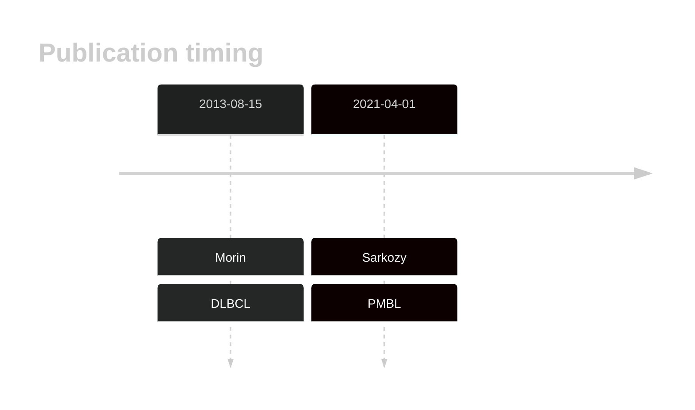
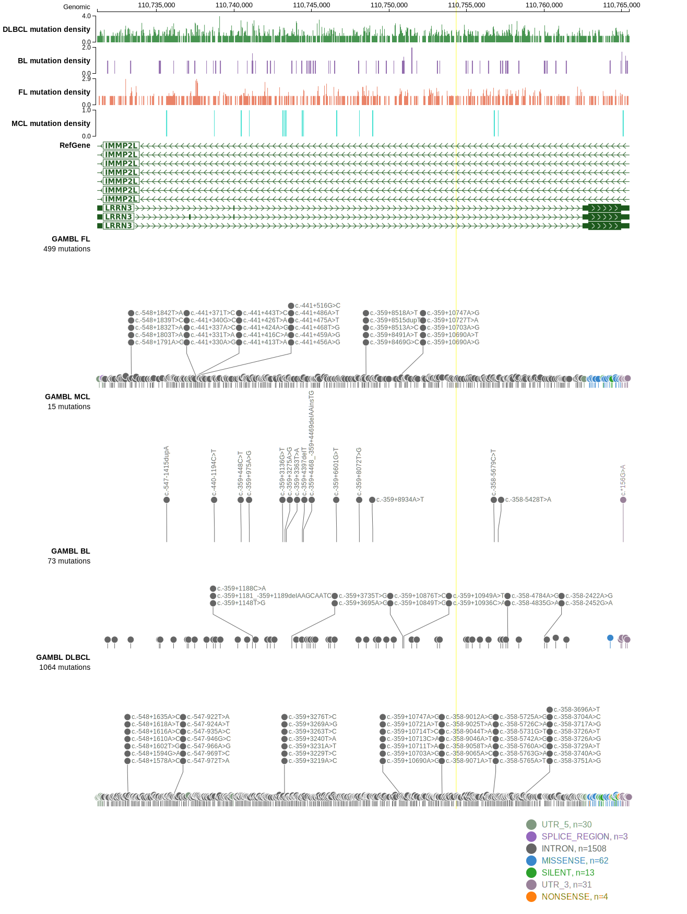

# LRRN3

## History

## Relevance tier by entity

|Entity|Tier|Description                              |
|:------:|:----:|-----------------------------------------|
||2|relevance in PMBL/cHL/GZL not firmly established[@sarkozyMutationalLandscapeGray2021a]|
| |2   |relevance in DLBCL not firmly established[@morinMutationalStructuralAnalysis2013]|

## Mutation incidence in large patient cohorts (GAMBL reanalysis)

|Entity|source        |frequency (%)|
|:------:|:--------------:|:-------------:|
|DLBCL |GAMBL genomes |8.22         |
|DLBCL |Schmitz cohort|8.09         |
|DLBCL |Reddy cohort  |6.51         |
|DLBCL |Chapuy cohort |6.84         |

## Mutation pattern and selective pressure estimates

|Entity|aSHM|Significant selection|dN/dS (missense)|dN/dS (nonsense)|
|:------:|:----:|:---------------------:|:----------------:|:----------------:|
|BL    |No  |No                   |2.141           |0               |
|DLBCL |No  |No                   |2.591           |0               |
|FL    |No  |No                   |0.000           |0               |

View coding variants in ProteinPaint [hg19](https://morinlab.github.io/LLMPP/GAMBL/LRRN3_protein.html)  or [hg38](https://morinlab.github.io/LLMPP/GAMBL/LRRN3_protein_hg38.html)

View all variants in GenomePaint [hg19](https://morinlab.github.io/LLMPP/GAMBL/LRRN3.html)  or [hg38](https://morinlab.github.io/LLMPP/GAMBL/LRRN3_hg38.html)

## LRRN3 Expression

<!-- ORIGIN: morinMutationalStructuralAnalysis2013 -->
<!-- DLBCL: morinMutationalStructuralAnalysis2013 -->
<!-- PMBL: sarkozyMutationalLandscapeGray2021a -->

## References

