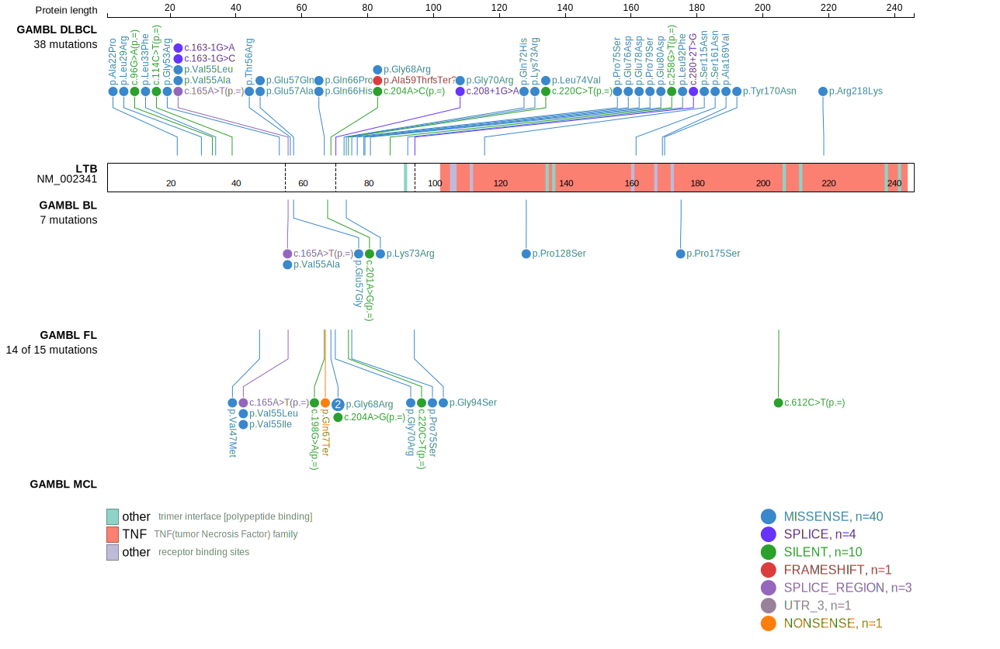
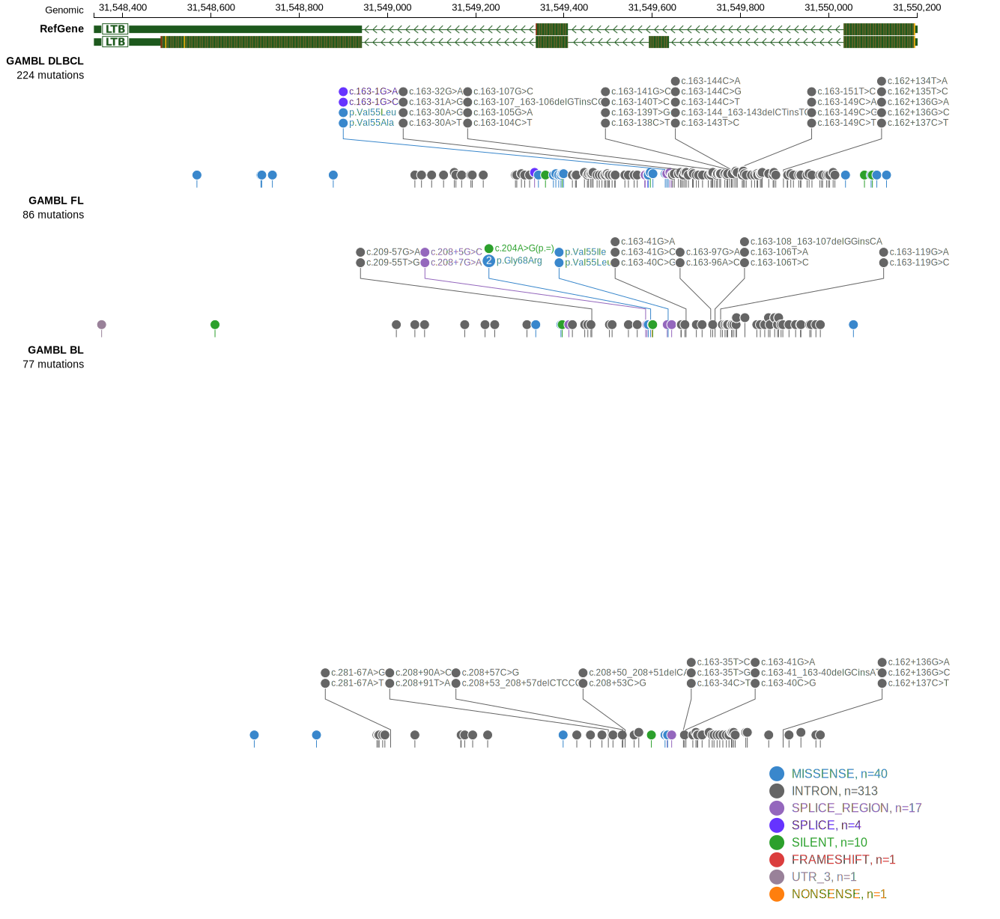

LTB is one of [a number of genes](https://github.com/morinlab/LLMPP/wiki/ashm) affected by aberrant somatic hypermutation in B-cell lymphomas, which complicates the interpretation of mutations at this locus.

## Mutation tier

|Entity|Tier|Description                           |
|:------:|:----:|--------------------------------------|
|DLBCL |1-a   |high-confidence DLBCL gene            |
|FL    |1-a   |high-confidence FL gene               |
|BL    |2   |relevance in BL not firmly established|

## Mutation incidence

|Entity|source               |frequency (%)|
|:------:|:---------------------:|:-------------:|
|BL    |GAMBL genomes+capture|3.00         |
|BL    |Thomas cohort        |3.00         |
|BL    |Panea cohort         |5.90         |
|DLBCL |GAMBL genomes        |9.37         |
|DLBCL |Schmitz cohort       |8.50         |
|DLBCL |Reddy cohort         |  NA         |
|DLBCL |Chapuy cohort        |9.80         |
|FL    |GAMBL genomes        |8.78         |

## Mutation pattern

|Entity|aSHM|Significant selection|dN/dS (missense)|dN/dS (nonsense)|
|:------:|:----:|:---------------------:|:----------------:|:----------------:|
|BL    |Yes |No                   |4.330           | 0.000          |
|DLBCL |Yes |No                   |2.261           |10.402          |
|FL    |Yes |No                   |5.259           |35.735          |

## aSHM regions

|chr_name|hg19_start|hg19_end|region                                                                                        |regulatory_comment|
|:--------:|:----------:|:--------:|:----------------------------------------------------------------------------------------------:|:------------------:|
|chr6    |31548325  |31550717|[intron-1](https://genome.ucsc.edu/s/rdmorin/GAMBL%20hg19?position=chr6%3A31548325%2D31550717)|enhancer          |

View coding variants in ProteinPaint [hg19](https://www.bcgsc.ca/downloads/morinlab/GAMBL/test/genes/LTB_protein.html)  or [hg38](https://www.bcgsc.ca/downloads/morinlab/GAMBL/test/genes/LTB_protein_hg38.html)

View all variants in GenomePaint [hg19](https://www.bcgsc.ca/downloads/morinlab/GAMBL/test/genes/LTB.html)  or [hg38](https://www.bcgsc.ca/downloads/morinlab/GAMBL/test/genes/LTB_hg38.html)

