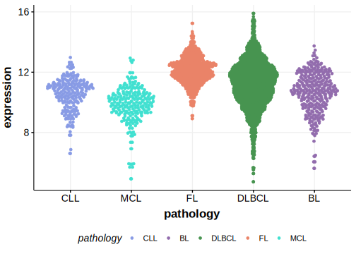

# LTB

## Overview
LTB (Lymphotoxin Beta) is a member of the tumor necrosis factor (TNF) superfamily, which plays a role in the development and organization of secondary lymphoid tissues and in the regulation of immune responses. LTB is one of [a number of genes](https://github.com/morinlab/LLMPP/wiki/ashm) affected by aberrant somatic hypermutation in B-cell lymphomas, which complicates the interpretation of mutations at this locus. Although the mutation incidence is relatively high in DLBCL, little is known about the role of these mutations in lymphomagenesis. The mutation pattern overall implies a selective pressure to acquire loss-of-function mutations in LTB. 
## History

## Relevance tier by entity

|Entity|Tier|Description                           |
|:------:|:----:|--------------------------------------|
||1|high-confidence PMBL/cHL/GZL gene|
| |1-a | aSHM target and high-confidence DLBCL gene            |
|    |1-a | aSHM target and high-confidence FL gene               |
|    |2-a | aSHM target; Although recurrent, the relevance of mutations in BL is tenuous |

## Mutation incidence in large patient cohorts (GAMBL reanalysis)

|Entity|source               |frequency (%)|
|:------:|:---------------------:|:-------------:|
|DLBCL |GAMBL genomes        |9.37         |
|DLBCL |Schmitz cohort       |8.51         |
|DLBCL |Reddy cohort         |  NA         |
|DLBCL |Chapuy cohort        |9.83         |
|FL    |GAMBL genomes        |8.78         |
|BL    |GAMBL genomes+capture|3.00         |
|BL    |Thomas cohort        |3.00         |
|BL    |Panea cohort         |5.90         |

## Mutation pattern and selective pressure estimates

|Entity|aSHM|Significant selection|dN/dS (missense)|dN/dS (nonsense)|
|:------:|:----:|:---------------------:|:----------------:|:----------------:|
|DLBCL |Yes |No                   |2.261           |10.402          |
|FL    |Yes |No                   |5.259           |35.735          |
|BL    |Yes |No                   |4.330           | 0.000          |

## aSHM regions

|chr_name|hg19_start|hg19_end|region                                                                                        |regulatory_comment|
|:--------:|:----------:|:--------:|:----------------------------------------------------------------------------------------------:|:------------------:|
|chr6    |31548325  |31550717|[intron-1](https://genome.ucsc.edu/s/rdmorin/GAMBL%20hg19?position=chr6%3A31548325%2D31550717)|enhancer          |

View coding variants in ProteinPaint [hg19](https://morinlab.github.io/LLMPP/GAMBL/LTB_protein.html)  or [hg38](https://morinlab.github.io/LLMPP/GAMBL/LTB_protein_hg38.html)

View all variants in GenomePaint [hg19](https://morinlab.github.io/LLMPP/GAMBL/LTB.html)  or [hg38](https://morinlab.github.io/LLMPP/GAMBL/LTB_hg38.html)

## LTB Expression

## References
<!-- ORIGIN: 29713087 -->
<!-- DLBCL: chapuyMolecularSubtypesDiffuse2018b -->
<!-- PMBL: deschGenotypingCirculatingTumor2020 -->
<!-- BL: 2 -->
