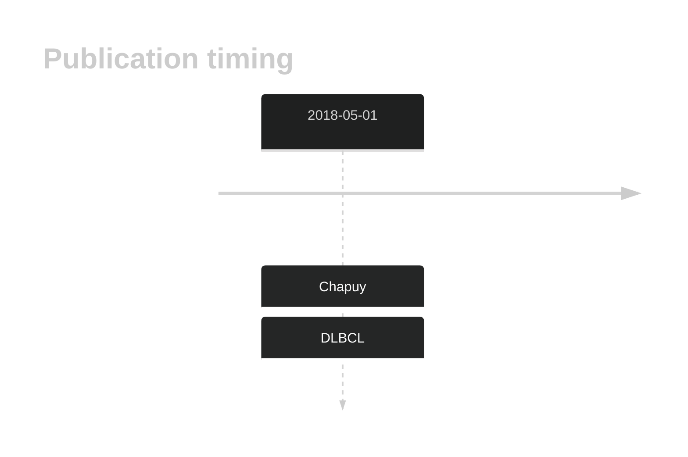

# LYN

## Overview
LYN mutations have been reported in DLBCL but the rate is relatively rare in most cohorts. The mutation pattern in DLBCL and FL implies the preferential accumulation of *inactivating mutations*. *Without further support, this gene may be migrated to Tier 2.*
## History

## Relevance tier by entity

|Entity|Tier|Description               |
|:------:|:----:|--------------------------|
| |2   |low-confidence DLBCL gene[@chapuyMolecularSubtypesDiffuse2018]|

## Mutation incidence in large patient cohorts (GAMBL reanalysis)

|Entity|source        |frequency (%)|
|:------:|:--------------:|:-------------:|
|DLBCL |GAMBL genomes |2.29         |
|DLBCL |Schmitz cohort|1.70         |
|DLBCL |Reddy cohort  |1.30         |
|DLBCL |Chapuy cohort |5.56         |

## Mutation pattern and selective pressure estimates

|Entity|aSHM|Significant selection|dN/dS (missense)|dN/dS (nonsense)|
|:------:|:----:|:---------------------:|:----------------:|:----------------:|
|BL    |No  |No                   | 1.641          | 0.000          |
|DLBCL |No  |No                   |10.031          |17.456          |
|FL    |No  |No                   | 0.000          | 0.000          |

View coding variants in ProteinPaint [hg19](https://morinlab.github.io/LLMPP/GAMBL/LYN_protein.html)  or [hg38](https://morinlab.github.io/LLMPP/GAMBL/LYN_protein_hg38.html)

View all variants in GenomePaint [hg19](https://morinlab.github.io/LLMPP/GAMBL/LYN.html)  or [hg38](https://morinlab.github.io/LLMPP/GAMBL/LYN_hg38.html)

## LYN Expression

<!-- FLAGGED FOR TIER 2 -->
<!-- ORIGIN: chapuyMolecularSubtypesDiffuse2018b -->
<!-- DLBCL: chapuyMolecularSubtypesDiffuse2018b -->

## All Mutations

[DLBCL-RICOVER_1081-Tumor](https://bcgsc.ca/downloads/morinlab/GAMBL/Chapuy_2018/DLBCL-RICOVER_1081-Tumor.html)
[DLBCL-RICOVER_181-Tumor](https://bcgsc.ca/downloads/morinlab/GAMBL/Chapuy_2018/DLBCL-RICOVER_181-Tumor.html)
[DLBCL-RICOVER_773-Tumor](https://bcgsc.ca/downloads/morinlab/GAMBL/Chapuy_2018/DLBCL-RICOVER_773-Tumor.html)

## References

