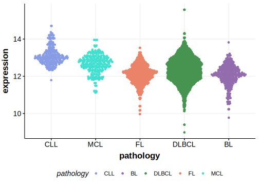

[[_TOC_]]

## Overview
LYN mutations have been reported in DLBCL but the rate is relatively rare in most cohorts. The mutation pattern in DLBCL and FL implies the preferential accumulation of *inactivating mutations*. *Without further support, this gene may be migrated to Tier 2.*

## Relevance tier by entity

[[include:tables/table1_LYN.md]]

## Mutation incidence in large patient cohorts (GAMBL reanalysis)

|Entity|source        |frequency (%)|
|:------:|:--------------:|:-------------:|
|DLBCL |GAMBL genomes |2.29         |
|DLBCL |Schmitz cohort|1.70         |
|DLBCL |Reddy cohort  |1.30         |
|DLBCL |Chapuy cohort |5.56         |

## Mutation pattern and selective pressure estimates

[[include:tables/dnds_LYN.md]]

[[include:browser_LYN.md]]

## Expression

<!-- FLAGGED FOR TIER 2 -->
<!-- ORIGIN: chapuyMolecularSubtypesDiffuse2018b -->
<!-- DLBCL: chapuyMolecularSubtypesDiffuse2018b -->

## All Mutations

[DLBCL-RICOVER_1081-Tumor](https://bcgsc.ca/downloads/morinlab/GAMBL/Chapuy_2018/DLBCL-RICOVER_1081-Tumor.html)
[DLBCL-RICOVER_181-Tumor](https://bcgsc.ca/downloads/morinlab/GAMBL/Chapuy_2018/DLBCL-RICOVER_181-Tumor.html)
[DLBCL-RICOVER_773-Tumor](https://bcgsc.ca/downloads/morinlab/GAMBL/Chapuy_2018/DLBCL-RICOVER_773-Tumor.html)

[[include:tables/mermaid_LYN.md]]

## References

