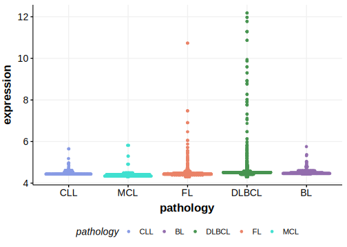

[[_TOC_]]

## Relevance tier by entity

[[include:table1_MAGEC1.md]]

## Mutation incidence in large patient cohorts (GAMBL reanalysis)

|Entity|source       |frequency (%)|
|:------:|:-------------:|:-------------:|
|FL    |GAMBL genomes|1.85         |

## Mutation pattern and selective pressure estimates

[[include:tables/dnds_MAGEC1.md]]

## MAGEC1 Hotspots

| Chromosome |Coordinate (hg19) | ref>alt | HGVSp | 
 | :---:| :---: | :--: | :---: |
| chrX | 140993821 | T>G | L211V |
| chrX | 140993827 | A>C | I213L |
| chrX | 140994066 | G>C | Q292H |
| chrX | 140994280 | A>G | T364A |

[[include:browser_MAGEC1.md]]

## Expression

<!-- ORIGIN: russler-germainMutationsAssociatedProgression2023a -->
<!-- FL: russler-germainMutationsAssociatedProgression2023b -->

[[include:tables/mermaid_MAGEC1.md]]

## References

