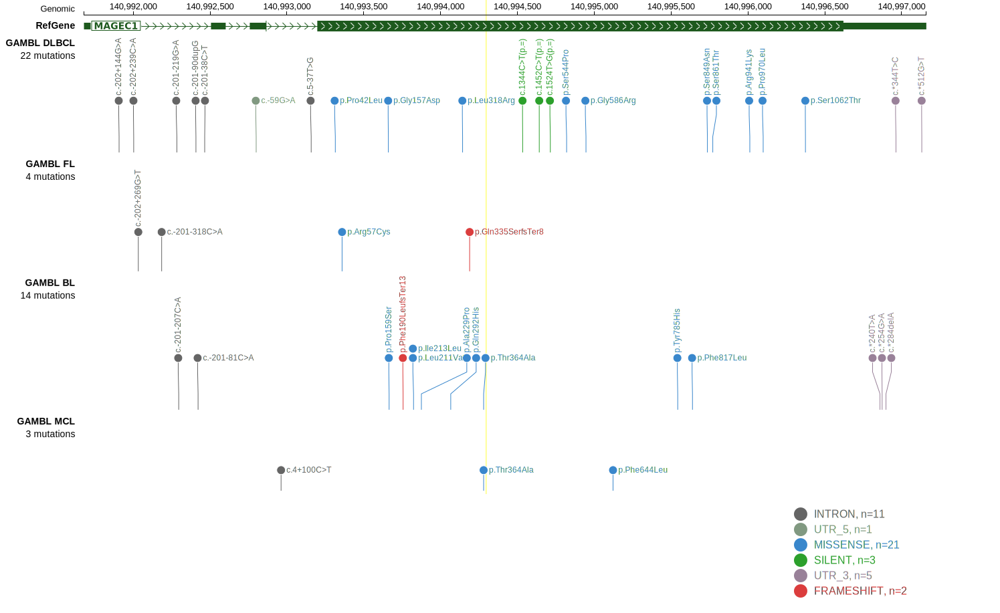

# [MAGEC1]

## Mutation tier

|Entity|Tier|Description                           |
|:------:|:----:|--------------------------------------|
|FL    |2   |relevance in FL not firmly established|
## Mutation incidence

|Entity|source       |frequency (%)|
|:------:|:-------------:|:-------------:|
|FL    |GAMBL genomes|1.85         |

## Mutation pattern

|Entity|aSHM|Significant selection|dN/dS (missense)|dN/dS (nonsense)|
|:------:|:----:|:---------------------:|:----------------:|:----------------:|
|BL    |No  |Yes                  |26.895          |0.000           |
|DLBCL |No  |No                   | 1.032          |4.703           |
|FL    |No  |No                   | 0.000          |0.000           |

> [!NOTE]
> First described in FL in 2023 by [Kalmbach S](https://pubmed.ncbi.nlm.nih.gov/37563306)

 ## MAGEC1 Hotspots

| Chromosome |Coordinate (hg19) | ref>alt | HGVSp | 
 | :---:| :---: | :--: | :---: |
| chrX | 140993821 | T>G | L211V |
| chrX | 140993827 | A>C | I213L |
| chrX | 140994066 | G>C | Q292H |
| chrX | 140994280 | A>G | T364A |

View coding variants in ProteinPaint [hg19](https://www.bcgsc.ca/downloads/morinlab/GAMBL/test/genes/MAGEC1_protein.html)  or [hg38](https://www.bcgsc.ca/downloads/morinlab/GAMBL/test/genes/MAGEC1_protein_hg38.html)

View all variants in GenomePaint [hg19](https://www.bcgsc.ca/downloads/morinlab/GAMBL/test/genes/MAGEC1.html)  or [hg38](https://www.bcgsc.ca/downloads/morinlab/GAMBL/test/genes/MAGEC1_hg38.html)

