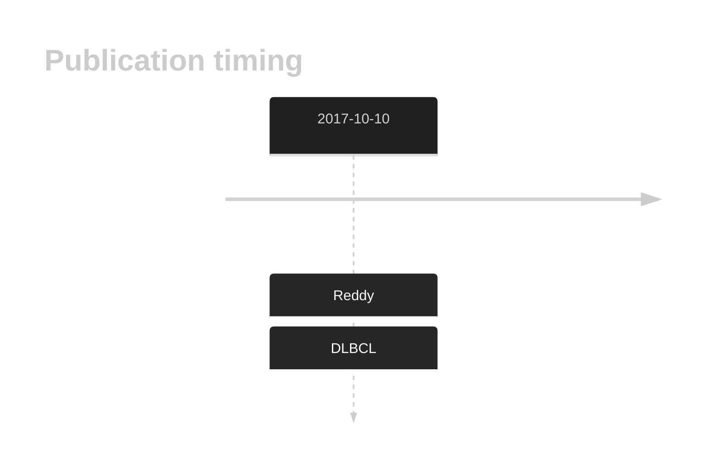

# MAGT1

## History

## Relevance tier by entity

|Entity|Tier|Description                              |
|:------:|:----:|-----------------------------------------|
| |2   |relevance in DLBCL not firmly established[@reddyGeneticFunctionalDrivers2017]|

## Mutation incidence in large patient cohorts (GAMBL reanalysis)

|Entity|source        |frequency (%)|
|:------:|:--------------:|:-------------:|
|DLBCL |GAMBL genomes |1.53         |
|DLBCL |Schmitz cohort|2.98         |
|DLBCL |Reddy cohort  |1.90         |
|DLBCL |Chapuy cohort |1.71         |

## Mutation pattern and selective pressure estimates

|Entity|aSHM|Significant selection|dN/dS (missense)|dN/dS (nonsense)|
|:------:|:----:|:---------------------:|:----------------:|:----------------:|
|BL    |No  |No                   |2.329           | 0.000          |
|DLBCL |No  |No                   |0.000           |57.832          |
|FL    |No  |No                   |0.000           | 0.000          |

View coding variants in ProteinPaint [hg19](https://morinlab.github.io/LLMPP/GAMBL/MAGT1_protein.html)  or [hg38](https://morinlab.github.io/LLMPP/GAMBL/MAGT1_protein_hg38.html)

View all variants in GenomePaint [hg19](https://morinlab.github.io/LLMPP/GAMBL/MAGT1.html)  or [hg38](https://morinlab.github.io/LLMPP/GAMBL/MAGT1_hg38.html)

## MAGT1 Expression

<!-- ORIGIN: reddyGeneticFunctionalDrivers2017 -->
<!-- DLBCL: reddyGeneticFunctionalDrivers2017 -->

## References

