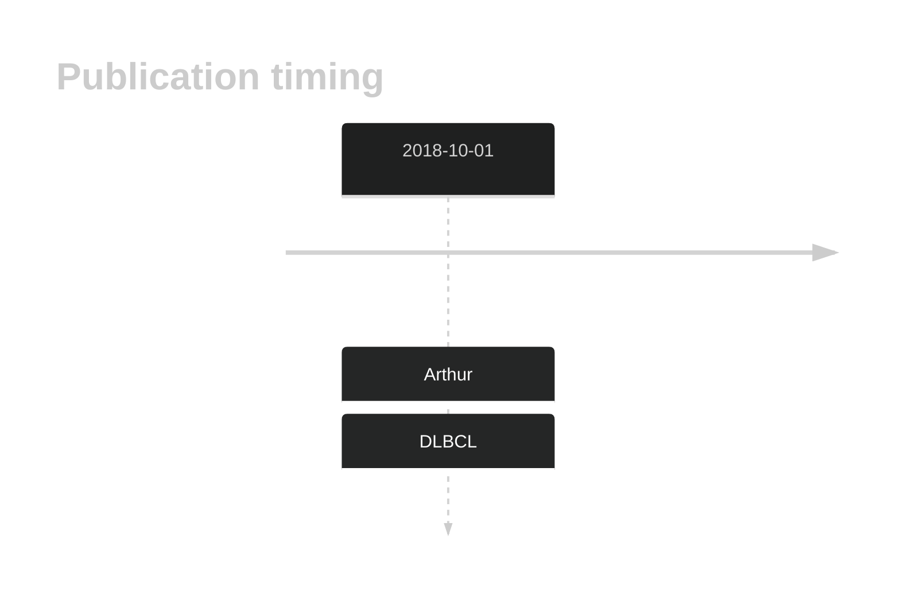

# MALAT1
## History

## Relevance tier by entity

|Entity|Tier|Description                              |
|:------:|:----:|-----------------------------------------|
| |2-a | aSHM target; Although recurrent, the relevance of mutations in DLBCL is tenuous |

## Mutation incidence in large patient cohorts (GAMBL reanalysis)

|Entity|source        |frequency (%)|
|:------:|:--------------:|:-------------:|
|DLBCL |GAMBL genomes |NA           |
|DLBCL |Schmitz cohort|NA           |
|DLBCL |Reddy cohort  |NA           |
|DLBCL |Chapuy cohort |NA           |

## Mutation pattern and selective pressure estimates

|

## aSHM regions

|chr_name|hg19_start|hg19_end|region                                                                                      |regulatory_comment|
|:--------:|:----------:|:--------:|:--------------------------------------------------------------------------------------------:|:------------------:|
|chr11   |65265237  |65268359|[ncRNA](https://genome.ucsc.edu/s/rdmorin/GAMBL%20hg19?position=chr11%3A65265237%2D65268359)|enhancer          |

View coding variants in ProteinPaint [hg19](https://morinlab.github.io/LLMPP/GAMBL/MALAT1_protein.html)  or [hg38](https://morinlab.github.io/LLMPP/GAMBL/MALAT1_protein_hg38.html)

View all variants in GenomePaint [hg19](https://morinlab.github.io/LLMPP/GAMBL/MALAT1.html)  or [hg38](https://morinlab.github.io/LLMPP/GAMBL/MALAT1_hg38.html)

## MALAT1 Expression

<!-- ORIGIN: arthurGenomewideDiscoverySomatic2018 -->
<!-- DLBCL: arthurGenomewideDiscoverySomatic2018 -->
## References
1.  Arthur SE, Jiang A, Grande BM, Alcaide M, Cojocaru R, Rushton CK, Mottok A, Hilton LK, Lat PK, Zhao EY, Culibrk L, Ennishi D, Jessa S, Chong L, Thomas N, Pararajalingam P, Meissner B, Boyle M, Davidson J, Bushell KR, Lai D, Farinha P, Slack GW, Morin GB, Shah S, Sen D, Jones SJM, Mungall AJ, Gascoyne RD, Audas TE, Unrau P, Marra MA, Connors JM, Steidl C, Scott DW, Morin RD. Genome-wide discovery of somatic regulatory variants in diffuse large B-cell lymphoma. Nat Commun. 2018 Oct 1;9(1):4001. PMCID: PMC6167379
