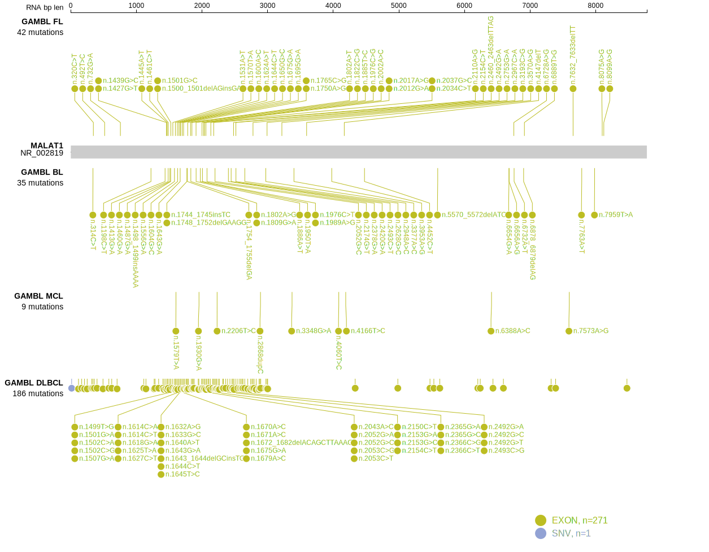
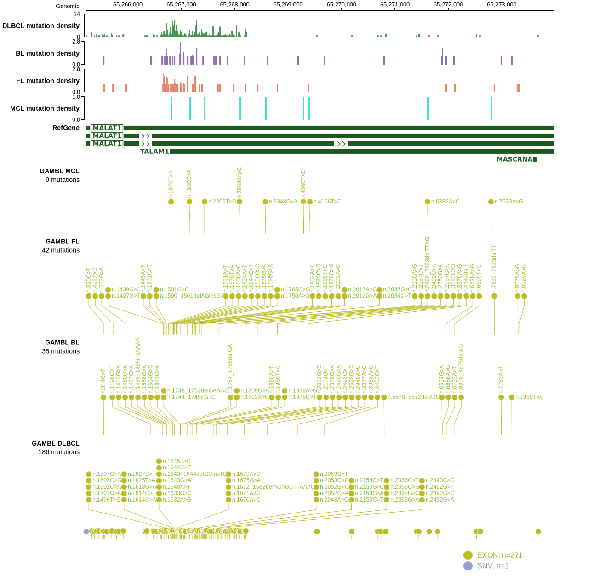
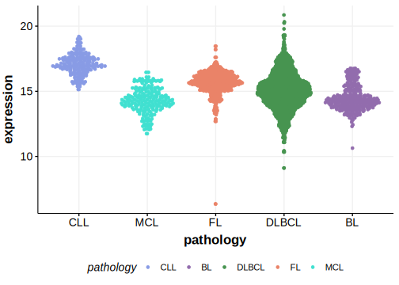

[[_TOC_]]

## Relevance tier by entity

|Entity|Tier|Description                              |
|:------:|:----:|-----------------------------------------|
| |2-a | aSHM target; Although recurrent, the relevance of mutations in DLBCL is tenuous [@arthurGenomewideDiscoverySomatic2018]|

## Mutation incidence in large patient cohorts (GAMBL reanalysis)

|Entity|source        |frequency (%)|
|:------:|:--------------:|:-------------:|
|DLBCL |GAMBL genomes |NA           |
|DLBCL |Schmitz cohort|NA           |
|DLBCL |Reddy cohort  |NA           |
|DLBCL |Chapuy cohort |NA           |

## Mutation pattern and selective pressure estimates

|

## aSHM regions

|chr_name|hg19_start|hg19_end|region                                                                                      |regulatory_comment|
|:--------:|:----------:|:--------:|:--------------------------------------------------------------------------------------------:|:------------------:|
|chr11   |65265237  |65268359|[ncRNA](https://genome.ucsc.edu/s/rdmorin/GAMBL%20hg19?position=chr11%3A65265237%2D65268359)|enhancer          |

View coding variants in ProteinPaint [hg19](https://morinlab.github.io/LLMPP/GAMBL/MALAT1_protein.html)  or [hg38](https://morinlab.github.io/LLMPP/GAMBL/MALAT1_protein_hg38.html)

View all variants in GenomePaint [hg19](https://morinlab.github.io/LLMPP/GAMBL/MALAT1.html)  or [hg38](https://morinlab.github.io/LLMPP/GAMBL/MALAT1_hg38.html)

## MALAT1 Expression

<!-- ORIGIN: arthurGenomewideDiscoverySomatic2018 -->
<!-- DLBCL: arthurGenomewideDiscoverySomatic2018 -->

[[include:mermaid_MALAT1.md]]

## References

