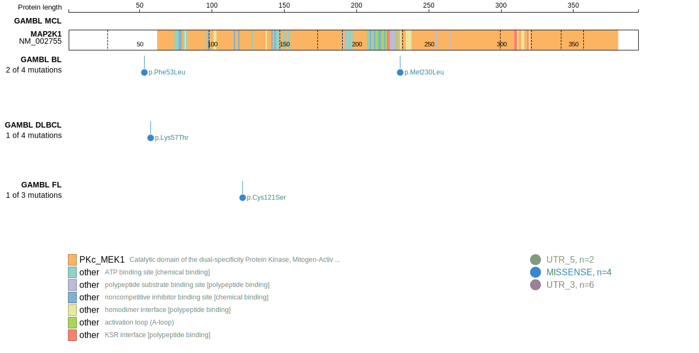
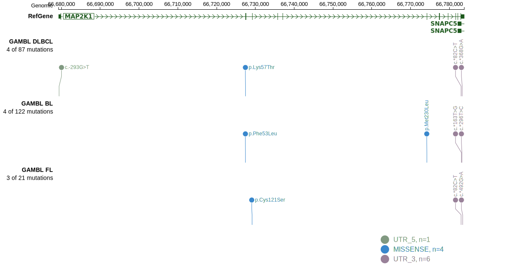
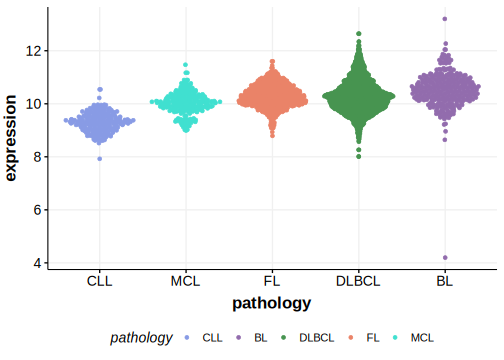

# MAP2K1

## Relevance tier by entity

|Entity|Tier|Description                              |
|:------:|:----:|-----------------------------------------|
|DLBCL |2   |relevance in DLBCL not firmly established|
|FL    |1   |high-confidence FL gene                  |

## Mutation incidence in large patient cohorts (GAMBL reanalysis)

|Entity|source        |frequency (%)|
|:------:|:--------------:|:-------------:|
|DLBCL |GAMBL genomes |1.34         |
|DLBCL |Schmitz cohort|3.19         |
|DLBCL |Reddy cohort  |2.20         |
|DLBCL |Chapuy cohort |2.14         |
|FL    |GAMBL genomes |1.39         |

## Mutation pattern and selective pressure estimates

|Entity|aSHM|Significant selection|dN/dS (missense)|dN/dS (nonsense)|
|:------:|:----:|:---------------------:|:----------------:|:----------------:|
|BL    |No  |No                   | 4.318          |0               |
|DLBCL |No  |No                   |11.932          |0               |
|FL    |No  |No                   | 5.696          |0               |

> [!NOTE]
> First described in FL in 2016 by [Louissaint A Jr](https://pubmed.ncbi.nlm.nih.gov/27325104)

 ## MAP2K1 Hotspots

| Chromosome |Coordinate (hg19) | ref>alt | HGVSp | 
 | :---:| :---: | :--: | :---: |
| chr15 | 66727441 | T>C | F53L |
| chr15 | 66727454 | A>C | K57T |

View coding variants in ProteinPaint [hg19](https://morinlab.github.io/LLMPP/GAMBL/MAP2K1_protein.html)  or [hg38](https://morinlab.github.io/LLMPP/GAMBL/MAP2K1_protein_hg38.html)

View all variants in GenomePaint [hg19](https://morinlab.github.io/LLMPP/GAMBL/MAP2K1.html)  or [hg38](https://morinlab.github.io/LLMPP/GAMBL/MAP2K1_hg38.html)

## MAP2K1 Expression

<!-- ORIGIN: shinBRAFV600EMAP2K12015 -->
