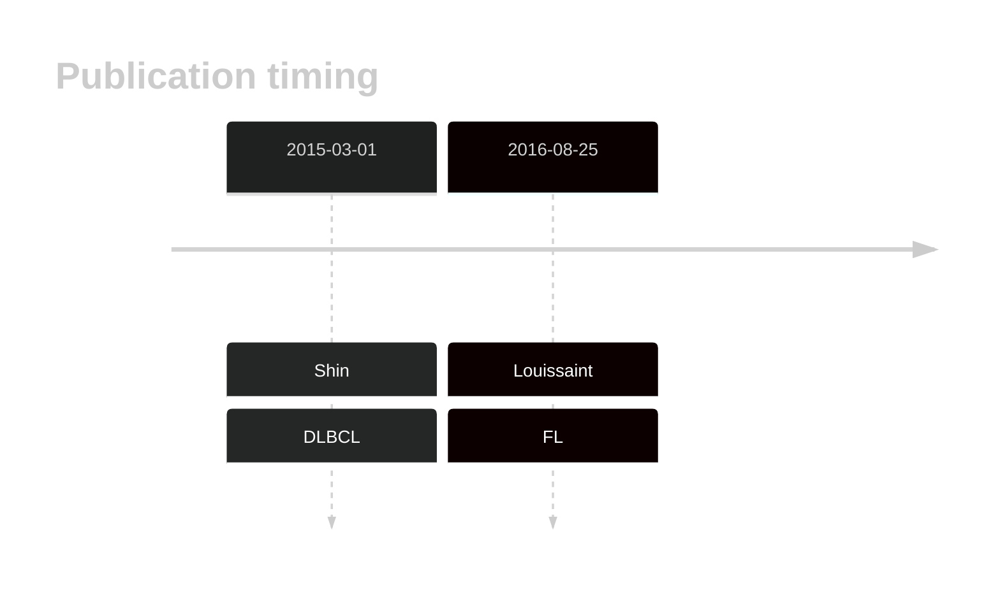

# MAP2K1

## History

## Relevance tier by entity

|Entity|Tier|Description                              |
|:------:|:----:|-----------------------------------------|
| |2   |relevance in DLBCL not firmly established|
|    |1   |high-confidence FL gene                  |

## Mutation incidence in large patient cohorts (GAMBL reanalysis)

|Entity|source        |frequency (%)|
|:------:|:--------------:|:-------------:|
|DLBCL |GAMBL genomes |1.34         |
|DLBCL |Schmitz cohort|3.19         |
|DLBCL |Reddy cohort  |2.20         |
|DLBCL |Chapuy cohort |2.14         |
|FL    |GAMBL genomes |1.39         |

## Mutation pattern and selective pressure estimates

|Entity|aSHM|Significant selection|dN/dS (missense)|dN/dS (nonsense)|
|:------:|:----:|:---------------------:|:----------------:|:----------------:|
|BL    |No  |No                   | 4.318          |0               |
|DLBCL |No  |No                   |11.932          |0               |
|FL    |No  |No                   | 5.696          |0               |

 ## MAP2K1 Hotspots

| Chromosome |Coordinate (hg19) | ref>alt | HGVSp | 
 | :---:| :---: | :--: | :---: |
| chr15 | 66727441 | T>C | F53L |
| chr15 | 66727454 | A>C | K57T |

View coding variants in ProteinPaint [hg19](https://morinlab.github.io/LLMPP/GAMBL/MAP2K1_protein.html)  or [hg38](https://morinlab.github.io/LLMPP/GAMBL/MAP2K1_protein_hg38.html)

View all variants in GenomePaint [hg19](https://morinlab.github.io/LLMPP/GAMBL/MAP2K1.html)  or [hg38](https://morinlab.github.io/LLMPP/GAMBL/MAP2K1_hg38.html)

## MAP2K1 Expression

<!-- ORIGIN: shinBRAFV600EMAP2K12015 -->
<!-- DLBCL: shinBRAFV600EMAP2K12015 -->
<!-- FL: louissaintPediatrictypeNodalFollicular2016a -->

## References
1.  Shin SY, Lee ST, Kim HJ, Ki CS, Jung CW, Kim JW, Kim SH. BRAF V600E and MAP2K1 mutations in hairy cell leukemia and splenic marginal zone lymphoma cases. Ann Lab Med. 2015 Mar;35(2):257–259. PMCID: PMC4330180
2.  Louissaint A, Schafernak KT, Geyer JT, Kovach AE, Ghandi M, Gratzinger D, Roth CG, Paxton CN, Kim S, Namgyal C, Morin R, Morgan EA, Neuberg DS, South ST, Harris MH, Hasserjian RP, Hochberg EP, Garraway LA, Harris NL, Weinstock DM. Pediatric-type nodal follicular lymphoma: a biologically distinct lymphoma with frequent MAPK pathway mutations. Blood. 2016 Aug 25;128(8):1093–1100. PMCID: PMC5000844
