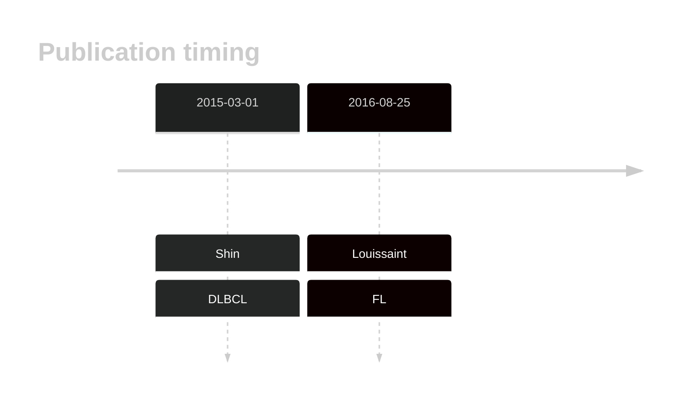

# MAP2K1

## History

## Relevance tier by entity

|Entity|Tier|Description                              |
|:------:|:----:|-----------------------------------------|
| |2   |relevance in DLBCL not firmly established[@shinBRAFV600EMAP2K12015]|
|    |1   |high-confidence FL gene                  [@louissaintPediatrictypeNodalFollicular2016]|

## Mutation incidence in large patient cohorts (GAMBL reanalysis)

[[include:DLBCL_MAP2K1.md]]
[[include:FL_MAP2K1.md]]

## Mutation pattern and selective pressure estimates

[[include:dnds_MAP2K1.md]]

## MAP2K1 Hotspots

| Chromosome |Coordinate (hg19) | ref>alt | HGVSp | 
 | :---:| :---: | :--: | :---: |
| chr15 | 66727441 | T>C | F53L |
| chr15 | 66727454 | A>C | K57T |

View coding variants in ProteinPaint [hg19](https://morinlab.github.io/LLMPP/GAMBL/MAP2K1_protein.html)  or [hg38](https://morinlab.github.io/LLMPP/GAMBL/MAP2K1_protein_hg38.html)

View all variants in GenomePaint [hg19](https://morinlab.github.io/LLMPP/GAMBL/MAP2K1.html)  or [hg38](https://morinlab.github.io/LLMPP/GAMBL/MAP2K1_hg38.html)

## MAP2K1 Expression

<!-- ORIGIN: shinBRAFV600EMAP2K12015 -->
<!-- DLBCL: shinBRAFV600EMAP2K12015 -->
<!-- FL: louissaintPediatrictypeNodalFollicular2016a -->

## References

