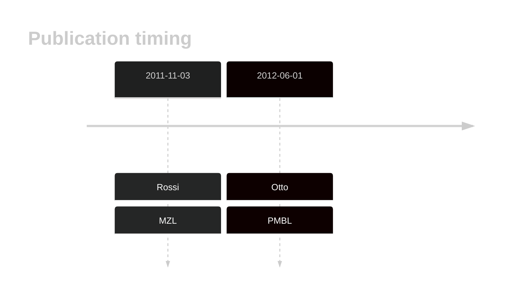

# MAP3K14

## History

## Relevance tier by entity

|Entity|Tier|Description|
|:------:|:----:|--------------------------------------|
||1|high-confidence MZL gene[@rossiAlterationBIRC3Multiple2011a]|
||1|high-confidence PMBL/cHL/GZL gene[@ottoGeneticLesionsTRAF32012a]|

## Mutation incidence in large patient cohorts (GAMBL reanalysis)

|Entity|source |frequency (%)|
|:------:|:----:|:----:|
|DLBCL|GAMBL Exome |0.162 |

## References

