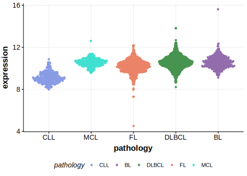

[[_TOC_]]

## Relevance tier by entity

[[include:table1_MAP7D1.md]]

## Mutation incidence in large patient cohorts (GAMBL reanalysis)

|Entity|source       |frequency (%)|
|:------:|:-------------:|:-------------:|
|FL    |GAMBL genomes|NA           |

## Mutation pattern and selective pressure estimates

[[include:tables/dnds_MAP7D1.md]]

[[include:browser_MAP7D1.md]]

## Expression

<!-- ORIGIN: russler-germainMutationsAssociatedProgression2023a -->
<!-- FL: russler-germainMutationsAssociatedProgression2023b -->

[[include:mermaid_MAP7D1.md]]

## References

