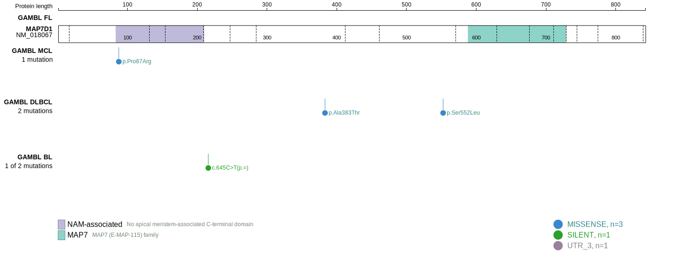

[[_TOC_]]

## Relevance tier by entity

|Entity|Tier|Description                           |
|:------:|:----:|--------------------------------------|
|    |2   |relevance in FL not firmly established[@russler-germainMutationsAssociatedProgression2023]|

## Mutation incidence in large patient cohorts (GAMBL reanalysis)

|Entity|source       |frequency (%)|
|:------:|:-------------:|:-------------:|
|FL    |GAMBL genomes|NA           |

## Mutation pattern and selective pressure estimates

[[include:dnds_MAP7D1.md]]

View coding variants in ProteinPaint [hg19](https://morinlab.github.io/LLMPP/GAMBL/MAP7D1_protein.html)  or [hg38](https://morinlab.github.io/LLMPP/GAMBL/MAP7D1_protein_hg38.html)

View all variants in GenomePaint [hg19](https://morinlab.github.io/LLMPP/GAMBL/MAP7D1.html)  or [hg38](https://morinlab.github.io/LLMPP/GAMBL/MAP7D1_hg38.html)

## MAP7D1 Expression

<!-- ORIGIN: russler-germainMutationsAssociatedProgression2023a -->
<!-- FL: russler-germainMutationsAssociatedProgression2023b -->

[[include:mermaid_MAP7D1.md]]

## References

