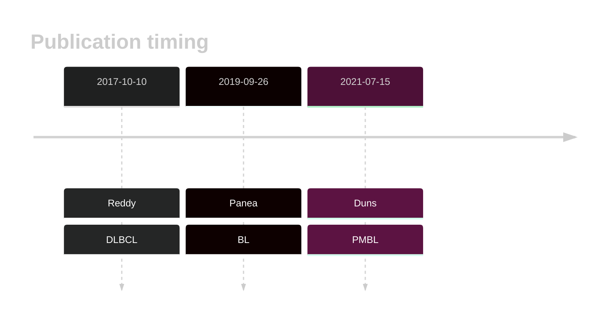
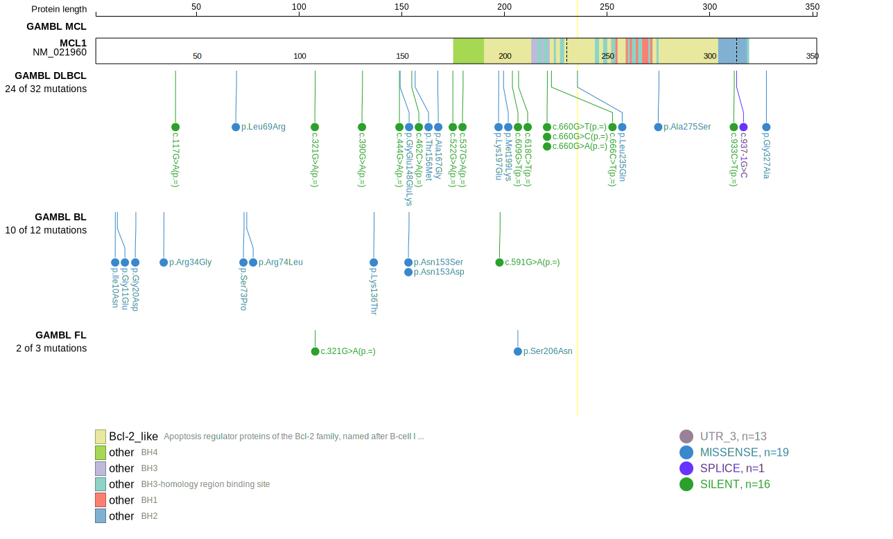
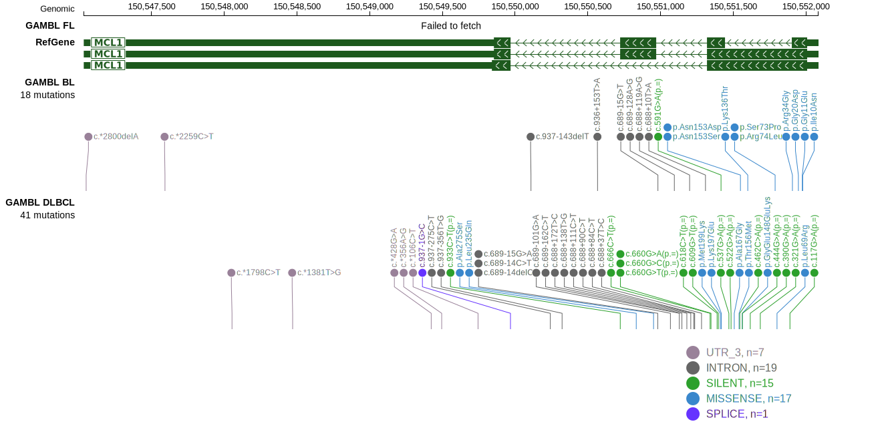
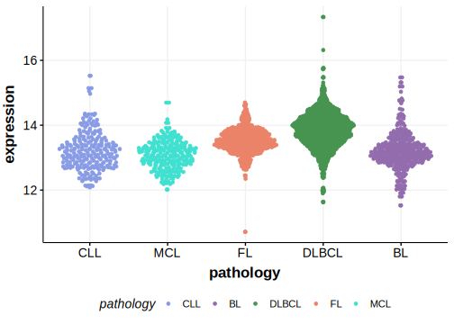
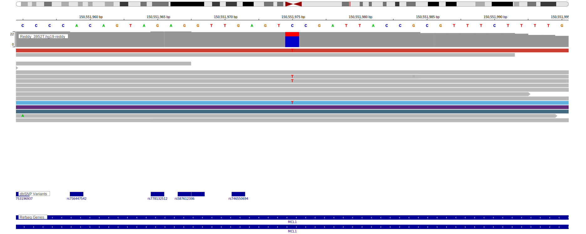
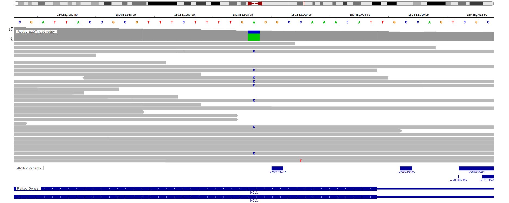

# MCL1

## Overview
MCL1 (Myeloid Cell Leukemia 1) is a member of the BCL2 family of proteins that play a critical role in inhibiting apoptosis. It is frequently overexpressed and sometimes mutated in DLBCL.1,2 Recurrent chromosomal gains and amplifications of the MCL1 locus occur are frequent in ABC-DLBCLs.1  MCL1 is one of [a number of genes](https://github.com/morinlab/LLMPP/wiki/ashm) affected by aberrant somatic hypermutation in B-cell lymphomas, which complicates the interpretation of mutations at this locus.

## History

## Relevance tier by entity

|Entity|Tier|Description                           |
|:------:|:----:|--------------------------------------|
||2|relevance in PMBL/cHL/GZL not firmly established|
|    |2-a | aSHM target; Although recurrent, the relevance of mutations in BL is tenuous |
| |1-a | aSHM target and high-confidence DLBCL gene            |

## Mutation incidence in large patient cohorts (GAMBL reanalysis)

|Entity|source               |frequency (%)|
|:------:|:---------------------:|:-------------:|
|BL    |GAMBL genomes+capture|1.85         |
|BL    |Thomas cohort        |2.10         |
|BL    |Panea cohort         |2.00         |
|DLBCL |GAMBL genomes        |2.49         |
|DLBCL |Schmitz cohort       |3.62         |
|DLBCL |Reddy cohort         |4.70         |
|DLBCL |Chapuy cohort        |3.42         |

## Mutation pattern and selective pressure estimates

|Entity|aSHM|Significant selection|dN/dS (missense)|dN/dS (nonsense)|
|:------:|:----:|:---------------------:|:----------------:|:----------------:|
|BL    |Yes |No                   |5.101           |0.000           |
|DLBCL |Yes |No                   |0.427           |2.401           |
|FL    |Yes |No                   |0.000           |0.000           |

## aSHM regions

|chr_name|hg19_start|hg19_end |region                                                                                        |regulatory_comment|
|:--------:|:----------:|:---------:|:----------------------------------------------------------------------------------------------:|:------------------:|
|chr1    |150550814 |150552135|[intron](https://genome.ucsc.edu/s/rdmorin/GAMBL%20hg19?position=chr1%3A150550814%2D150552135)|NA                |

View coding variants in ProteinPaint [hg19](https://morinlab.github.io/LLMPP/GAMBL/MCL1_protein.html)  or [hg38](https://morinlab.github.io/LLMPP/GAMBL/MCL1_protein_hg38.html)

View all variants in GenomePaint [hg19](https://morinlab.github.io/LLMPP/GAMBL/MCL1.html)  or [hg38](https://morinlab.github.io/LLMPP/GAMBL/MCL1_hg38.html)

## MCL1 Expression

## Representative Mutations

### DLBCL

**Rating**
&starf; &starf; &star; &star; &star;

**Rating**
&starf; &starf; &star; &star; &star;

## All Mutations

[Reddy_2074T](https://www.bcgsc.ca/downloads/morinlab/GAMBL/Reddy/igv_reports/Reddy_2074T.html)
[Reddy_2114T](https://www.bcgsc.ca/downloads/morinlab/GAMBL/Reddy/igv_reports/Reddy_2114T.html)
[Reddy_2124T](https://www.bcgsc.ca/downloads/morinlab/GAMBL/Reddy/igv_reports/Reddy_2124T.html)
[Reddy_2148T](https://www.bcgsc.ca/downloads/morinlab/GAMBL/Reddy/igv_reports/Reddy_2148T.html)
[Reddy_2150T](https://www.bcgsc.ca/downloads/morinlab/GAMBL/Reddy/igv_reports/Reddy_2150T.html)
[Reddy_2153T](https://www.bcgsc.ca/downloads/morinlab/GAMBL/Reddy/igv_reports/Reddy_2153T.html)
[Reddy_2156T](https://www.bcgsc.ca/downloads/morinlab/GAMBL/Reddy/igv_reports/Reddy_2156T.html)
[Reddy_2215T](https://www.bcgsc.ca/downloads/morinlab/GAMBL/Reddy/igv_reports/Reddy_2215T.html)
[Reddy_2233T](https://www.bcgsc.ca/downloads/morinlab/GAMBL/Reddy/igv_reports/Reddy_2233T.html)
[Reddy_2476T](https://www.bcgsc.ca/downloads/morinlab/GAMBL/Reddy/igv_reports/Reddy_2476T.html)
[Reddy_2478T](https://www.bcgsc.ca/downloads/morinlab/GAMBL/Reddy/igv_reports/Reddy_2478T.html)
[Reddy_2482T](https://www.bcgsc.ca/downloads/morinlab/GAMBL/Reddy/igv_reports/Reddy_2482T.html)
[Reddy_2525T](https://www.bcgsc.ca/downloads/morinlab/GAMBL/Reddy/igv_reports/Reddy_2525T.html)
[Reddy_2540T](https://www.bcgsc.ca/downloads/morinlab/GAMBL/Reddy/igv_reports/Reddy_2540T.html)
[Reddy_2542T](https://www.bcgsc.ca/downloads/morinlab/GAMBL/Reddy/igv_reports/Reddy_2542T.html)
[Reddy_2554T](https://www.bcgsc.ca/downloads/morinlab/GAMBL/Reddy/igv_reports/Reddy_2554T.html)
[Reddy_2649T](https://www.bcgsc.ca/downloads/morinlab/GAMBL/Reddy/igv_reports/Reddy_2649T.html)
[Reddy_2706T](https://www.bcgsc.ca/downloads/morinlab/GAMBL/Reddy/igv_reports/Reddy_2706T.html)
[Reddy_2713T](https://www.bcgsc.ca/downloads/morinlab/GAMBL/Reddy/igv_reports/Reddy_2713T.html)
[Reddy_2727T](https://www.bcgsc.ca/downloads/morinlab/GAMBL/Reddy/igv_reports/Reddy_2727T.html)
[Reddy_2819T](https://www.bcgsc.ca/downloads/morinlab/GAMBL/Reddy/igv_reports/Reddy_2819T.html)
[Reddy_2832T](https://www.bcgsc.ca/downloads/morinlab/GAMBL/Reddy/igv_reports/Reddy_2832T.html)
[Reddy_2874T](https://www.bcgsc.ca/downloads/morinlab/GAMBL/Reddy/igv_reports/Reddy_2874T.html)
[Reddy_2948T](https://www.bcgsc.ca/downloads/morinlab/GAMBL/Reddy/igv_reports/Reddy_2948T.html)
[Reddy_2952T](https://www.bcgsc.ca/downloads/morinlab/GAMBL/Reddy/igv_reports/Reddy_2952T.html)
[Reddy_3385T](https://www.bcgsc.ca/downloads/morinlab/GAMBL/Reddy/igv_reports/Reddy_3385T.html)
[Reddy_3454T](https://www.bcgsc.ca/downloads/morinlab/GAMBL/Reddy/igv_reports/Reddy_3454T.html)
[Reddy_3468T](https://www.bcgsc.ca/downloads/morinlab/GAMBL/Reddy/igv_reports/Reddy_3468T.html)
[Reddy_3471T](https://www.bcgsc.ca/downloads/morinlab/GAMBL/Reddy/igv_reports/Reddy_3471T.html)
[Reddy_3476T](https://www.bcgsc.ca/downloads/morinlab/GAMBL/Reddy/igv_reports/Reddy_3476T.html)
[Reddy_3527T](https://www.bcgsc.ca/downloads/morinlab/GAMBL/Reddy/igv_reports/Reddy_3527T.html)
[Reddy_3547T](https://www.bcgsc.ca/downloads/morinlab/GAMBL/Reddy/igv_reports/Reddy_3547T.html)
[Reddy_3593T](https://www.bcgsc.ca/downloads/morinlab/GAMBL/Reddy/igv_reports/Reddy_3593T.html)
[Reddy_3602T](https://www.bcgsc.ca/downloads/morinlab/GAMBL/Reddy/igv_reports/Reddy_3602T.html)
[Reddy_3622T](https://www.bcgsc.ca/downloads/morinlab/GAMBL/Reddy/igv_reports/Reddy_3622T.html)
[Reddy_3664T](https://www.bcgsc.ca/downloads/morinlab/GAMBL/Reddy/igv_reports/Reddy_3664T.html)
[Reddy_3667T](https://www.bcgsc.ca/downloads/morinlab/GAMBL/Reddy/igv_reports/Reddy_3667T.html)
[Reddy_3766T](https://www.bcgsc.ca/downloads/morinlab/GAMBL/Reddy/igv_reports/Reddy_3766T.html)
[Reddy_3777T](https://www.bcgsc.ca/downloads/morinlab/GAMBL/Reddy/igv_reports/Reddy_3777T.html)
[Reddy_3782T](https://www.bcgsc.ca/downloads/morinlab/GAMBL/Reddy/igv_reports/Reddy_3782T.html)
[Reddy_3811T](https://www.bcgsc.ca/downloads/morinlab/GAMBL/Reddy/igv_reports/Reddy_3811T.html)
[Reddy_3817T](https://www.bcgsc.ca/downloads/morinlab/GAMBL/Reddy/igv_reports/Reddy_3817T.html)
[Reddy_3825T](https://www.bcgsc.ca/downloads/morinlab/GAMBL/Reddy/igv_reports/Reddy_3825T.html)
[Reddy_3829T](https://www.bcgsc.ca/downloads/morinlab/GAMBL/Reddy/igv_reports/Reddy_3829T.html)
[Reddy_3837T](https://www.bcgsc.ca/downloads/morinlab/GAMBL/Reddy/igv_reports/Reddy_3837T.html)
[Reddy_3927T](https://www.bcgsc.ca/downloads/morinlab/GAMBL/Reddy/igv_reports/Reddy_3927T.html)
[Reddy_3952T](https://www.bcgsc.ca/downloads/morinlab/GAMBL/Reddy/igv_reports/Reddy_3952T.html)
[Reddy_3965T](https://www.bcgsc.ca/downloads/morinlab/GAMBL/Reddy/igv_reports/Reddy_3965T.html)
[Reddy_3966T](https://www.bcgsc.ca/downloads/morinlab/GAMBL/Reddy/igv_reports/Reddy_3966T.html)
[Reddy_3984T](https://www.bcgsc.ca/downloads/morinlab/GAMBL/Reddy/igv_reports/Reddy_3984T.html)
[Reddy_689T](https://www.bcgsc.ca/downloads/morinlab/GAMBL/Reddy/igv_reports/Reddy_689T.html)
[Reddy_830T](https://www.bcgsc.ca/downloads/morinlab/GAMBL/Reddy/igv_reports/Reddy_830T.html)

## References
1. *Wenzel, S., Grau, M., Mavis, C., Hailfinger, S., Wolf, A., Madle, H., Deeb, G., Dörken, B., Thome, M., Lenz, P., Dirnhofer, S., Hernandez-Ilizaliturri, F., Tzankov, A., & Lenz, G. (2013). MCL1 is deregulated in subgroups of diffuse large B-cell lymphoma. Leukemia, 27, 1381-1390. https://doi.org/10.1038/leu.2012.367.*
2. *Reddy A, Zhang J, Davis NS, Moffitt AB, Love CL, Waldrop A, Leppa S, Pasanen A, Meriranta L, Karjalainen-Lindsberg ML, Nørgaard P, Pedersen M, Gang AO, Høgdall E, Heavican TB, Lone W, Iqbal J, Qin Q, Li G, Kim SY, Healy J, Richards KL, Fedoriw Y, Bernal-Mizrachi L, Koff JL, Staton AD, Flowers CR, Paltiel O, Goldschmidt N, Calaminici M, Clear A, Gribben J, Nguyen E, Czader MB, Ondrejka SL, Collie A, Hsi ED, Tse E, Au-Yeung RKH, Kwong YL, Srivastava G, Choi WWL, Evens AM, Pilichowska M, Sengar M, Reddy N, Li S, Chadburn A, Gordon LI, Jaffe ES, Levy S, Rempel R, Tzeng T, Happ LE, Dave T, Rajagopalan D, Datta J, Dunson DB, Dave SS. Genetic and Functional Drivers of Diffuse Large B Cell Lymphoma. Cell. 2017 Oct 5;171(2):481-494.e15. doi: 10.1016/j.cell.2017.09.027. PMID: 28985567; PMCID: PMC5659841.*
3.  *Panea R, Love C, Shingleton JR, Reddy A, Bailey J, Moormann A, Otieno J, Ong’echa J, Oduor C, Schroêder K, Masalu N, Chao N, Agajanian M, Major M, Fedoriw Y, Richards K, Rymkiewicz G, Miles R, Alobeid B, Bhagat G, Flowers C, Ondrejka S, Hsi E, Choi W, Au-Yeung R, Hartmann W, Lenz G, Meyerson H, Lin YY, Zhuang Y, Luftig M, Waldrop A, Dave T, Thakkar D, Sahay H, Li G, Palus B, Seshadri V, Kim S, Gascoyne R, Levy S, Mukhopadhyay M, Dunson D, Dave S. The whole genome landscape of Burkitt lymphoma subtypes. Blood. 2019;* 
4.  *Duns G, Viganò E, Ennishi D, Sarkozy C, Hung SS, Chavez E, Takata K, Rushton C, Jiang A, Ben-Neriah S, Woolcock BW, Slack GW, Hsi ED, Craig JW, Hilton LK, Shah SP, Farinha P, Mottok A, Gascoyne RD, Morin RD, Savage KJ, Scott DW, Steidl C. Characterization of DLBCL with a PMBL gene expression signature. Blood. 2021 Jul 15;138(2):136–148. PMID: 33684939*
<!-- ORIGIN: reddyGeneticFunctionalDrivers2017 -->
<!-- BL: paneaWholeGenomeLandscape2019 -->
<!-- BL: paneaWholeGenomeLandscape2019 -->
<!-- DLBCL: reddyGeneticFunctionalDrivers2017 -->
<!-- PMBL: dunsCharacterizationDLBCLPMBL2021b -->
