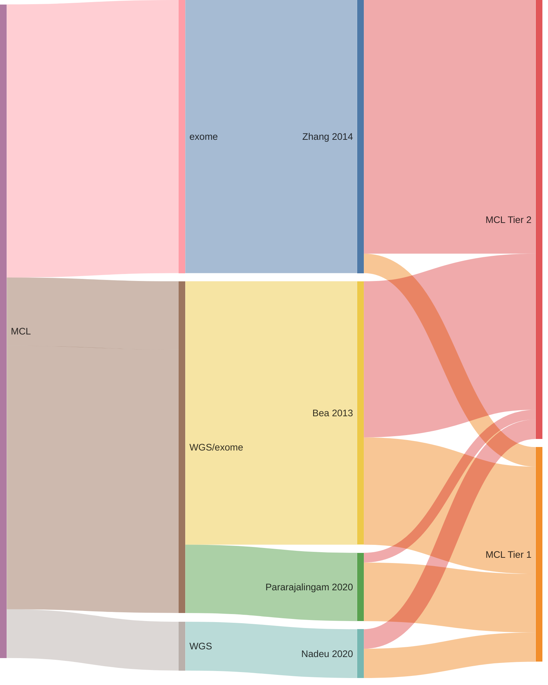

## Origins of MCL genes

## Tier 1 MCL genes

### *23 total*

|Gene|Tier| First MCL evidence | Other entities |
|:-:|:-:|:--|:-|
|[ATM](ATM)|1|[Bea et al](papers/beaLandscapeSomaticMutations2013)[@beaLandscapeSomaticMutations2013]|[@reddyGeneticFunctionalDrivers2017; @braggioGenomicAnalysisMarginal2012]|
|[BIRC3](BIRC3)|1|[Bea et al](papers/beaLandscapeSomaticMutations2013)[@beaLandscapeSomaticMutations2013]|[@dunsCharacterizationDLBCLPMBL2021b; @rossiAlterationBIRC3Multiple2011a; @arthurGenomewideDiscoverySomatic2018]|
|[CARD11](CARD11)|1|[Wu et al](papers/wuGeneticHeterogeneityPrimary2016)[@wuGeneticHeterogeneityPrimary2016]|[@paneaWholeGenomeLandscape2019; @yanBCRTLRSignaling2012a; @lenzOncogenicCARD11Mutations2008; @morinFrequentMutationHistonemodifying2011]|
|[CCND1](CCND1)|1-EE|[Bea et al](papers/beaLandscapeSomaticMutations2013)[@beaLandscapeSomaticMutations2013]||
|[DAZAP1](DAZAP1)|1|[Pararajalingam et al](papers/pararajalingamCodingNoncodingDrivers2020)[@pararajalingamCodingNoncodingDrivers2020]||
|[EWSR1](EWSR1)|1|[Pararajalingam et al](papers/pararajalingamCodingNoncodingDrivers2020)[@pararajalingamCodingNoncodingDrivers2020]||
|[HNRNPH1](HNRNPH1)|1-EE|[Pararajalingam et al](papers/pararajalingamCodingNoncodingDrivers2020)[@pararajalingamCodingNoncodingDrivers2020]||
|[KMT2D](KMT2D)|1|[Bea et al](papers/beaLandscapeSomaticMutations2013)[@beaLandscapeSomaticMutations2013]|[@morinFrequentMutationHistonemodifying2011; @grandeGenomewideDiscoverySomatic2019; @rossiCodingGenomeSplenic2012c; @deschGenotypingCirculatingTumor2020]|
|[MEF2B](MEF2B)|1|[Bea et al](papers/beaLandscapeSomaticMutations2013)[@beaLandscapeSomaticMutations2013]|[@morinFrequentMutationHistonemodifying2011]|
|[NFKBIE](NFKBIE)|1|[Pararajalingam et al](papers/pararajalingamCodingNoncodingDrivers2020)[@pararajalingamCodingNoncodingDrivers2020]|[@morinGeneticLandscapesRelapsed2016; @mansouriFrequentNFKBIEDeletions2016]|
|[NOTCH1](NOTCH1)|1|[Bea et al](papers/beaLandscapeSomaticMutations2013)[@beaLandscapeSomaticMutations2013]|[@pasqualucciAnalysisCodingGenome2011; @loveGeneticLandscapeMutations2012; @rossiCodingGenomeSplenic2012c]|
|[NOTCH2](NOTCH2)|1|[Bea et al](papers/beaLandscapeSomaticMutations2013)[@beaLandscapeSomaticMutations2013]|[@rossiCodingGenomeSplenic2012c; @troenNOTCH2MutationsMarginal2008; @paneaWholeGenomeLandscape2019]|
|[NSD2](NSD2)|1|[Bea et al](papers/beaLandscapeSomaticMutations2013)[@beaLandscapeSomaticMutations2013]||
|[POT1](POT1)|1|[Zhang et al](papers/zhangGenomicLandscapeMantle2014)[@zhangGenomicLandscapeMantle2014]||
|[RB1](RB1)|1|[Zhang et al](papers/zhangGenomicLandscapeMantle2014)[@zhangGenomicLandscapeMantle2014]|[@morinMutationalStructuralAnalysis2013]|
|[S1PR1](S1PR1)|1|[Pararajalingam et al](papers/pararajalingamCodingNoncodingDrivers2020)[@pararajalingamCodingNoncodingDrivers2020]|[@lohrDiscoveryPrioritizationSomatic2012a]|
|[SMARCA4](SMARCA4)|1|[Nadeu et al](papers/nadeuGenomicEpigenomicInsights2020b)[@nadeuGenomicEpigenomicInsights2020b]|[@krysiakRecurrentSomaticMutations2017b; @richterRecurrentMutationID32012a; @lohrDiscoveryPrioritizationSomatic2012a]|
|[SP140](SP140)|1|[Bea et al](papers/beaLandscapeSomaticMutations2013)[@beaLandscapeSomaticMutations2013]||
|[SYNE1](SYNE1)|1|[Nadeu et al](papers/nadeuGenomicEpigenomicInsights2020b)[@nadeuGenomicEpigenomicInsights2020b]||
|[TERT](TERT)|1|[Nadeu et al](papers/nadeuGenomicEpigenomicInsights2020b)[@nadeuGenomicEpigenomicInsights2020b]||
|[TLR2](TLR2)|1|[Bea et al](papers/beaLandscapeSomaticMutations2013)[@beaLandscapeSomaticMutations2013]|[@chapuyMolecularSubtypesDiffuse2018b]|
|[TP53](TP53)|1-EE|[Bea et al](papers/beaLandscapeSomaticMutations2013)[@beaLandscapeSomaticMutations2013]|[@tiacciPervasiveMutationsJAKSTAT2018b; @lohrDiscoveryPrioritizationSomatic2012a; @rossiCodingGenomeSplenic2012c; @morinFrequentMutationHistonemodifying2011; @wildaInactivationARFMDM2p53Pathway2004]|
|[UBR5](UBR5)|1|[Pararajalingam et al](papers/pararajalingamCodingNoncodingDrivers2020)[@pararajalingamCodingNoncodingDrivers2020]|[@zhangGeneticHeterogeneityDiffuse2013]|

## Tier 2 MCL genes

### *46 total*

|Gene|Tier| First MCL evidence | Other entities |
|:-:|:-:|:--|:-|
|[ABCA3](ABCA3)|2|[Bea et al](papers/beaLandscapeSomaticMutations2013)[@beaLandscapeSomaticMutations2013]||
|[ABCC9](ABCC9)|2|[Bea et al](papers/beaLandscapeSomaticMutations2013)[@beaLandscapeSomaticMutations2013]||
|[ANK2](ANK2)|2|[Zhang et al](papers/zhangGenomicLandscapeMantle2014)[@zhangGenomicLandscapeMantle2014]||
|[ARID1B](ARID1B)|2||[@reddyGeneticFunctionalDrivers2017]|
|[ATP11C](ATP11C)|2|[Zhang et al](papers/zhangGenomicLandscapeMantle2014)[@zhangGenomicLandscapeMantle2014]||
|[B2M](B2M)|2|[Pararajalingam et al](papers/pararajalingamCodingNoncodingDrivers2020)[@pararajalingamCodingNoncodingDrivers2020]|[@reichelFlowSortingExome2015a; @morinFrequentMutationHistonemodifying2011]|
|[BCOR](BCOR)|2|[Nadeu et al](papers/nadeuGenomicEpigenomicInsights2020b)[@nadeuGenomicEpigenomicInsights2020b]|[@jalladesExomeSequencingIdentifies2017]|
|[CDH8](CDH8)|2|[Zhang et al](papers/zhangGenomicLandscapeMantle2014)[@zhangGenomicLandscapeMantle2014]||
|[CHMP4C](CHMP4C)|2|[Bea et al](papers/beaLandscapeSomaticMutations2013)[@beaLandscapeSomaticMutations2013]||
|[COL11A1](COL11A1)|2|[Zhang et al](papers/zhangGenomicLandscapeMantle2014)[@zhangGenomicLandscapeMantle2014]||
|[COL16A1](COL16A1)|2|[Zhang et al](papers/zhangGenomicLandscapeMantle2014)[@zhangGenomicLandscapeMantle2014]||
|[CRYBG3](CRYBG3)|2|[Bea et al](papers/beaLandscapeSomaticMutations2013)[@beaLandscapeSomaticMutations2013]||
|[CTNNA2](CTNNA2)|2|[Zhang et al](papers/zhangGenomicLandscapeMantle2014)[@zhangGenomicLandscapeMantle2014]||
|[DCP1B](DCP1B)|2|[Bea et al](papers/beaLandscapeSomaticMutations2013)[@beaLandscapeSomaticMutations2013]||
|[DHDH](DHDH)|2|[Zhang et al](papers/zhangGenomicLandscapeMantle2014)[@zhangGenomicLandscapeMantle2014]||
|[DLC1](DLC1)|2|[Zhang et al](papers/zhangGenomicLandscapeMantle2014)[@zhangGenomicLandscapeMantle2014]||
|[DLGAP2](DLGAP2)|2|[Bea et al](papers/beaLandscapeSomaticMutations2013)[@beaLandscapeSomaticMutations2013]||
|[DNAJC6](DNAJC6)|2|[Bea et al](papers/beaLandscapeSomaticMutations2013)[@beaLandscapeSomaticMutations2013]||
|[EIF2AK4](EIF2AK4)|2|[Zhang et al](papers/zhangGenomicLandscapeMantle2014)[@zhangGenomicLandscapeMantle2014]||
|[ESX1](ESX1)|2|[Zhang et al](papers/zhangGenomicLandscapeMantle2014)[@zhangGenomicLandscapeMantle2014]||
|[FAT4](FAT4)|2|[Zhang et al](papers/zhangGenomicLandscapeMantle2014)[@zhangGenomicLandscapeMantle2014]|[@parryWholeExomeSequencing2013; @morinMutationalStructuralAnalysis2013]|
|[GRIN2A](GRIN2A)|2|[Zhang et al](papers/zhangGenomicLandscapeMantle2014)[@zhangGenomicLandscapeMantle2014]||
|[HEPH](HEPH)|2|[Zhang et al](papers/zhangGenomicLandscapeMantle2014)[@zhangGenomicLandscapeMantle2014]||
|[KCNC2](KCNC2)|2|[Bea et al](papers/beaLandscapeSomaticMutations2013)[@beaLandscapeSomaticMutations2013]||
|[KIAA1671](KIAA1671)|2|[Bea et al](papers/beaLandscapeSomaticMutations2013)[@beaLandscapeSomaticMutations2013]||
|[KMT2C](KMT2C)|2|[Zhang et al](papers/zhangGenomicLandscapeMantle2014)[@zhangGenomicLandscapeMantle2014]|[@zhouSporadicEndemicBurkitt2019; @zhangGeneticHeterogeneityDiffuse2013; @sarkozyMutationalLandscapeGray2021a]|
|[LUZP4](LUZP4)|2|[Bea et al](papers/beaLandscapeSomaticMutations2013)[@beaLandscapeSomaticMutations2013]||
|[MRGPRF](MRGPRF)|2|[Zhang et al](papers/zhangGenomicLandscapeMantle2014)[@zhangGenomicLandscapeMantle2014]||
|[NIN](NIN)|2|[Zhang et al](papers/zhangGenomicLandscapeMantle2014)[@zhangGenomicLandscapeMantle2014]||
|[OGDHL](OGDHL)|2|[Zhang et al](papers/zhangGenomicLandscapeMantle2014)[@zhangGenomicLandscapeMantle2014]||
|[PCDHB2](PCDHB2)|2|[Zhang et al](papers/zhangGenomicLandscapeMantle2014)[@zhangGenomicLandscapeMantle2014]||
|[PCSK2](PCSK2)|2|[Bea et al](papers/beaLandscapeSomaticMutations2013)[@beaLandscapeSomaticMutations2013]||
|[PDLIM3](PDLIM3)|2|[Bea et al](papers/beaLandscapeSomaticMutations2013)[@beaLandscapeSomaticMutations2013]||
|[PLXNB3](PLXNB3)|2|[Zhang et al](papers/zhangGenomicLandscapeMantle2014)[@zhangGenomicLandscapeMantle2014]|[@spinaGeneticsNodalMarginal2016b]|
|[RGS4](RGS4)|2|[Bea et al](papers/beaLandscapeSomaticMutations2013)[@beaLandscapeSomaticMutations2013]||
|[ROBO2](ROBO2)|2|[Zhang et al](papers/zhangGenomicLandscapeMantle2014)[@zhangGenomicLandscapeMantle2014]||
|[SALL3](SALL3)|2|[Zhang et al](papers/zhangGenomicLandscapeMantle2014)[@zhangGenomicLandscapeMantle2014]|[@loveGeneticLandscapeMutations2012]|
|[SI](SI)|2|[Zhang et al](papers/zhangGenomicLandscapeMantle2014)[@zhangGenomicLandscapeMantle2014]||
|[SLC17A6](SLC17A6)|2|[Bea et al](papers/beaLandscapeSomaticMutations2013)[@beaLandscapeSomaticMutations2013]||
|[SMARCB1](SMARCB1)|2|[Nadeu et al](papers/nadeuGenomicEpigenomicInsights2020b)[@nadeuGenomicEpigenomicInsights2020b]||
|[SMC1A](SMC1A)|2|[Zhang et al](papers/zhangGenomicLandscapeMantle2014)[@zhangGenomicLandscapeMantle2014]||
|[TBC1D26](TBC1D26)|2|[Zhang et al](papers/zhangGenomicLandscapeMantle2014)[@zhangGenomicLandscapeMantle2014]||
|[TNRC6B](TNRC6B)|2|[Bea et al](papers/beaLandscapeSomaticMutations2013)[@beaLandscapeSomaticMutations2013]||
|[TRPM6](TRPM6)|2|[Bea et al](papers/beaLandscapeSomaticMutations2013)[@beaLandscapeSomaticMutations2013]||
|[ZNF117](ZNF117)|2|[Zhang et al](papers/zhangGenomicLandscapeMantle2014)[@zhangGenomicLandscapeMantle2014]||
|[ZNF296](ZNF296)|2|[Zhang et al](papers/zhangGenomicLandscapeMantle2014)[@zhangGenomicLandscapeMantle2014]||

# References
