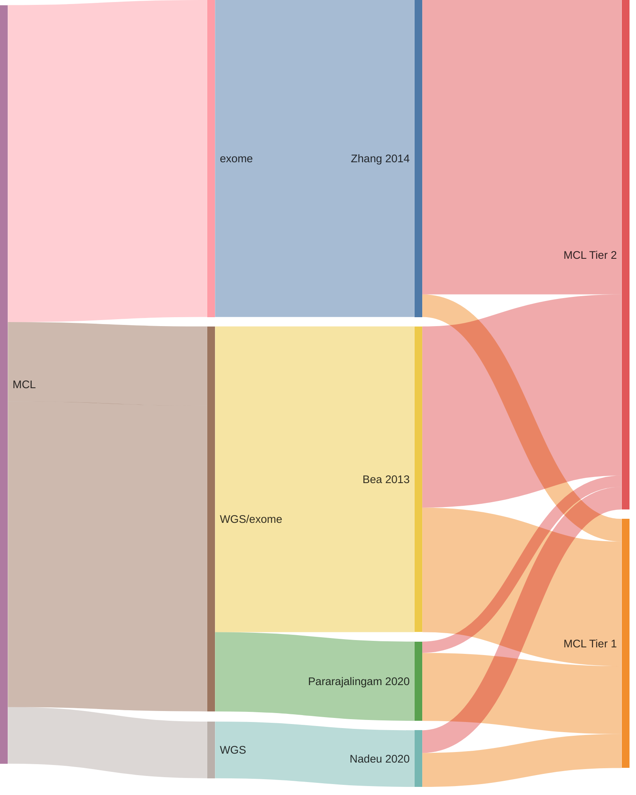

# MCL genes

## Origins of MCL genes

## Tier 1 MCL genes

### *23 total*

|        Gene        |     Tier     | Relevant references                                                                            |
|:------------------:|:------------:|:-----------------------------------------------------------------------------------------------|
|     [ATM](ATM)     |      1       | Beà et al. 2013; Braggio et al. 2012; Reddy et al. 2017                                      |
|   [BIRC3](BIRC3)   |      1       | Duns et al. 2021; Rossi et al. 2011; Arthur et al. 2018; Beà et al. 2013                     |
|  [CARD11](CARD11)  |      1       | Wu et al. 2016; Panea et al. 2019; Morin et al. 2011; Yan et al. 2012; Lenz et al. 2008      |
|   [CCND1](CCND1)   |   1, aSHM    | Beà et al. 2013                                                                              |
|  [DAZAP1](DAZAP1)  |      1       | Pararajalingam et al. 2020                                                                   |
|   [EWSR1](EWSR1)   |      1       | Pararajalingam et al. 2020                                                                   |
| [HNRNPH1](HNRNPH1) | 1, noncoding | Pararajalingam et al. 2020                                                                   |
|   [KMT2D](KMT2D)   |      1       | Grande et al. 2019; Beà et al. 2013; Morin et al. 2011; Desch et al. 2020; Rossi et al. 2012 |
|   [MEF2B](MEF2B)   |      1       | Beà et al. 2013; Morin et al. 2011                                                           |
|  [NFKBIE](NFKBIE)  |      1       | Mansouri et al. 2016; Pararajalingam et al. 2020; Morin et al. 2016                          |
|  [NOTCH1](NOTCH1)  |      1       | Rossi et al. 2012; Love et al. 2012; Pasqualucci et al. 2011; Beà et al. 2013                |
|  [NOTCH2](NOTCH2)  |      1       | Trøen et al. 2008; Beà et al. 2013; Rossi et al. 2012; Panea et al. 2019                     |
|    [NSD2](NSD2)    |      1       | Beà et al. 2013                                                                              |
|    [POT1](POT1)    |      1       | Zhang et al. 2014                                                                            |
|     [RB1](RB1)     |      1       | Zhang et al. 2014; Morin et al. 2013                                                         |
|   [S1PR1](S1PR1)   |      1       | Pararajalingam et al. 2020                                                                   |
| [SMARCA4](SMARCA4) |      1       | Nadeu et al. 2020; Zhang et al. 2013; Krysiak et al. 2017; Richter et al. 2012               |
|   [SP140](SP140)   |      1       | Beà et al. 2013                                                                              |
|   [SYNE1](SYNE1)   |      1       | Nadeu et al. 2020                                                                            |
|    [TERT](TERT)    | 1, noncoding | Nadeu et al. 2020                                                                            |
|    [TLR2](TLR2)    |      1       | Chapuy et al. 2018; Beà et al. 2013                                                          |
|    [TP53](TP53)    |      1       | Rossi et al. 2012; Wilda et al. 2004; Morin et al. 2011; Tiacci et al. 2018; Beà et al. 2013 |
|    [UBR5](UBR5)    |      1       | Pararajalingam et al. 2020; Zhang et al. 2013                                                |

## Tier 2 MCL genes

### *46 total*

|         Gene         | Tier | Relevant references                                                           |
|:--------------------:|:----:|:------------------------------------------------------------------------------|
|    [ABCA3](ABCA3)    |  2   | Beà et al. 2013                                                             |
|    [ABCC9](ABCC9)    |  2   | Beà et al. 2013                                                             |
|     [ANK2](ANK2)     |  2   | Zhang et al. 2014                                                           |
|   [ARID1B](ARID1B)   |  2   | Reddy et al. 2017                                                           |
|   [ATP11C](ATP11C)   |  2   | Zhang et al. 2014                                                           |
|      [B2M](B2M)      |  2   | Pararajalingam et al. 2020; Reichel et al. 2015; Morin et al. 2011          |
|     [BCOR](BCOR)     |  2   | Nadeu et al. 2020; Jallades et al. 2017                                     |
|     [CDH8](CDH8)     |  2   | Zhang et al. 2014                                                           |
|   [CHMP4C](CHMP4C)   |  2   | Beà et al. 2013                                                             |
|  [COL11A1](COL11A1)  |  2   | Zhang et al. 2014                                                           |
|  [COL16A1](COL16A1)  |  2   | Zhang et al. 2014                                                           |
|   [CRYBG3](CRYBG3)   |  2   | Beà et al. 2013                                                             |
|   [CTNNA2](CTNNA2)   |  2   | Zhang et al. 2014                                                           |
|    [DCP1B](DCP1B)    |  2   | Beà et al. 2013                                                             |
|     [DHDH](DHDH)     |  2   | Zhang et al. 2014                                                           |
|     [DLC1](DLC1)     |  2   | Zhang et al. 2014                                                           |
|   [DLGAP2](DLGAP2)   |  2   | Beà et al. 2013                                                             |
|   [DNAJC6](DNAJC6)   |  2   | Beà et al. 2013                                                             |
|  [EIF2AK4](EIF2AK4)  |  2   | Zhang et al. 2014                                                           |
|     [ESX1](ESX1)     |  2   | Zhang et al. 2014                                                           |
|     [FAT4](FAT4)     |  2   | Parry et al. 2013; Zhang et al. 2014; Morin et al. 2013                     |
|   [GRIN2A](GRIN2A)   |  2   | Zhang et al. 2014                                                           |
|     [HEPH](HEPH)     |  2   | Zhang et al. 2014                                                           |
|    [KCNC2](KCNC2)    |  2   | Beà et al. 2013                                                             |
| [KIAA1671](KIAA1671) |  2   | Beà et al. 2013                                                             |
|    [KMT2C](KMT2C)    |  2   | Sarkozy et al. 2021; Zhang et al. 2014; Zhang et al. 2013; Zhou et al. 2019 |
|    [LUZP4](LUZP4)    |  2   | Beà et al. 2013                                                             |
|   [MRGPRF](MRGPRF)   |  2   | Zhang et al. 2014                                                           |
|      [NIN](NIN)      |  2   | Zhang et al. 2014                                                           |
|    [OGDHL](OGDHL)    |  2   | Zhang et al. 2014                                                           |
|   [PCDHB2](PCDHB2)   |  2   | Zhang et al. 2014                                                           |
|    [PCSK2](PCSK2)    |  2   | Beà et al. 2013                                                             |
|   [PDLIM3](PDLIM3)   |  2   | Beà et al. 2013                                                             |
|   [PLXNB3](PLXNB3)   |  2   | Spina et al. 2016; Zhang et al. 2014                                        |
|     [RGS4](RGS4)     |  2   | Beà et al. 2013                                                             |
|    [ROBO2](ROBO2)    |  2   | Zhang et al. 2014                                                           |
|    [SALL3](SALL3)    |  2   | Love et al. 2012; Zhang et al. 2014                                         |
|       [SI](SI)       |  2   | Zhang et al. 2014                                                           |
|  [SLC17A6](SLC17A6)  |  2   | Beà et al. 2013                                                             |
|  [SMARCB1](SMARCB1)  |  2   | Nadeu et al. 2020                                                           |
|    [SMC1A](SMC1A)    |  2   | Zhang et al. 2014                                                           |
|  [TBC1D26](TBC1D26)  |  2   | Zhang et al. 2014                                                           |
|   [TNRC6B](TNRC6B)   |  2   | Beà et al. 2013                                                             |
|    [TRPM6](TRPM6)    |  2   | Beà et al. 2013                                                             |
|   [ZNF117](ZNF117)   |  2   | Zhang et al. 2014                                                           |
|   [ZNF296](ZNF296)   |  2   | Zhang et al. 2014                                                           |

# References

Arthur, Sarah E., Aixiang Jiang, Bruno M. Grande, Miguel Alcaide, Razvan
Cojocaru, Christopher K. Rushton, Anja Mottok, et al. 2018. “Genome-Wide
Discovery of Somatic Regulatory Variants in Diffuse Large B-cell Lymphoma.” *Nature Communications* 9 1:
4001. <https://doi.org/10.1038/s41467-018-06354-3>.

Beà, Sílvia, Rafael Valdés-Mas, Alba Navarro, Itziar Salaverria, David
Martín-Garcia, Pedro Jares, Eva Giné, et al. 2013. “Landscape of Somatic
Mutations and Clonal Evolution in Mantle Cell Lymphoma.” *Proceedings of
the National Academy of Sciences* 110 45: 18250–55.
<https://doi.org/10.1073/pnas.1314608110>.

Braggio, Esteban, Ahmet Dogan, Jonathan J. Keats, Wee J. Chng, Gaofeng
Huang, Julie M. Matthews, Matthew J. Maurer, et al. 2012. “Genomic
Analysis of Marginal Zone and Lymphoplasmacytic Lymphomas Identified
Common and Disease-Specific Abnormalities.” *Modern Pathology: An
Official Journal of the United States and Canadian Academy of Pathology,
Inc* 25 5: 651–60. <https://doi.org/10.1038/modpathol.2011.213>.

Chapuy, Bjoern, Chip Stewart, Andrew J. Dunford, Jaegil Kim, Atanas
Kamburov, Robert A. Redd, Mike S. Lawrence, et al. 2018. “Molecular
Subtypes of Diffuse Large B Cell Lymphoma Are Associated with Distinct
Pathogenic Mechanisms and Outcomes.” *Nature Medicine* 24 5: 679–90.
<https://doi.org/10.1038/s41591-018-0016-8>.

Desch, Ann-Kathrin, Kristin Hartung, Ante Botzen, Alexander Brobeil,
Mathias Rummel, Lars Kurch, Thomas Georgi, et al. 2020. “Genotyping
Circulating Tumor DNA of Pediatric Hodgkin Lymphoma.” *Leukemia* 34 1:
151–66. <https://doi.org/10.1038/s41375-019-0541-6>.

Duns, Gerben, Elena Viganò, Daisuke Ennishi, Clementine Sarkozy, Stacy
S. Hung, Elizabeth Chavez, Katsuyoshi Takata, et al. 2021.
“Characterization of DLBCL with a PMBL Gene Expression Signature.”
*Blood* 138 2: 136–48. <https://doi.org/10.1182/blood.2020007683>.

Grande, Bruno M., Daniela S. Gerhard, Aixiang Jiang, Nicholas B. Griner,
Jeremy S. Abramson, Thomas B. Alexander, Hilary Allen, et al. 2019.
“Genome-Wide Discovery of Somatic Coding and Noncoding Mutations in
Pediatric Endemic and Sporadic Burkitt Lymphoma.” *Blood* 133 12:
1313–24. <https://doi.org/10.1182/blood-2018-09-871418>.

Jallades, Laurent, Lucile Baseggio, Pierre Sujobert, Sarah Huet, Kaddour
Chabane, Evelyne Callet-Bauchu, Aurélie Verney, et al. 2017. “Exome
Sequencing Identifies Recurrent BCOR Alterations and the Absence of
KLF2, TNFAIP3 and MYD88 Mutations in Splenic Diffuse Red Pulp Small
B-cell Lymphoma.” *Haematologica* 102 10:
1758–66. <https://doi.org/10.3324/haematol.2016.160192>.

Krysiak, Kilannin, Felicia Gomez, Brian S. White, Matthew Matlock,
Christopher A. Miller, Lee Trani, Catrina C. Fronick, et al. 2017.
“Recurrent Somatic Mutations Affecting B-cell Receptor Signaling Pathway Genes in
Follicular Lymphoma.” *Blood* 129 4: 473–83.
<https://doi.org/10.1182/blood-2016-07-729954>.

Lenz, Georg, R Eric Davis, Vu N Ngo, Lloyd Lam, Thaddeus C George,
George W Wright, Sandeep S Dave, et al. 2008. “Oncogenic CARD11
Mutations in Human Diffuse Large B Cell Lymphoma.” *Science* 319 5870:
1676–79.

Love, Cassandra, Zhen Sun, Dereje Jima, Guojie Li, Jenny Zhang, Rodney
Miles, Kristy L. Richards, et al. 2012. “The Genetic Landscape of
Mutations in Burkitt Lymphoma.” *Nature Genetics* 44 12: 1321–25.
<https://doi.org/10.1038/ng.2468>.

Mansouri, Larry, Daniel Noerenberg, Emma Young, Elena Mylonas, Maysaa
Abdulla, Mareike Frick, Fazila Asmar, et al. 2016. “Frequent NFKBIE
Deletions Are Associated with Poor Outcome in Primary Mediastinal B-cell Lymphoma.” *Blood* 128 23: 2666–70.
<https://doi.org/10.1182/blood-2016-03-704528>.

Morin, Ryan D., Sarit Assouline, Miguel Alcaide, Arezoo Mohajeri,
Rebecca L. Johnston, Lauren Chong, Jasleen Grewal, et al. 2016. “Genetic
Landscapes of Relapsed and Refractory Diffuse Large B-Cell Lymphomas.”
*Clinical Cancer Research: An Official Journal of the American
Association for Cancer Research* 22 9: 2290–300.
<https://doi.org/10.1158/1078-0432.CCR-15-2123>.

Morin, Ryan D., Maria Mendez-Lago, Andrew J. Mungall, Rodrigo Goya,
Karen L. Mungall, Richard D. Corbett, Nathalie A. Johnson, et al. 2011.
“Frequent Mutation of Histone-Modifying Genes in Non-Hodgkin Lymphoma.”
*Nature* 476 7360: 298–303. <https://doi.org/10.1038/nature10351>.

Morin, Ryan D., Karen Mungall, Erin Pleasance, Andrew J. Mungall,
Rodrigo Goya, Ryan D. Huff, David W. Scott, et al. 2013. “Mutational and
Structural Analysis of Diffuse Large B-cell
Lymphoma Using Whole-Genome Sequencing.” *Blood* 122 7: 1256–65.
<https://doi.org/10.1182/blood-2013-02-483727>.

Nadeu, F., D. Martín-García, G. Clot, A. Díaz-Navarro, M. Duran-Ferrer,
A. Navarro, Roser Vilarrasa-Blasi, et al. 2020. “Genomic and Epigenomic
Insights into the Origin, Pathogenesis and Clinical Behavior of Mantle
Cell Lymphoma Subtypes.” *Blood*.
<https://doi.org/10.1182/blood.2020005289>.

Panea, R., C. Love, Jennifer R. Shingleton, Anupama Reddy, J. Bailey, A.
Moormann, J. Otieno, et al. 2019. “The Whole Genome Landscape of Burkitt
Lymphoma Subtypes.” *Blood*. <https://doi.org/10.1182/blood.2019001880>.

Pararajalingam, Prasath, Krysta M. Coyle, Sarah E. Arthur, Nicole
Thomas, Miguel Alcaide, Barbara Meissner, Merrill Boyle, et al. 2020.
“Coding and Noncoding Drivers of Mantle Cell Lymphoma Identified Through
Exome and Genome Sequencing.” *Blood* 136 5: 572–84.
<https://doi.org/10.1182/blood.2019002385>.

Parry, Marina, Matthew J. J. Rose-Zerilli, Jane Gibson, Sarah Ennis,
Renata Walewska, Jade Forster, Helen Parker, et al. 2013. “Whole Exome
Sequencing Identifies Novel Recurrently Mutated Genes in Patients with
Splenic Marginal Zone Lymphoma.” *PloS One* 8 12: e83244.
<https://doi.org/10.1371/journal.pone.0083244>.

Pasqualucci, Laura, Vladimir Trifonov, Giulia Fabbri, Jing Ma, Davide
Rossi, Annalisa Chiarenza, Victoria A. Wells, et al. 2011. “Analysis of
the Coding Genome of Diffuse Large B-cell
Lymphoma.” *Nature Genetics* 43 9: 830–37.
<https://doi.org/10.1038/ng.892>.

Reddy, Anupama, Jenny Zhang, Nicholas S Davis, Andrea B Moffitt,
Cassandra L Love, Alexander Waldrop, Sirpa Leppa, et al. 2017. “Genetic
and Functional Drivers of Diffuse Large B Cell Lymphoma.” *Cell* 171
2: 481–494.e15.

Reichel, Jonathan, Amy Chadburn, Paul G. Rubinstein, Lisa Giulino-Roth,
Wayne Tam, Yifang Liu, Rafael Gaiolla, et al. 2015. “Flow Sorting and
Exome Sequencing Reveal the Oncogenome of Primary Hodgkin and
Reed-Sternberg Cells.” *Blood* 125 7: 1061–72.
<https://doi.org/10.1182/blood-2014-11-610436>.

Richter, Julia, Matthias Schlesner, Steve Hoffmann, Markus Kreuz, Ellen
Leich, Birgit Burkhardt, Maciej Rosolowski, et al. 2012. “Recurrent
Mutation of the ID3 Gene in Burkitt Lymphoma Identified by Integrated
Genome, Exome and Transcriptome Sequencing.” *Nature Genetics* 44 12:
1316–20. <https://doi.org/10.1038/ng.2469>.

Rossi, Davide, Silvia Deaglio, David Dominguez-Sola, Silvia Rasi,
Tiziana Vaisitti, Claudio Agostinelli, Valeria Spina, et al. 2011.
“Alteration of BIRC3 and Multiple Other NF-κB Pathway Genes in Splenic Marginal Zone
Lymphoma.” *Blood* 118 18: 4930–34.
<https://doi.org/10.1182/blood-2011-06-359166>.

Rossi, Davide, Vladimir Trifonov, Marco Fangazio, Alessio Bruscaggin,
Silvia Rasi, Valeria Spina, Sara Monti, et al. 2012. “The Coding Genome
of Splenic Marginal Zone Lymphoma: Activation of NOTCH2 and Other
Pathways Regulating Marginal Zone Development.” *The Journal of
Experimental Medicine* 209 9: 1537–51.
<https://doi.org/10.1084/jem.20120904>.

Sarkozy, Clémentine, Stacy S. Hung, Elizabeth A. Chavez, Gerben Duns,
Katsuyoshi Takata, Lauren C. Chong, Tomohiro Aoki, et al. 2021.
“Mutational Landscape of Gray Zone Lymphoma.” *Blood* 137 13: 1765–76.
<https://doi.org/10.1182/blood.2020007507>.

Spina, Valeria, Hossein Khiabanian, Monica Messina, Sara Monti, Luciano
Cascione, Alessio Bruscaggin, Elisa Spaccarotella, et al. 2016. “The
Genetics of Nodal Marginal Zone Lymphoma.” *Blood* 128 10: 1362–73.
<https://doi.org/10.1182/blood-2016-02-696757>.

Tiacci, Enrico, Erik Ladewig, Gianluca Schiavoni, Alex Penson,
Elisabetta Fortini, Valentina Pettirossi, Yuchun Wang, et al. 2018.
“Pervasive Mutations of JAK-STAT Pathway Genes in Classical Hodgkin
Lymphoma.” *Blood* 131 22: 2454–65.
<https://doi.org/10.1182/blood-2017-11-814913>.

Trøen, Gunhild, Iwona Wlodarska, Abdirashid Warsame, Silvia Hernández
Llodrà, Christiane De Wolf-Peeters, and Jan Delabie. 2008. “NOTCH2
Mutations in Marginal Zone Lymphoma.” *Haematologica* 93 7: 1107–9.
<https://doi.org/10.3324/haematol.11635>.

Wilda, M., J. Bruch, L. Harder, D. Rawer, A. Reiter, A. Borkhardt, and
W. Woessmann. 2004. “Inactivation of the ARF-MDM-2-p53 Pathway in Sporadic Burkitt’s
Lymphoma in Children.” *Leukemia* 18 3: 584–88.
<https://doi.org/10.1038/sj.leu.2403254>.

Wu, Chenglin, Noel Fcc de Miranda, Longyun Chen, Agata M. Wasik, Larry
Mansouri, Wojciech Jurczak, Krystyna Galazka, et al. 2016. “Genetic
Heterogeneity in Primary and Relapsed Mantle Cell Lymphomas: Impact of
Recurrent CARD11 Mutations.” *Oncotarget* 7 25: 38180–90.
<https://doi.org/10.18632/oncotarget.9500>.

Yan, Qingguo, Yuanxue Huang, A. James Watkins, Sylvia Kocialkowski,
Naiyan Zeng, Rifat A. Hamoudi, Peter G. Isaacson, Laurence de Leval,
Andrew Wotherspoon, and Ming-Qing Du. 2012. “BCR and TLR Signaling
Pathways Are Recurrently Targeted by Genetic Changes in Splenic Marginal
Zone Lymphomas.” *Haematologica* 97 4: 595–98.
<https://doi.org/10.3324/haematol.2011.054080>.

Zhang, Jenny, Vladimir Grubor, Cassandra L Love, Anjishnu Banerjee,
Kristy L Richards, Piotr A Mieczkowski, Cherie Dunphy, et al. 2013.
“Genetic Heterogeneity of Diffuse Large B-cell Lymphoma.” January.

Zhang, Jenny, Dereje Jima, Andrea B. Moffitt, Qingquan Liu, Magdalena
Czader, Eric D. Hsi, Yuri Fedoriw, et al. 2014. “The Genomic Landscape
of Mantle Cell Lymphoma Is Related to the Epigenetically Determined
Chromatin State of Normal B Cells.” *Blood* 123 19: 2988–96.
<https://doi.org/10.1182/blood-2013-07-517177>.

Zhou, Peixun, Alex E. Blain, Alexander M. Newman, Masood Zaka, George
Chagaluka, Filbert R. Adlar, Ugonna T. Offor, et al. 2019. “Sporadic and
Endemic Burkitt Lymphoma Have Frequent FOXO1 Mutations but Distinct
Hotspots in the AKT Recognition Motif.” *Blood Advances* 3 14:
2118–27. <https://doi.org/10.1182/bloodadvances.2018029546>.

