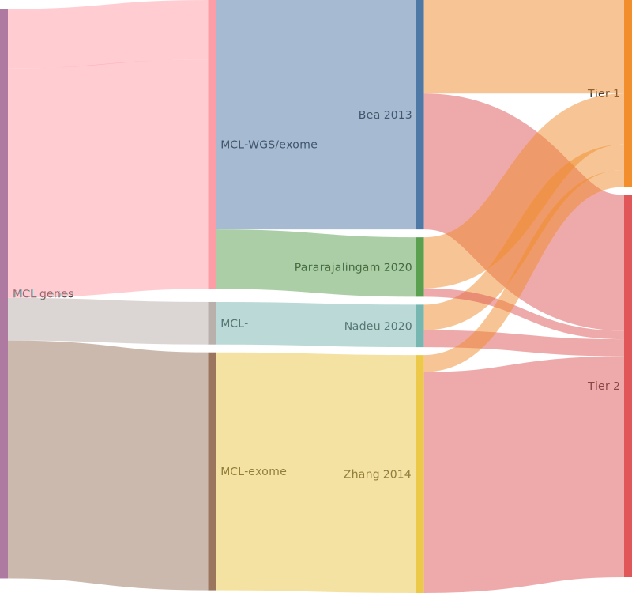

## Origins of MCL genes

## Tier 1, high-confidence MCL genes

### *23 total*

|Gene|Summary| First MCL study | Other entities | QC result |
|:-:|:--:|:-:|:-|:-|
|[ATM](ATM)|Tier 1 GE[@beaLandscapeSomaticMutations2013], FE[@camachoATMGeneInactivation2002]|[Bea et al](papers/beaLandscapeSomaticMutations2013)|[@braggioGenomicAnalysisMarginal2012; @reddyGeneticFunctionalDrivers2017]||
|[BIRC3](BIRC3)|Tier 1 GE[@beaLandscapeSomaticMutations2013], aSHM|[Bea et al](papers/beaLandscapeSomaticMutations2013)|[@arthurGenomewideDiscoverySomatic2018; @dunsCharacterizationDLBCLPMBL2021; @rossiAlterationBIRC3Multiple2011]||
|[CARD11](CARD11)|Tier 1 GE[@wuGeneticHeterogeneityPrimary2016], FE[@lenzOncogenicCARD11Mutations2008]|[Wu et al](papers/wuGeneticHeterogeneityPrimary2016)|[@lenzOncogenicCARD11Mutations2008; @morinFrequentMutationHistonemodifying2011; @yanBCRTLRSignaling2012]||
|[CCND1](CCND1)|Tier 1 GE[@beaLandscapeSomaticMutations2013]|[Bea et al](papers/beaLandscapeSomaticMutations2013)|||
|[DAZAP1](DAZAP1)|Tier 1 GE[@pararajalingamCodingNoncodingDrivers2020]|[Pararajalingam et al](papers/pararajalingamCodingNoncodingDrivers2020)|||
|[EWSR1](EWSR1)|Tier 1 GE[@pararajalingamCodingNoncodingDrivers2020]|[Pararajalingam et al](papers/pararajalingamCodingNoncodingDrivers2020)|||
|[HNRNPH1](HNRNPH1)|Tier 1 GE[@pararajalingamCodingNoncodingDrivers2020]|[Pararajalingam et al](papers/pararajalingamCodingNoncodingDrivers2020)|||
|[KMT2D](KMT2D)|Tier 1 GE[@beaLandscapeSomaticMutations2013], FE[@zhangDisruptionKMT2DPerturbs2015]|[Bea et al](papers/beaLandscapeSomaticMutations2013)|[@deschGenotypingCirculatingTumor2020; @grandeGenomewideDiscoverySomatic2019; @morinFrequentMutationHistonemodifying2011; @rossiCodingGenomeSplenic2012]||
|[MEF2B](MEF2B)|Tier 1 GE[@beaLandscapeSomaticMutations2013], FE[@ponMEF2BMutationsNonHodgkin2015], aSHM|[Bea et al](papers/beaLandscapeSomaticMutations2013)|[@morinFrequentMutationHistonemodifying2011]||
|[NFKBIE](NFKBIE)|Tier 1 GE[@pararajalingamCodingNoncodingDrivers2020], FE[@mansouriFunctionalLossIkBe2015]|[Pararajalingam et al](papers/pararajalingamCodingNoncodingDrivers2020)|[@mansouriFrequentNFKBIEDeletions2016; @morinGeneticLandscapesRelapsed2016]||
|[NOTCH1](NOTCH1)|Tier 1 GE[@beaLandscapeSomaticMutations2013], FE[@ryanCellRegulomeLinks2017]|[Bea et al](papers/beaLandscapeSomaticMutations2013)|[@loveGeneticLandscapeMutations2012; @pasqualucciAnalysisCodingGenome2011; @rossiCodingGenomeSplenic2012]||
|[NOTCH2](NOTCH2)|Tier 1 GE[@beaLandscapeSomaticMutations2013], FE[@leeGainoffunctionMutationsCopy2009]|[Bea et al](papers/beaLandscapeSomaticMutations2013)|[@rossiCodingGenomeSplenic2012; @zhangGeneticHeterogeneityDiffuse2013]||
|[NSD2](NSD2)|Tier 1 GE[@beaLandscapeSomaticMutations2013]|[Bea et al](papers/beaLandscapeSomaticMutations2013)|[@zhangGeneticHeterogeneityDiffuse2013]||
|[POT1](POT1)|Tier 1 GE[@zhangGenomicLandscapeMantle2014]|[Zhang et al](papers/zhangGenomicLandscapeMantle2014)|||
|[RB1](RB1)|Tier 1 GE[@zhangGenomicLandscapeMantle2014], FE[@pinyolInactivationRB1Mantlecell2007]|[Zhang et al](papers/zhangGenomicLandscapeMantle2014)|[@morinMutationalStructuralAnalysis2013]||
|[S1PR1](S1PR1)|Tier 1 GE[@pararajalingamCodingNoncodingDrivers2020]|[Pararajalingam et al](papers/pararajalingamCodingNoncodingDrivers2020)|[@lohrDiscoveryPrioritizationSomatic2012]||
|[SMARCA4](SMARCA4)|Tier 1 GE[@nadeuGenomicEpigenomicInsights2020b], FE[@fernandoFunctionalCharacterizationSMARCA42020]|[Nadeu et al](papers/nadeuGenomicEpigenomicInsights2020b)|[@krysiakRecurrentSomaticMutations2017; @reddyGeneticFunctionalDrivers2017; @richterRecurrentMutationID32012]||
|[SP140](SP140)|Tier 1 GE[@beaLandscapeSomaticMutations2013]|[Bea et al](papers/beaLandscapeSomaticMutations2013)|||
|[SYNE1](SYNE1)|Tier 1 GE[@nadeuGenomicEpigenomicInsights2020b]|[Nadeu et al](papers/nadeuGenomicEpigenomicInsights2020b)|||
|[TERT](TERT)|Tier 1 GE[@nadeuGenomicEpigenomicInsights2020b]|[Nadeu et al](papers/nadeuGenomicEpigenomicInsights2020b)|||
|[TLR2](TLR2)|Tier 1 GE[@beaLandscapeSomaticMutations2013]|[Bea et al](papers/beaLandscapeSomaticMutations2013)|[@chapuyMolecularSubtypesDiffuse2018]||
|[TP53](TP53)|Tier 1 GE[@beaLandscapeSomaticMutations2013], FE[@katoUnderstandingFunctionstructureFunctionmutation2003]|[Bea et al](papers/beaLandscapeSomaticMutations2013)|[@morinFrequentMutationHistonemodifying2011; @rossiCodingGenomeSplenic2012; @tiacciPervasiveMutationsJAKSTAT2018; @wildaInactivationARFMDM2p53Pathway2004]||
|[UBR5](UBR5)|Tier 1 GE[@pararajalingamCodingNoncodingDrivers2020]|[Pararajalingam et al](papers/pararajalingamCodingNoncodingDrivers2020)|[@albuquerqueEnhancingKnowledgeDiscovery2017]||

## Tier 2, low-confidence MCL genes

### *46 total*

|Gene|Summary| First MCL study | Other entities | QC result |
|:-:|:--:|:-:|:-|:-|
|[ABCA3](ABCA3)|Tier 2 GE[@beaLandscapeSomaticMutations2013]|[Bea et al](papers/beaLandscapeSomaticMutations2013)|[@zhangGeneticHeterogeneityDiffuse2013]||
|[ABCC9](ABCC9)|Tier 2 GE[@beaLandscapeSomaticMutations2013]|[Bea et al](papers/beaLandscapeSomaticMutations2013)|||
|[ANK2](ANK2)|Tier 2 GE[@zhangGenomicLandscapeMantle2014]|[Zhang et al](papers/zhangGenomicLandscapeMantle2014)|[@zhangGeneticHeterogeneityDiffuse2013]||
|[ARID1B](ARID1B)|Tier 2 GE||[@reddyGeneticFunctionalDrivers2017]||
|[ATP11C](ATP11C)|Tier 2 GE[@zhangGenomicLandscapeMantle2014]|[Zhang et al](papers/zhangGenomicLandscapeMantle2014)|||
|[B2M](B2M)|Tier 2 GE[@pararajalingamCodingNoncodingDrivers2020], FE[@challa-malladiCombinedGeneticInactivation2011]|[Pararajalingam et al](papers/pararajalingamCodingNoncodingDrivers2020)|[@morinFrequentMutationHistonemodifying2011; @reichelFlowSortingExome2015]||
|[BCOR](BCOR)|Tier 2 GE[@nadeuGenomicEpigenomicInsights2020b]|[Nadeu et al](papers/nadeuGenomicEpigenomicInsights2020b)|[@jalladesExomeSequencingIdentifies2017]||
|[CDH8](CDH8)|Tier 2 GE[@zhangGenomicLandscapeMantle2014]|[Zhang et al](papers/zhangGenomicLandscapeMantle2014)|[@reddyGeneticFunctionalDrivers2017]||
|[CHMP4C](CHMP4C)|Tier 2 GE[@beaLandscapeSomaticMutations2013]|[Bea et al](papers/beaLandscapeSomaticMutations2013)|||
|[COL11A1](COL11A1)|Tier 2 GE[@zhangGenomicLandscapeMantle2014]|[Zhang et al](papers/zhangGenomicLandscapeMantle2014)|||
|[COL16A1](COL16A1)|Tier 2 GE[@zhangGenomicLandscapeMantle2014]|[Zhang et al](papers/zhangGenomicLandscapeMantle2014)|||
|[CRYBG3](CRYBG3)|Tier 2 GE[@beaLandscapeSomaticMutations2013]|[Bea et al](papers/beaLandscapeSomaticMutations2013)|||
|[CTNNA2](CTNNA2)|Tier 2 GE[@zhangGenomicLandscapeMantle2014]|[Zhang et al](papers/zhangGenomicLandscapeMantle2014)|||
|[DCP1B](DCP1B)|Tier 2 GE[@beaLandscapeSomaticMutations2013]|[Bea et al](papers/beaLandscapeSomaticMutations2013)|||
|[DHDH](DHDH)|Tier 2 GE[@zhangGenomicLandscapeMantle2014]|[Zhang et al](papers/zhangGenomicLandscapeMantle2014)|||
|[DLC1](DLC1)|Tier 2 GE[@zhangGenomicLandscapeMantle2014]|[Zhang et al](papers/zhangGenomicLandscapeMantle2014)|||
|[DLGAP2](DLGAP2)|Tier 2 GE[@beaLandscapeSomaticMutations2013]|[Bea et al](papers/beaLandscapeSomaticMutations2013)|||
|[DNAJC6](DNAJC6)|Tier 2 GE[@beaLandscapeSomaticMutations2013]|[Bea et al](papers/beaLandscapeSomaticMutations2013)|||
|[EIF2AK4](EIF2AK4)|Tier 2 GE[@zhangGenomicLandscapeMantle2014]|[Zhang et al](papers/zhangGenomicLandscapeMantle2014)|||
|[ESX1](ESX1)|Tier 2 GE[@zhangGenomicLandscapeMantle2014]|[Zhang et al](papers/zhangGenomicLandscapeMantle2014)|||
|[FAT4](FAT4)|Tier 2 GE[@zhangGenomicLandscapeMantle2014]|[Zhang et al](papers/zhangGenomicLandscapeMantle2014)|[@morinMutationalStructuralAnalysis2013; @parryWholeExomeSequencing2013]||
|[GRIN2A](GRIN2A)|Tier 2 GE[@zhangGenomicLandscapeMantle2014]|[Zhang et al](papers/zhangGenomicLandscapeMantle2014)|||
|[HEPH](HEPH)|Tier 2 GE[@zhangGenomicLandscapeMantle2014]|[Zhang et al](papers/zhangGenomicLandscapeMantle2014)|||
|[KCNC2](KCNC2)|Tier 2 GE[@beaLandscapeSomaticMutations2013]|[Bea et al](papers/beaLandscapeSomaticMutations2013)|||
|[KIAA1671](KIAA1671)|Tier 2 GE[@beaLandscapeSomaticMutations2013]|[Bea et al](papers/beaLandscapeSomaticMutations2013)|||
|[KMT2C](KMT2C)|Tier 2 GE[@zhangGenomicLandscapeMantle2014]|[Zhang et al](papers/zhangGenomicLandscapeMantle2014)|[@sarkozyMutationalLandscapeGray2021; @zhangGeneticHeterogeneityDiffuse2013; @zhouSporadicEndemicBurkitt2019]||
|[LUZP4](LUZP4)|Tier 2 GE[@beaLandscapeSomaticMutations2013]|[Bea et al](papers/beaLandscapeSomaticMutations2013)|||
|[MRGPRF](MRGPRF)|Tier 2 GE[@zhangGenomicLandscapeMantle2014]|[Zhang et al](papers/zhangGenomicLandscapeMantle2014)|||
|[NIN](NIN)|Tier 2 GE[@zhangGenomicLandscapeMantle2014]|[Zhang et al](papers/zhangGenomicLandscapeMantle2014)|||
|[OGDHL](OGDHL)|Tier 2 GE[@zhangGenomicLandscapeMantle2014]|[Zhang et al](papers/zhangGenomicLandscapeMantle2014)|||
|[PCDHB2](PCDHB2)|Tier 2 GE[@zhangGenomicLandscapeMantle2014]|[Zhang et al](papers/zhangGenomicLandscapeMantle2014)|||
|[PCSK2](PCSK2)|Tier 2 GE[@beaLandscapeSomaticMutations2013]|[Bea et al](papers/beaLandscapeSomaticMutations2013)|||
|[PDLIM3](PDLIM3)|Tier 2 GE[@beaLandscapeSomaticMutations2013]|[Bea et al](papers/beaLandscapeSomaticMutations2013)|||
|[PLXNB3](PLXNB3)|Tier 2 GE[@zhangGenomicLandscapeMantle2014]|[Zhang et al](papers/zhangGenomicLandscapeMantle2014)|[@spinaGeneticsNodalMarginal2016]||
|[RGS4](RGS4)|Tier 2 GE[@beaLandscapeSomaticMutations2013]|[Bea et al](papers/beaLandscapeSomaticMutations2013)|||
|[ROBO2](ROBO2)|Tier 2 GE[@zhangGenomicLandscapeMantle2014]|[Zhang et al](papers/zhangGenomicLandscapeMantle2014)|||
|[SALL3](SALL3)|Tier 2 GE[@zhangGenomicLandscapeMantle2014]|[Zhang et al](papers/zhangGenomicLandscapeMantle2014)|[@loveGeneticLandscapeMutations2012]||
|[SI](SI)|Tier 2 GE[@zhangGenomicLandscapeMantle2014]|[Zhang et al](papers/zhangGenomicLandscapeMantle2014)|||
|[SLC17A6](SLC17A6)|Tier 2 GE[@beaLandscapeSomaticMutations2013]|[Bea et al](papers/beaLandscapeSomaticMutations2013)|||
|[SMARCB1](SMARCB1)|Tier 2 GE[@nadeuGenomicEpigenomicInsights2020b]|[Nadeu et al](papers/nadeuGenomicEpigenomicInsights2020b)|||
|[SMC1A](SMC1A)|Tier 2 GE[@zhangGenomicLandscapeMantle2014]|[Zhang et al](papers/zhangGenomicLandscapeMantle2014)|||
|[TBC1D26](TBC1D26)|Tier 2 GE[@zhangGenomicLandscapeMantle2014]|[Zhang et al](papers/zhangGenomicLandscapeMantle2014)|||
|[TNRC6B](TNRC6B)|Tier 2 GE[@beaLandscapeSomaticMutations2013]|[Bea et al](papers/beaLandscapeSomaticMutations2013)|||
|[TRPM6](TRPM6)|Tier 2 GE[@beaLandscapeSomaticMutations2013]|[Bea et al](papers/beaLandscapeSomaticMutations2013)|||
|[ZNF117](ZNF117)|Tier 2 GE[@zhangGenomicLandscapeMantle2014]|[Zhang et al](papers/zhangGenomicLandscapeMantle2014)|||
|[ZNF296](ZNF296)|Tier 2 GE[@zhangGenomicLandscapeMantle2014]|[Zhang et al](papers/zhangGenomicLandscapeMantle2014)|||

## Tier 3, retired MCL genes

### *0 total*

|Gene|Summary| First MCL study | Other entities | QC result |
|:-:|:--:|:-:|:-|:-|

# References
