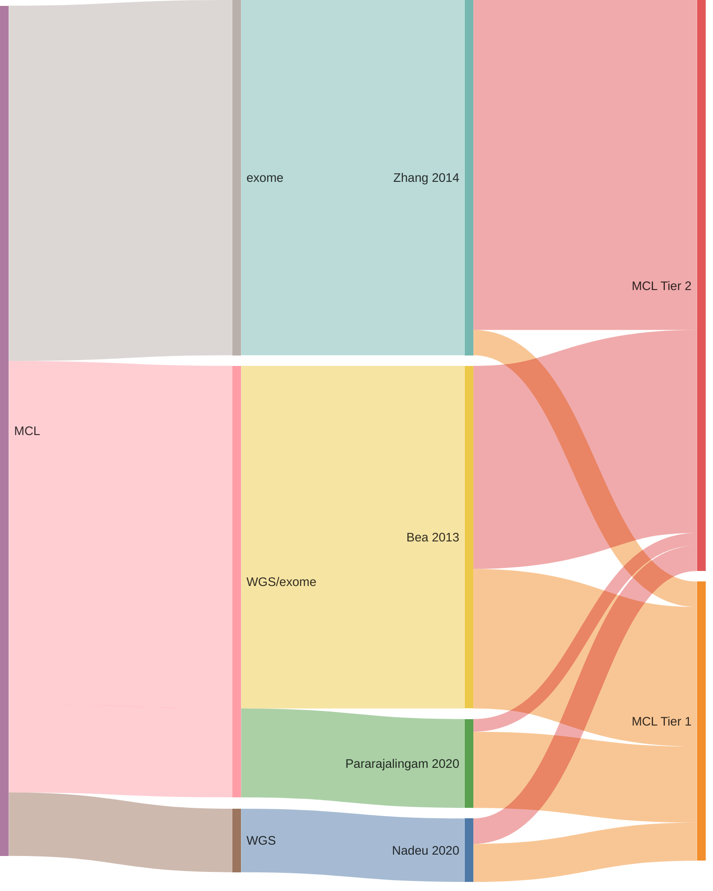

```mermaid
---
config:
  sankey:
    showValues: false
    linkColor: target
    width: 800
    height: 1000
    nodeAlignment: right
---
sankey-beta
Nadeu 2020, MCL Tier 1, 3
Nadeu 2020, MCL Tier 2, 2
Zhang 2014, MCL Tier 1, 2
Zhang 2014, MCL Tier 2, 26
Pararajalingam 2020, MCL Tier 1, 6
Pararajalingam 2020, MCL Tier 2, 1
Bea 2013, MCL Tier 1, 11
Bea 2013, MCL Tier 2, 16
MCL, WGS/exome, 27
WGS/exome, Bea 2013, 27
MCL, WGS, 5
WGS, Nadeu 2020, 5
MCL, exome, 28
exome, Zhang 2014, 28
MCL, WGS/exome, 7
WGS/exome, Pararajalingam 2020, 7
```
