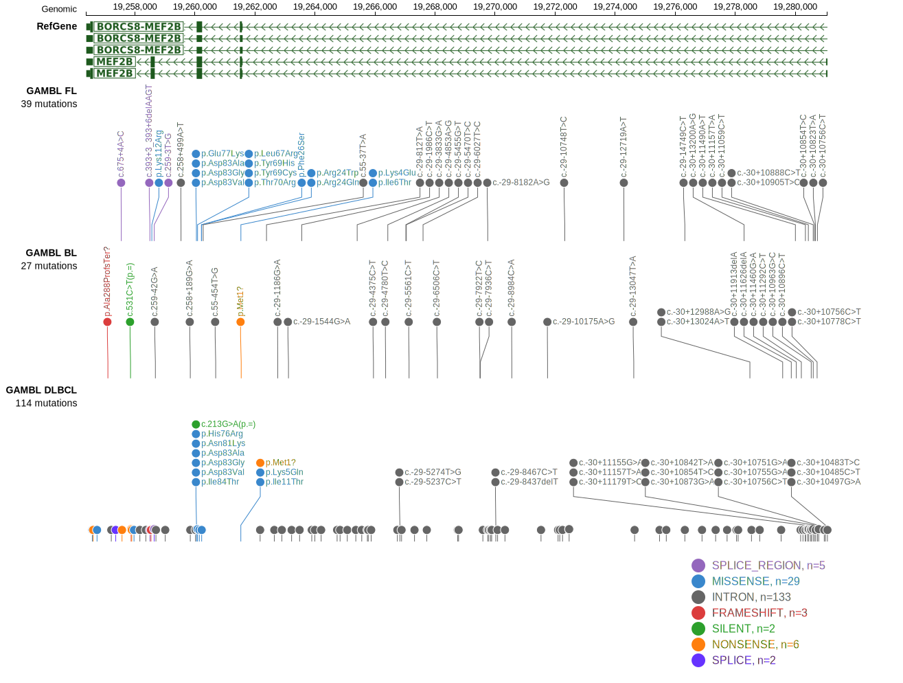
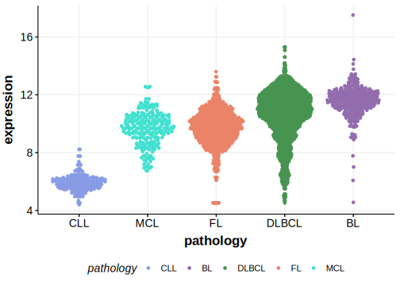

# MEF2B
## Overview
MEF2B is one of [a number of genes](https://github.com/morinlab/LLMPP/wiki/ashm) affected by aberrant somatic hypermutation in B-cell lymphomas, which complicates the interpretation of mutations at this locus. MEF2B mutations are observed in a significant subset of follicular lymphoma cases, as well as in other B-cell lymphomas, including diffuse large B-cell lymphoma (DLBCL) and MCL.1 MEF2B has known hotspot mutations that affect multiple distinct domains of the protein. 

## Relevance tier by entity

|Entity|Tier|Description                           |
|:------:|:----:|--------------------------------------|
|BL    |2-a | aSHM target; Although recurrent, the relevance of mutations in BL is tenuous |
|DLBCL |1-a | aSHM target and high-confidence DLBCL gene            |
|FL    |1-a | aSHM target and high-confidence FL gene               |

## Mutation incidence in large patient cohorts (GAMBL reanalysis)

|Entity|source               |frequency (%)|
|:------:|:---------------------:|:-------------:|
|BL    |GAMBL genomes+capture| 1.39        |
|BL    |Thomas cohort        | 0.80        |
|BL    |Panea cohort         | 3.00        |
|DLBCL |GAMBL genomes        |11.28        |
|DLBCL |Schmitz cohort       | 9.79        |
|DLBCL |Reddy cohort         | 5.91        |
|DLBCL |Chapuy cohort        | 5.56        |
|FL    |GAMBL genomes        |12.93        |
|MCL   |GAMBL genomes        | 5.69        |

## Mutation pattern and selective pressure estimates

|Entity|aSHM|Significant selection|dN/dS (missense)|dN/dS (nonsense)|
|:------:|:----:|:---------------------:|:----------------:|:----------------:|
|BL    |Yes |No                   |  2.449         |  0.000         |
|DLBCL |Yes |Yes                  | 22.928         |171.945         |
|FL    |Yes |Yes                  |111.098         |  0.000         |

## aSHM regions

|chr_name|hg19_start|hg19_end|region                                                                                    |regulatory_comment|
|:--------:|:----------:|:--------:|:------------------------------------------------------------------------------------------:|:------------------:|
|chr19   |19279635  |19281441|[TSS](https://genome.ucsc.edu/s/rdmorin/GAMBL%20hg19?position=chr19%3A19279635%2D19281441)|active_promoter   |

> [!NOTE]
> First described in DLBCL in 2011 by [Morin RD](https://pubmed.ncbi.nlm.nih.gov/21796119). First described in FL in 2011 by [Morin RD](https://pubmed.ncbi.nlm.nih.gov/21796119). First described in MCL in 2013 by [Beà S](https://pubmed.ncbi.nlm.nih.gov/24145436)

## MEF2B Hotspots

### DNA-Binding Domain (MADS-box and MEF2 Domain):
**R24 (Arginine 24)** A recurrent hotspot mutation. This position is located within the MADS-box domain, which is crucial for DNA binding and dimerization with other MEF2 family members.

**R30 (Arginine 30)** Another recurrent hotspot in the MADS-box domain. Mutations at this site can disrupt DNA binding and affect the transcriptional activity of MEF2B.

### Transcriptional Activation Domain:
**N81 (Asparagine 81)** A mutation hotspot within the transcriptional activation domain. Alterations at this position can enhance the transcriptional activity of MEF2B, contributing to the overexpression of target genes involved in cell survival and proliferation.

## Functional Impact of MEF2B Mutations
### Altered Transcriptional Activity:
Mutations in the DNA-binding domain, such as those at R24 and R30, can alter the binding affinity and specificity of MEF2B for its target DNA sequences. This can lead to changes in the expression of genes that are critical for cell growth, differentiation, and survival.
Mutations in the transcriptional activation domain, like N81, can enhance the ability of MEF2B to activate transcription, which may lead to the upregulation of oncogenes and survival pathways.

## MEF2B Hot Spots from GAMBL

| Chromosome |Coordinate (hg19) | ref>alt | HGVSp | 
 | :---:| :---: | :--: | :---: |
| chr19 | 19260066 | T>C | H76R |
| chr19 | 19260064 | C>T | E77K |
| chr19 | 19260050 | G>T | N81K |
| chr19 | 19260045 | T>G | D83A |
| chr19 | 19260045 | T>C | D83G |
| chr19 | 19260045 | T>A | D83V |
| chr19 | 19260042 | A>G | I84T |

View coding variants in ProteinPaint [hg19](https://morinlab.github.io/LLMPP/GAMBL/MEF2B_protein.html)  or [hg38](https://morinlab.github.io/LLMPP/GAMBL/MEF2B_protein_hg38.html)

View all variants in GenomePaint [hg19](https://morinlab.github.io/LLMPP/GAMBL/MEF2B.html)  or [hg38](https://morinlab.github.io/LLMPP/GAMBL/MEF2B_hg38.html)

## MEF2B Expression

## References

1. *Morin RD, Mendez-Lago M, Mungall AJ, Goya R, Mungall KL, Corbett RD, Johnson NA, Severson TM, Chiu R, Field M, Jackman S, Krzywinski M, Scott DW, Trinh DL, Tamura-Wells J, Li S, Firme MR, Rogic S, Griffith M, Chan S, Yakovenko O, Meyer IM, Zhao EY, Smailus D, Moksa M, Chittaranjan S, Rimsza L, Brooks-Wilson A, Spinelli JJ, Ben-Neriah S, Meissner B, Woolcock B, Boyle M, McDonald H, Tam A, Zhao Y, Delaney A, Zeng T, Tse K, Butterfield Y, Birol I, Holt R, Schein J, Horsman DE, Moore R, Jones SJ, Connors JM, Hirst M, Gascoyne RD, Marra MA. Frequent mutation of histone-modifying genes in non-Hodgkin lymphoma. Nature. 2011 Jul 27;476(7360):298-303. doi: 10.1038/nature10351. PMID: 21796119; PMCID: PMC3210554.*

