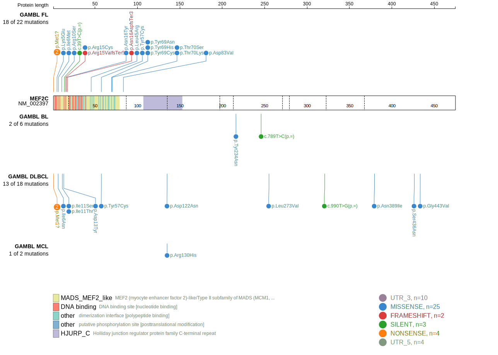
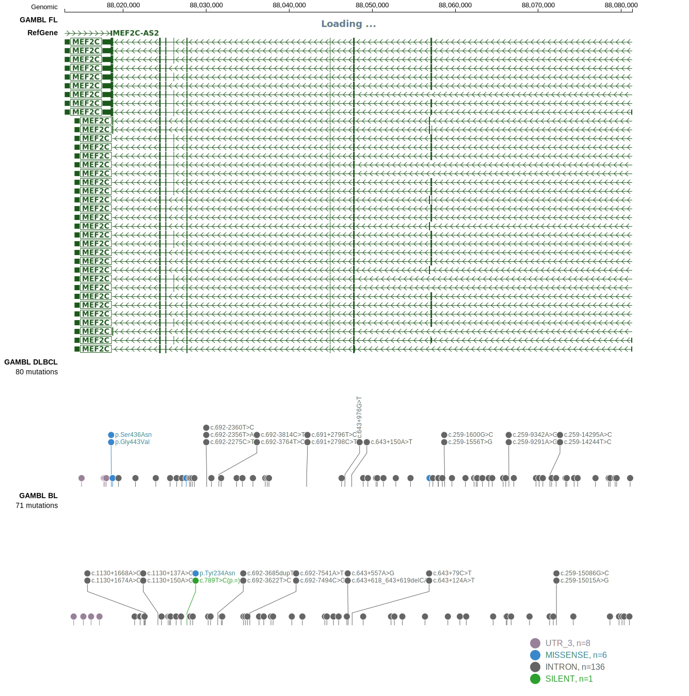

MEF2C is one of [a number of genes](https://github.com/morinlab/LLMPP/wiki/ashm) affected by aberrant somatic hypermutation in B-cell lymphomas, which complicates the interpretation of mutations at this locus.

## Mutation tier

|Entity|Tier|Description               |
|:------:|:----:|--------------------------|
|DLBCL |1-a | aSHM target and high-confidence DLBCL gene|
|FL    |1-a | aSHM target and high-confidence FL gene   |
## Mutation incidence

|Entity|source        |frequency (%)|
|:------:|:--------------:|:-------------:|
|DLBCL |GAMBL genomes |3.44         |
|DLBCL |Schmitz cohort|1.91         |
|DLBCL |Reddy cohort  |1.70         |
|DLBCL |Chapuy cohort |2.99         |
|FL    |GAMBL genomes |6.24         |

## Mutation pattern

|Entity|aSHM|Significant selection|dN/dS (missense)|dN/dS (nonsense)|
|:------:|:----:|:---------------------:|:----------------:|:----------------:|
|BL    |Yes |No                   | 3.687          | 0.000          |
|DLBCL |Yes |No                   | 9.617          |13.957          |
|FL    |Yes |Yes                  |36.127          | 0.000          |

## aSHM regions

|chr_name|hg19_start|hg19_end|region                                                                                     |regulatory_comment|
|:--------:|:----------:|:--------:|:-------------------------------------------------------------------------------------------:|:------------------:|
|chr5    |88131209  |88174373|[TSS-3](https://genome.ucsc.edu/s/rdmorin/GAMBL%20hg19?position=chr5%3A88131209%2D88174373)|active_promoter   |
|chr5    |88174374  |88182243|[TSS-2](https://genome.ucsc.edu/s/rdmorin/GAMBL%20hg19?position=chr5%3A88174374%2D88182243)|active_promoter   |
|chr5    |88182244  |88206620|[TSS-1](https://genome.ucsc.edu/s/rdmorin/GAMBL%20hg19?position=chr5%3A88182244%2D88206620)|active_promoter   |

View coding variants in ProteinPaint [hg19](https://www.bcgsc.ca/downloads/morinlab/GAMBL/test/genes/MEF2C_protein.html)  or [hg38](https://www.bcgsc.ca/downloads/morinlab/GAMBL/test/genes/MEF2C_protein_hg38.html)

View all variants in GenomePaint [hg19](https://www.bcgsc.ca/downloads/morinlab/GAMBL/test/genes/MEF2C.html)  or [hg38](https://www.bcgsc.ca/downloads/morinlab/GAMBL/test/genes/MEF2C_hg38.html)

