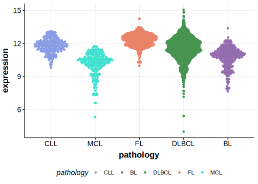

[[_TOC_]]

## Overview
MEF2C is one of [a number of genes](https://github.com/morinlab/LLMPP/wiki/ashm) affected by aberrant somatic hypermutation in B-cell lymphomas, which complicates the interpretation of mutations at this locus. 
Mutations in this gene were first described in DLBCL by [Arthur et al](papers/arthurGenomewideDiscoverySomatic2018.md).[@arthurGenomewideDiscoverySomatic2018]

## Relevance tier by entity

[[include:tables/table1_MEF2C.md]]

## Mutation incidence in large patient cohorts (GAMBL reanalysis)

### DLBCL
[[include:tables/DLBCL_MEF2C.md]]

### DLBCL
[[include:tables/DLBCL_MEF2C.md]]

## Mutation pattern and selective pressure estimates

[[include:tables/dnds_MEF2C.md]]

## aSHM regions

|chr_name|hg19_start|hg19_end|region                                                                                     |regulatory_comment|
|:--------:|:----------:|:--------:|:-------------------------------------------------------------------------------------------:|:------------------:|
|chr5    |88131209  |88174373|[TSS-3](https://genome.ucsc.edu/s/rdmorin/GAMBL%20hg19?position=chr5%3A88131209%2D88174373)|active_promoter   |
|chr5    |88174374  |88182243|[TSS-2](https://genome.ucsc.edu/s/rdmorin/GAMBL%20hg19?position=chr5%3A88174374%2D88182243)|active_promoter   |
|chr5    |88182244  |88206620|[TSS-1](https://genome.ucsc.edu/s/rdmorin/GAMBL%20hg19?position=chr5%3A88182244%2D88206620)|active_promoter   |

[[include:browser_MEF2C.md]]

## Expression

[[include:tables/mermaid_MEF2C.md]]

## References

<!-- ORIGIN: arthurGenomewideDiscoverySomatic2018 -->
<!-- DLBCL: arthurGenomewideDiscoverySomatic2018 -->
