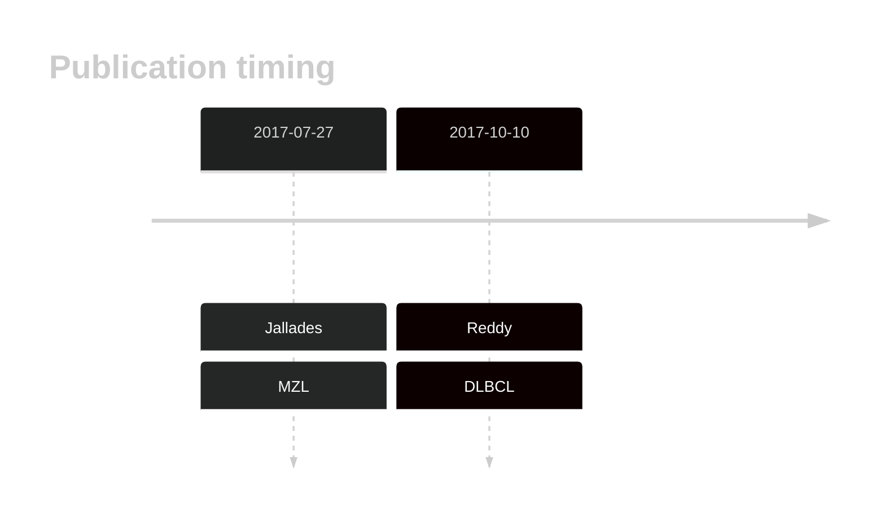

# MGA

## Overview
MGA acts as a transcriptional repressor and interacts with MYC, a well-known oncogene. Mutations in MGA have been described in DLBCL.1 One study suggested MGA mutations were more common in DLBCLs in patients of African ancestry.2 The mutation pattern in MGA is consistent with a role as a tumour suppressor gene. 

## History

## Relevance tier by entity

|Entity|Tier|Description               |
|:------:|:----:|--------------------------|
||2|relevance in MZL not firmly established[@jalladesExomeSequencingIdentifies2017]|
| |1   |high-confidence DLBCL gene[@reddyGeneticFunctionalDrivers2017]|

## Mutation incidence in large patient cohorts (GAMBL reanalysis)

[[include:DLBCL_MGA.md]]

## Mutation pattern and selective pressure estimates

|Entity|aSHM|Significant selection|dN/dS (missense)|dN/dS (nonsense)|
|:------:|:----:|:---------------------:|:----------------:|:----------------:|
|DLBCL |No  |No                   |1.432           |12.504          |
|BL    |No  |No                   |2.443           | 3.733          |
|FL    |No  |No                   |0.000           | 0.000          |

View coding variants in ProteinPaint [hg19](https://morinlab.github.io/LLMPP/GAMBL/MGA_protein.html)  or [hg38](https://morinlab.github.io/LLMPP/GAMBL/MGA_protein_hg38.html)

View all variants in GenomePaint [hg19](https://morinlab.github.io/LLMPP/GAMBL/MGA.html)  or [hg38](https://morinlab.github.io/LLMPP/GAMBL/MGA_hg38.html)

## MGA Expression

## References

<!-- ORIGIN: zhangGeneticHeterogeneityDiffuse2013 -->
<!-- MZL: jalladesExomeSequencingIdentifies2017 -->
<!-- DLBCL: zhangGeneticHeterogeneityDiffuse2013 -->
