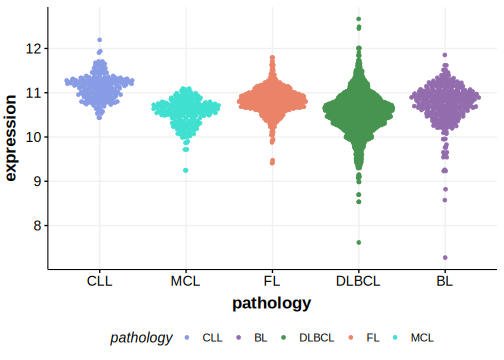

# MGA
## Overview
MGA acts as a transcriptional repressor and interacts with MYC, a well-known oncogene. Mutations in MGA have been described in DLBCL.1 One study suggested MGA mutations were more common in DLBCLs in patients of African ancestry.2 

## Relevance tier by entity

|Entity|Tier|Description               |
|:------:|:----:|--------------------------|
|DLBCL |1   |high-confidence DLBCL gene|

## Mutation incidence in large patient cohorts (GAMBL reanalysis)

|Entity|source        |frequency (%)|
|:------:|:--------------:|:-------------:|
|DLBCL |GAMBL genomes |4.02         |
|DLBCL |Schmitz cohort|7.23         |
|DLBCL |Reddy cohort  |4.70         |
|DLBCL |Chapuy cohort |3.42         |

## Mutation pattern and selective pressure estimates

|Entity|aSHM|Significant selection|dN/dS (missense)|dN/dS (nonsense)|
|:------:|:----:|:---------------------:|:----------------:|:----------------:|
|BL    |No  |No                   |2.443           | 3.733          |
|DLBCL |No  |No                   |1.432           |12.504          |
|FL    |No  |No                   |0.000           | 0.000          |

> [!NOTE]
> First described in DLBCL in 2013 by [Zhang J](https://pubmed.ncbi.nlm.nih.gov/23292937)

View coding variants in ProteinPaint [hg19](https://morinlab.github.io/LLMPP/GAMBL/MGA_protein.html)  or [hg38](https://morinlab.github.io/LLMPP/GAMBL/MGA_protein_hg38.html)

View all variants in GenomePaint [hg19](https://morinlab.github.io/LLMPP/GAMBL/MGA.html)  or [hg38](https://morinlab.github.io/LLMPP/GAMBL/MGA_hg38.html)

## MGA Expression

## References
1. *Zhang J, Grubor V, Love CL, Banerjee A, Richards KL, Mieczkowski PA, Dunphy C, Choi W, Au WY, Srivastava G, Lugar PL, Rizzieri DA, Lagoo AS, Bernal-Mizrachi L, Mann KP, Flowers C, Naresh K, Evens A, Gordon LI, Czader M, Gill JI, Hsi ED, Liu Q, Fan A, Walsh K, Jima D, Smith LL, Johnson AJ, Byrd JC, Luftig MA, Ni T, Zhu J, Chadburn A, Levy S, Dunson D, Dave SS. Genetic heterogeneity of diffuse large B-cell lymphoma. Proc Natl Acad Sci U S A. 2013 Jan 22;110(4):1398-403. doi: 10.1073/pnas.1205299110. Epub 2013 Jan 4. PMID: 23292937; PMCID: PMC3557051.*
2. *Lee MJ, Koff JL, Switchenko JM, Jhaney CI, Harkins RA, Patel SP, Dave SS, Flowers CR. Genome-defined African ancestry is associated with distinct mutations and worse survival in patients with diffuse large B-cell lymphoma. Cancer. 2020 Aug 1;126(15):3493-3503. doi: 10.1002/cncr.32866. Epub 2020 May 29. PMID: 32469082; PMCID: PMC7494053.*

