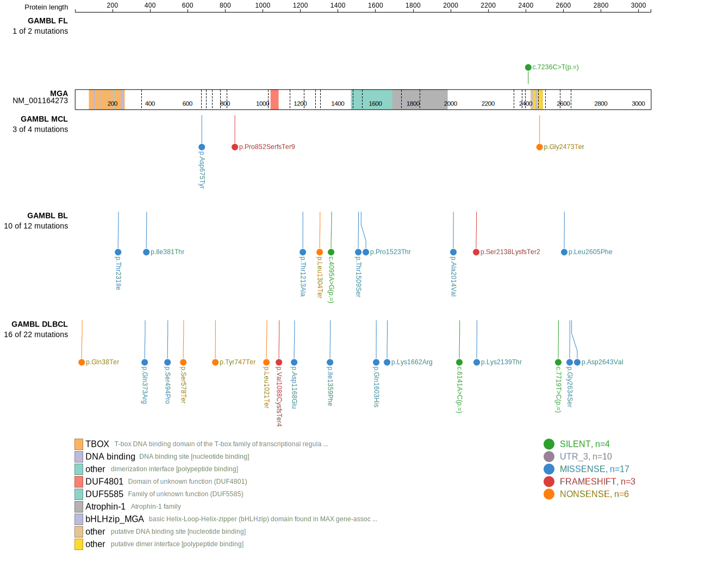
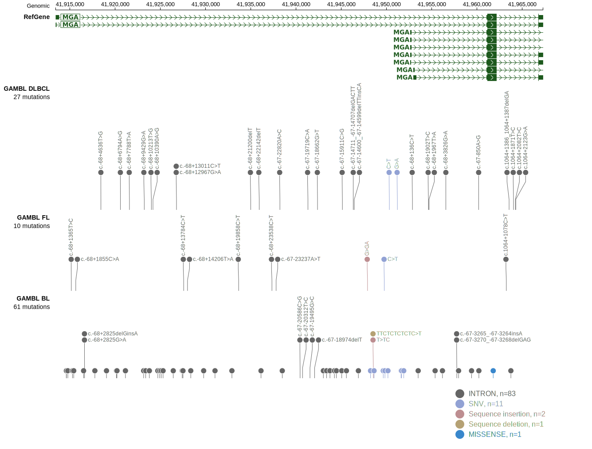

# MGA

## Relevance tier by entity

|Entity|Tier|Description               |
|:------:|:----:|--------------------------|
|DLBCL |1   |high-confidence DLBCL gene|

## Mutation incidence in large patient cohorts (GAMBL reanalysis)

|Entity|source        |frequency (%)|
|:------:|:--------------:|:-------------:|
|DLBCL |GAMBL genomes |4.02         |
|DLBCL |Schmitz cohort|7.23         |
|DLBCL |Reddy cohort  |4.70         |
|DLBCL |Chapuy cohort |3.42         |

## Mutation pattern and selective pressure estimates

|Entity|aSHM|Significant selection|dN/dS (missense)|dN/dS (nonsense)|
|:------:|:----:|:---------------------:|:----------------:|:----------------:|
|BL    |No  |No                   |2.443           | 3.733          |
|DLBCL |No  |No                   |1.432           |12.504          |
|FL    |No  |No                   |0.000           | 0.000          |

> [!NOTE]
> First described in DLBCL in 2013 by [Zhang J](https://pubmed.ncbi.nlm.nih.gov/23292937)

View coding variants in ProteinPaint [hg19](https://morinlab.github.io/LLMPP/GAMBL/MGA_protein.html)  or [hg38](https://morinlab.github.io/LLMPP/GAMBL/MGA_protein_hg38.html)

View all variants in GenomePaint [hg19](https://morinlab.github.io/LLMPP/GAMBL/MGA.html)  or [hg38](https://morinlab.github.io/LLMPP/GAMBL/MGA_hg38.html)

