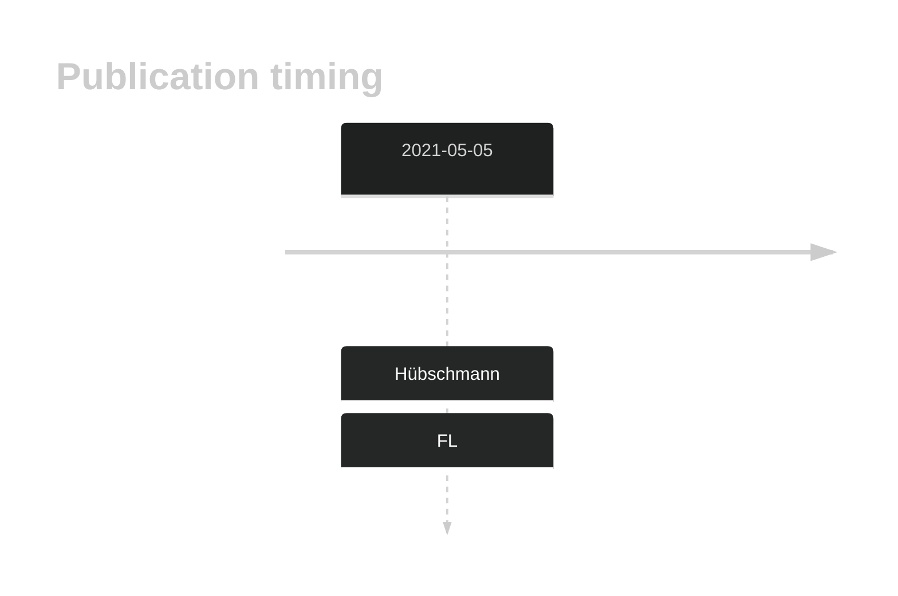

# MGEA5

## History
Mutations in this gene were first described in DLBCL and FL in 2021 by Hübschmann et al.1

## Relevance tier by entity

|Entity|Tier|Description                           |
|:------:|:----:|--------------------------------------|
|    |2   |relevance in FL not firmly established[@hubschmannMutationalMechanismsShaping2021b]|

## Mutation incidence in large patient cohorts (GAMBL reanalysis)

|Entity|source       |frequency (%)|
|:------:|:-------------:|:-------------:|
|FL    |GAMBL genomes|1.85         |

## Mutation pattern and selective pressure estimates

|Entity|aSHM|Significant selection|dN/dS (missense)|dN/dS (nonsense)|
|:------:|:----:|:---------------------:|:----------------:|:----------------:|
|BL    |No  |No                   |1.383           |0               |
|DLBCL |No  |No                   |2.152           |0               |
|FL    |No  |No                   |3.398           |0               |

View coding variants in ProteinPaint [hg19](https://morinlab.github.io/LLMPP/GAMBL/MGEA5_protein.html)  or [hg38](https://morinlab.github.io/LLMPP/GAMBL/MGEA5_protein_hg38.html)

View all variants in GenomePaint [hg19](https://morinlab.github.io/LLMPP/GAMBL/MGEA5.html)  or [hg38](https://morinlab.github.io/LLMPP/GAMBL/MGEA5_hg38.html)

## MGEA5 Expression

## All Mutations

[SP193655](https://www.bcgsc.ca/downloads/morinlab/GAMBL/MALY/SP193655.html)
[SP116618](https://www.bcgsc.ca/downloads/morinlab/GAMBL/MALY/SP116618.html)
[SP116649](https://www.bcgsc.ca/downloads/morinlab/GAMBL/MALY/SP116649.html)

## References

<!-- ORIGIN: hubschmannMutationalMechanismsShaping2021b -->
<!-- FL: hubschmannMutationalMechanismsShaping2021b -->
