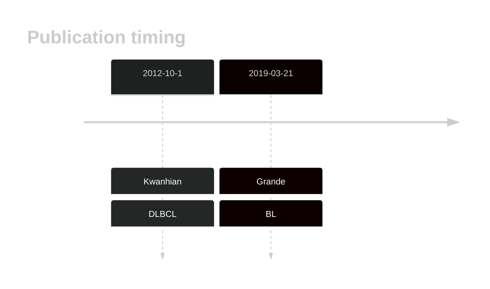

# MIR142
## History

## Relevance tier by entity

|Entity|Tier|Description                              |
|:------:|:----:|-----------------------------------------|
|    |2   |relevance in BL not firmly established   |
| |2   |relevance in DLBCL not firmly established|

## Mutation incidence in large patient cohorts (GAMBL reanalysis)

|Entity|source               |frequency (%)|
|:------:|:---------------------:|:-------------:|
|BL    |GAMBL genomes+capture|NA           |
|BL    |Thomas cohort        |NA           |
|BL    |Panea cohort         |NA           |
|DLBCL |GAMBL genomes        |NA           |
|DLBCL |Schmitz cohort       |NA           |
|DLBCL |Reddy cohort         |NA           |
|DLBCL |Chapuy cohort        |NA           |

## Mutation pattern and selective pressure estimates

|

> [!NOTE]
> First described in BL in 2019 by [Grande BM](https://pubmed.ncbi.nlm.nih.gov/30617194). First described in DLBCL in 2012 by [Kwanhian W](https://pubmed.ncbi.nlm.nih.gov/23342264)
## MIR142 Expression

<!-- ORIGIN: kwanhianMicroRNA142Mutated202012b -->
<!-- BL: grandeGenomewideDiscoverySomatic2019 -->
<!-- DLBCL: kwanhianMicroRNA142Mutated202012b -->
## References
1.  Kwanhian W, Lenze D, Alles J, Motsch N, Barth S, Döll C, Imig J, Hummel M, Tinguely M, Trivedi P, Lulitanond V, Meister G, Renner C, Grässer FA. MicroRNA-142 is mutated in about 20% of diffuse large B-cell lymphoma. Cancer Med. 2012 Oct;1(2):141–155. PMCID: PMC3544448
2.  Grande BM, Gerhard DS, Jiang A, Griner NB, Abramson JS, Alexander TB, Allen H, Ayers LW, Bethony JM, Bhatia K, Bowen J, Casper C, Choi JK, Culibrk L, Davidsen TM, Dyer MA, Gastier-Foster JM, Gesuwan P, Greiner TC, Gross TG, Hanf B, Harris NL, He Y, Irvin JD, Jaffe ES, Jones SJM, Kerchan P, Knoetze N, Leal FE, Lichtenberg TM, Ma Y, Martin JP, Martin MR, Mbulaiteye SM, Mullighan CG, Mungall AJ, Namirembe C, Novik K, Noy A, Ogwang MD, Omoding A, Orem J, Reynolds SJ, Rushton CK, Sandlund JT, Schmitz R, Taylor C, Wilson WH, Wright GW, Zhao EY, Marra MA, Morin RD, Staudt LM. Genome-wide discovery of somatic coding and noncoding mutations in pediatric endemic and sporadic Burkitt lymphoma. Blood. 2019 Mar 21;133(12):1313–1324. 
