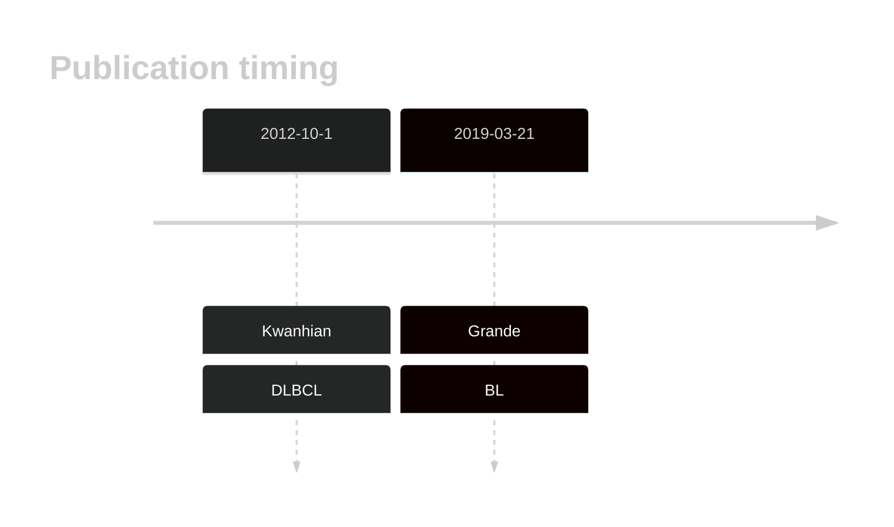
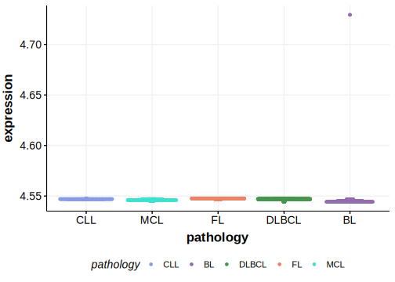

# MIR142

## History

## Relevance tier by entity

|Entity|Tier|Description                              |
|:------:|:----:|-----------------------------------------|
|    |2   |relevance in BL not firmly established   [@grandeGenomewideDiscoverySomatic2019]|
| |2   |relevance in DLBCL not firmly established[@kwanhianMicroRNA142Mutated202012b]|

## Mutation incidence in large patient cohorts (GAMBL reanalysis)

|Entity|source               |frequency (%)|
|:------:|:---------------------:|:-------------:|
|BL    |GAMBL genomes+capture|NA           |
|BL    |Thomas cohort        |NA           |
|BL    |Panea cohort         |NA           |
|DLBCL |GAMBL genomes        |NA           |
|DLBCL |Schmitz cohort       |NA           |
|DLBCL |Reddy cohort         |NA           |
|DLBCL |Chapuy cohort        |NA           |

## Mutation pattern and selective pressure estimates

|

## MIR142 Expression

<!-- ORIGIN: kwanhianMicroRNA142Mutated202012b -->
<!-- BL: grandeGenomewideDiscoverySomatic2019 -->
<!-- DLBCL: kwanhianMicroRNA142Mutated202012b -->

## References
