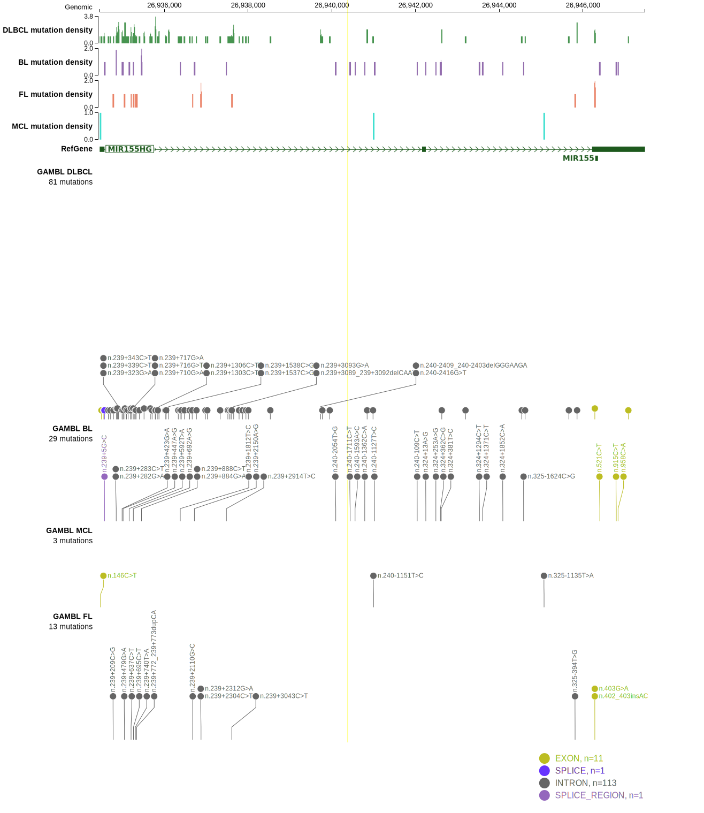

# MIR155HG

## Relevance tier by entity

|Entity|Tier|Description                              |
|:------:|:----:|-----------------------------------------|
|DLBCL |2-a | aSHM target; Although recurrent, the relevance of mutations in DLBCL is tenuous |

## Mutation incidence in large patient cohorts (GAMBL reanalysis)

|Entity|source        |frequency (%)|
|:------:|:--------------:|:-------------:|
|DLBCL |GAMBL genomes |0.19         |
|DLBCL |Schmitz cohort|  NA         |
|DLBCL |Reddy cohort  |  NA         |
|DLBCL |Chapuy cohort |  NA         |

## Mutation pattern and selective pressure estimates

|

## aSHM regions

|chr_name|hg19_start|hg19_end|region                                                                                    |regulatory_comment|
|:--------:|:----------:|:--------:|:------------------------------------------------------------------------------------------:|:------------------:|
|chr21   |26934372  |26937651|[TSS](https://genome.ucsc.edu/s/rdmorin/GAMBL%20hg19?position=chr21%3A26934372%2D26937651)|active_promoter   |

View coding variants in ProteinPaint [hg19](https://morinlab.github.io/LLMPP/GAMBL/MIR155HG_protein.html)  or [hg38](https://morinlab.github.io/LLMPP/GAMBL/MIR155HG_protein_hg38.html)

View all variants in GenomePaint [hg19](https://morinlab.github.io/LLMPP/GAMBL/MIR155HG.html)  or [hg38](https://morinlab.github.io/LLMPP/GAMBL/MIR155HG_hg38.html)

