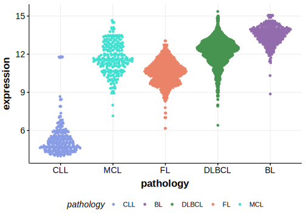

[[_TOC_]]

## Relevance tier by entity

|Entity|Tier|Description                           |
|:------:|:----:|--------------------------------------|
|    |2   |relevance in BL not firmly established[@schmitzBurkittLymphomaPathogenesis2012]|
|    |2   |relevance in FL not firmly established[@russler-germainMutationsAssociatedProgression2023]|

## Mutation incidence in large patient cohorts (GAMBL reanalysis)

|Entity|source               |frequency (%)|
|:------:|:---------------------:|:-------------:|
|BL    |GAMBL genomes+capture|6.00         |
|BL    |Thomas cohort        |  NA         |
|BL    |Panea cohort         |  NA         |
|FL    |GAMBL genomes        |1.15         |

## Mutation pattern and selective pressure estimates

[[include:dnds_MKI67.md]]

[[include:browser_MKI67.md]]

## Expression

<!-- ORIGIN: schmitzBurkittLymphomaPathogenesis2012 -->
<!-- BL: schmitzBurkittLymphomaPathogenesis2012 -->
<!-- FL: russler-germainMutationsAssociatedProgression2023b -->

[[include:mermaid_MKI67.md]]

## References
