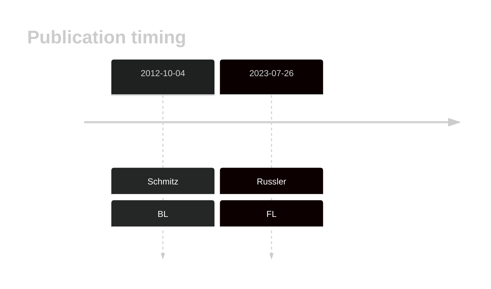
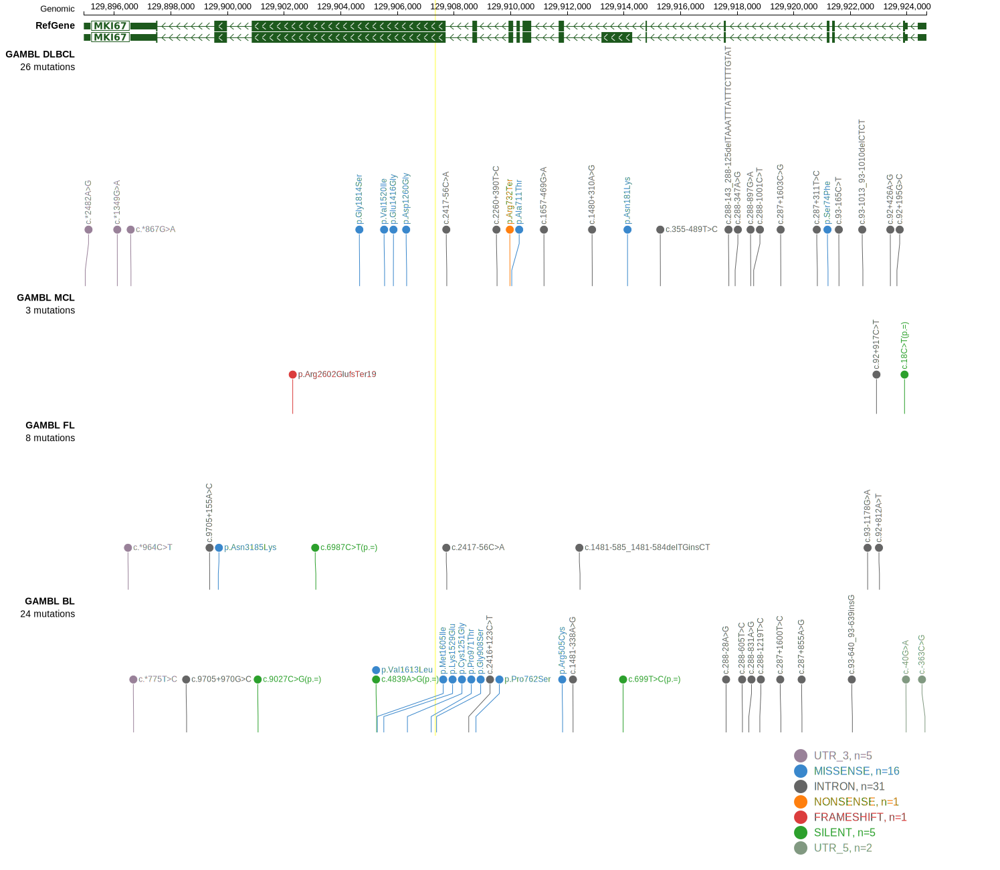

# MKI67
## History

## Relevance tier by entity

|Entity|Tier|Description                           |
|:------:|:----:|--------------------------------------|
|    |2   |relevance in BL not firmly established|
|    |2   |relevance in FL not firmly established|

## Mutation incidence in large patient cohorts (GAMBL reanalysis)

|Entity|source               |frequency (%)|
|:------:|:---------------------:|:-------------:|
|BL    |GAMBL genomes+capture|6.00         |
|BL    |Thomas cohort        |  NA         |
|BL    |Panea cohort         |  NA         |
|FL    |GAMBL genomes        |1.15         |

## Mutation pattern and selective pressure estimates

|Entity|aSHM|Significant selection|dN/dS (missense)|dN/dS (nonsense)|
|:------:|:----:|:---------------------:|:----------------:|:----------------:|
|BL    |No  |No                   |1.547           |0               |
|DLBCL |No  |No                   |1.029           |0               |
|FL    |No  |No                   |0.987           |0               |

> [!NOTE]
> First described in BL in 2022 by [Burkhardt B](https://pubmed.ncbi.nlm.nih.gov/35794096). First described in FL in 2023 by [Russler-Germain DA](https://pubmed.ncbi.nlm.nih.gov/37493986)

View coding variants in ProteinPaint [hg19](https://morinlab.github.io/LLMPP/GAMBL/MKI67_protein.html)  or [hg38](https://morinlab.github.io/LLMPP/GAMBL/MKI67_protein_hg38.html)

View all variants in GenomePaint [hg19](https://morinlab.github.io/LLMPP/GAMBL/MKI67.html)  or [hg38](https://morinlab.github.io/LLMPP/GAMBL/MKI67_hg38.html)

## MKI67 Expression

<!-- ORIGIN: schmitzBurkittLymphomaPathogenesis2012 -->
<!-- BL: schmitzBurkittLymphomaPathogenesis2012 -->
<!-- FL: russler-germainMutationsAssociatedProgression2023b -->
## References
1.  Schmitz R, Young RM, Ceribelli M, Jhavar S, Xiao W, Zhang M, Wright G, Shaffer AL, Hodson DJ, Buras E, Liu X, Powell J, Yang Y, Xu W, Zhao H, Kohlhammer H, Rosenwald A, Kluin P, Müller-Hermelink HK, Ott G, Gascoyne RD, Connors JM, Rimsza LM, Campo E, Jaffe ES, Delabie J, Smeland EB, Ogwang MD, Reynolds SJ, Fisher RI, Braziel RM, Tubbs RR, Cook JR, Weisenburger DD, Chan WC, Pittaluga S, Wilson W, Waldmann TA, Rowe M, Mbulaiteye SM, Rickinson AB, Staudt LM. Burkitt lymphoma pathogenesis and therapeutic targets from structural and functional genomics. Nature. 2012 Oct 4;490(7418):116–120. PMCID: PMC3609867
2.  Russler-Germain DA, Krysiak K, Ramirez CA, Mosior M, Watkins MP, Gomez F, Skidmore ZL, Trani L, Gao F, Geyer S, Cashen A, Mehta-Shah N, Kahl B, Bartlett N, Alderuccio J, Lossos I, Ondrejka S, Hsi E, Martin P, Leonard J, Griffith M, Griffith O, Fehniger T. Mutations associated with progression in follicular lymphoma predict inferior outcomes at diagnosis: Alliance A151303. Blood Advances. 2023;7:5524–5539. 
