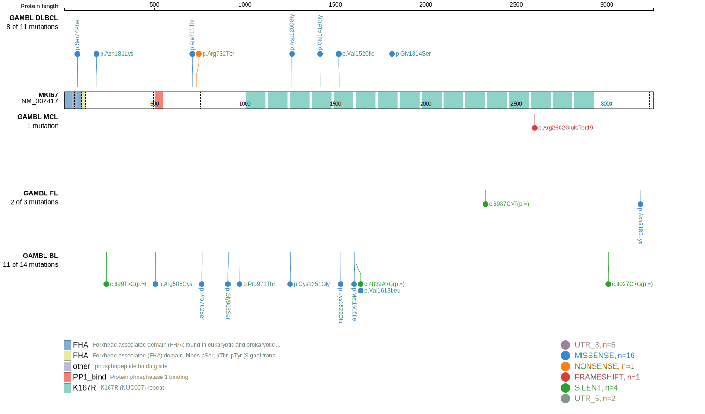

# MKI67

## History

## Relevance tier by entity

|Entity|Tier|Description                           |
|:------:|:----:|--------------------------------------|
|    |2   |relevance in BL not firmly established[@schmitzBurkittLymphomaPathogenesis2012]|
|    |2   |relevance in FL not firmly established[@russler-germainMutationsAssociatedProgression2023]|

## Mutation incidence in large patient cohorts (GAMBL reanalysis)

|Entity|source               |frequency (%)|
|:------:|:---------------------:|:-------------:|
|BL    |GAMBL genomes+capture|6.00         |
|BL    |Thomas cohort        |  NA         |
|BL    |Panea cohort         |  NA         |
|FL    |GAMBL genomes        |1.15         |

## Mutation pattern and selective pressure estimates

|Entity|aSHM|Significant selection|dN/dS (missense)|dN/dS (nonsense)|
|:------:|:----:|:---------------------:|:----------------:|:----------------:|
|BL    |No  |No                   |1.547           |0               |
|DLBCL |No  |No                   |1.029           |0               |
|FL    |No  |No                   |0.987           |0               |

View coding variants in ProteinPaint [hg19](https://morinlab.github.io/LLMPP/GAMBL/MKI67_protein.html)  or [hg38](https://morinlab.github.io/LLMPP/GAMBL/MKI67_protein_hg38.html)

View all variants in GenomePaint [hg19](https://morinlab.github.io/LLMPP/GAMBL/MKI67.html)  or [hg38](https://morinlab.github.io/LLMPP/GAMBL/MKI67_hg38.html)

## MKI67 Expression

<!-- ORIGIN: schmitzBurkittLymphomaPathogenesis2012 -->
<!-- BL: schmitzBurkittLymphomaPathogenesis2012 -->
<!-- FL: russler-germainMutationsAssociatedProgression2023b -->

## References
