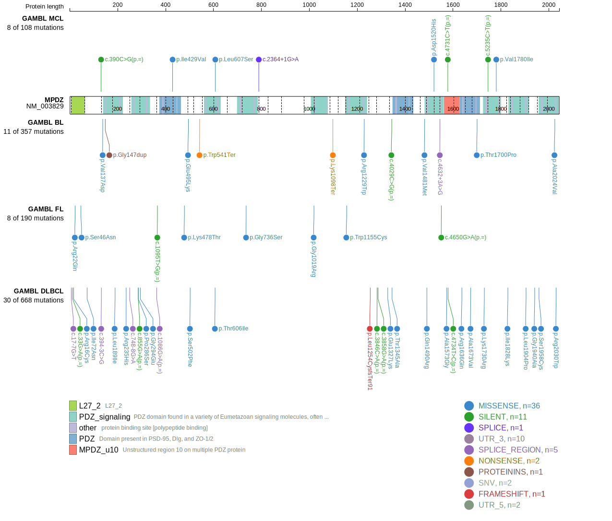
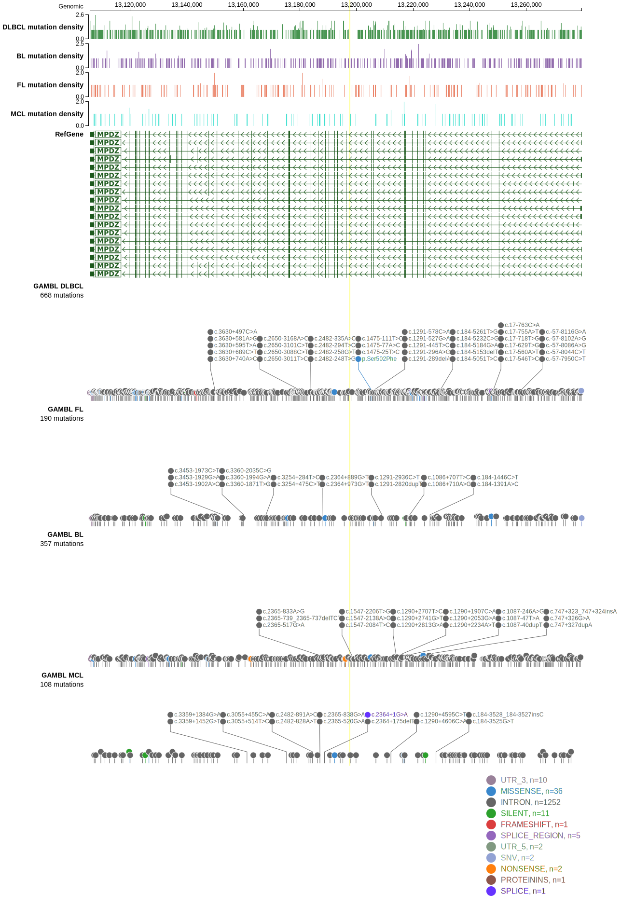
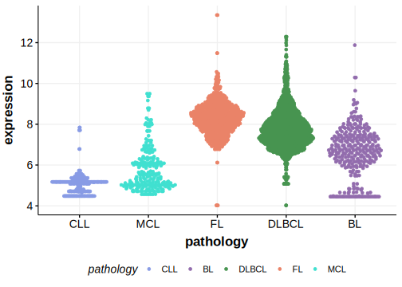

[[_TOC_]]

## Relevance tier by entity

|Entity|Tier|Description                              |
|:------:|:----:|-----------------------------------------|
||2|relevance in PMBL/cHL/GZL not firmly established[@reichelFlowSortingExome2015]|
| |2   |relevance in DLBCL not firmly established[@morinMutationalStructuralAnalysis2013]|

## Mutation incidence in large patient cohorts (GAMBL reanalysis)

|Entity|source        |frequency (%)|
|:------:|:--------------:|:-------------:|
|DLBCL |GAMBL genomes | 6.31        |
|DLBCL |Schmitz cohort|11.70        |
|DLBCL |Reddy cohort  | 5.61        |
|DLBCL |Chapuy cohort | 2.99        |

## Mutation pattern and selective pressure estimates

[[include:dnds_MPDZ.md]]

View coding variants in ProteinPaint [hg19](https://morinlab.github.io/LLMPP/GAMBL/MPDZ_protein.html)  or [hg38](https://morinlab.github.io/LLMPP/GAMBL/MPDZ_protein_hg38.html)

View all variants in GenomePaint [hg19](https://morinlab.github.io/LLMPP/GAMBL/MPDZ.html)  or [hg38](https://morinlab.github.io/LLMPP/GAMBL/MPDZ_hg38.html)

## MPDZ Expression

<!-- ORIGIN: morinMutationalStructuralAnalysis2013 -->
<!-- DLBCL: morinMutationalStructuralAnalysis2013 -->
<!-- PMBL: reichelFlowSortingExome2015a -->

## All Mutations

### DLBCL[@morinMutationalStructuralAnalysis2013]

[RG054](https://www.bcgsc.ca/downloads/morinlab/GAMBL/Morin_2013/RG054.html)
[RG064](https://www.bcgsc.ca/downloads/morinlab/GAMBL/Morin_2013/RG064.html)
[RG081](https://www.bcgsc.ca/downloads/morinlab/GAMBL/Morin_2013/RG081.html)
[RG115](https://www.bcgsc.ca/downloads/morinlab/GAMBL/Morin_2013/RG115.html)
[RG130](https://www.bcgsc.ca/downloads/morinlab/GAMBL/Morin_2013/RG130.html)

[[include:mermaid_MPDZ.md]]

## References
