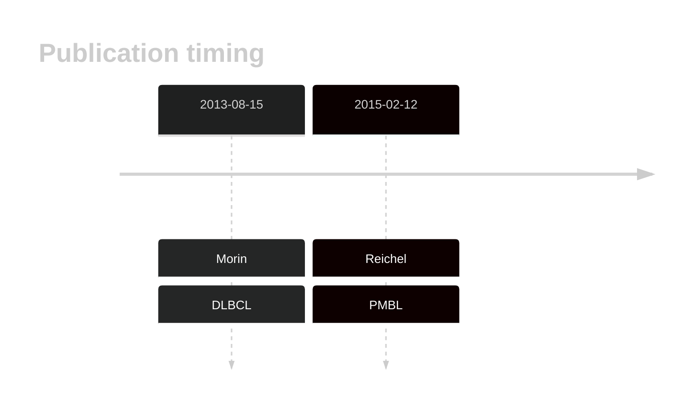

# MPDZ

## History

## Relevance tier by entity

|Entity|Tier|Description                              |
|:------:|:----:|-----------------------------------------|
||2|relevance in PMBL/cHL/GZL not firmly established[@reichelFlowSortingExome2015a]|
| |2   |relevance in DLBCL not firmly established[@morinMutationalStructuralAnalysis2013]|

## Mutation incidence in large patient cohorts (GAMBL reanalysis)

|Entity|source        |frequency (%)|
|:------:|:--------------:|:-------------:|
|DLBCL |GAMBL genomes | 6.31        |
|DLBCL |Schmitz cohort|11.70        |
|DLBCL |Reddy cohort  | 5.61        |
|DLBCL |Chapuy cohort | 2.99        |

## Mutation pattern and selective pressure estimates

|Entity|aSHM|Significant selection|dN/dS (missense)|dN/dS (nonsense)|
|:------:|:----:|:---------------------:|:----------------:|:----------------:|
|BL    |No  |No                   |2.932           |8.789           |
|DLBCL |No  |No                   |0.632           |1.772           |
|FL    |No  |No                   |2.769           |0.000           |

View coding variants in ProteinPaint [hg19](https://morinlab.github.io/LLMPP/GAMBL/MPDZ_protein.html)  or [hg38](https://morinlab.github.io/LLMPP/GAMBL/MPDZ_protein_hg38.html)

View all variants in GenomePaint [hg19](https://morinlab.github.io/LLMPP/GAMBL/MPDZ.html)  or [hg38](https://morinlab.github.io/LLMPP/GAMBL/MPDZ_hg38.html)

## MPDZ Expression

<!-- ORIGIN: morinMutationalStructuralAnalysis2013 -->
<!-- DLBCL: morinMutationalStructuralAnalysis2013 -->
<!-- PMBL: reichelFlowSortingExome2015a -->

## References
