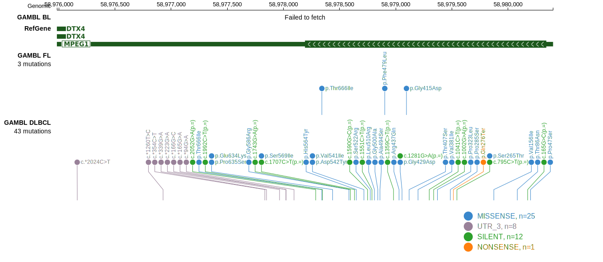

# MPEG1

## Relevance tier by entity

|Entity|Tier|Description               |
|:------:|:----:|--------------------------|
|DLBCL |1   |high-confidence DLBCL gene|

## Mutation incidence in large patient cohorts (GAMBL reanalysis)

|Entity|source        |frequency (%)|
|:------:|:--------------:|:-------------:|
|DLBCL |GAMBL genomes | 4.78        |
|DLBCL |Schmitz cohort| 9.15        |
|DLBCL |Reddy cohort  | 5.81        |
|DLBCL |Chapuy cohort |10.68        |

## Mutation pattern and selective pressure estimates

|Entity|aSHM|Significant selection|dN/dS (missense)|dN/dS (nonsense)|
|:------:|:----:|:---------------------:|:----------------:|:----------------:|
|BL    |No  |No                   |1.434           |0.000           |
|DLBCL |No  |No                   |1.449           |1.685           |
|FL    |No  |No                   |4.371           |0.000           |

> [!NOTE]
> First described in DLBCL in 2013 by [Morin RD](https://pubmed.ncbi.nlm.nih.gov/23699601)

View coding variants in ProteinPaint [hg19](https://morinlab.github.io/LLMPP/GAMBL/MPEG1_protein.html)  or [hg38](https://morinlab.github.io/LLMPP/GAMBL/MPEG1_protein_hg38.html)

View all variants in GenomePaint [hg19](https://morinlab.github.io/LLMPP/GAMBL/MPEG1.html)  or [hg38](https://morinlab.github.io/LLMPP/GAMBL/MPEG1_hg38.html)

