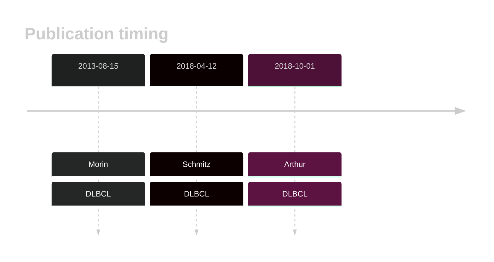

# MPEG1

## Overview
Mutations in MPEG1 have been described in DLBCL1 with the overall rate of mutations somewhat variable across studies. MPEG1 is one of [a number of genes](https://github.com/morinlab/LLMPP/wiki/ashm) affected by aberrant somatic hypermutation in B-cell lymphomas, which complicates the interpretation of mutations at this locus. Coding and non-coding MPEG1 mutations are a feature of the MCD genetic subgroup of DLBCL. 

## History

## Relevance tier by entity

|Entity|Tier|Description               |
|:------:|:----:|--------------------------|
||1|high-confidence MZL gene|
| |1   |high-confidence DLBCL gene[@morinMutationalStructuralAnalysis2013; @schmitzGeneticsPathogenesisDiffuse2018a]|

## Mutation incidence in large patient cohorts (GAMBL reanalysis)

[[include:DLBCL_MPEG1.md]]

## Mutation pattern and selective pressure estimates

|Entity|aSHM|Significant selection|dN/dS (missense)|dN/dS (nonsense)|
|:------:|:----:|:---------------------:|:----------------:|:----------------:|
|BL    |No  |No                   |1.434           |0.000           |
|DLBCL |No  |No                   |1.449           |1.685           |
|FL    |No  |No                   |4.371           |0.000           |

View coding variants in ProteinPaint [hg19](https://morinlab.github.io/LLMPP/GAMBL/MPEG1_protein.html)  or [hg38](https://morinlab.github.io/LLMPP/GAMBL/MPEG1_protein_hg38.html)

View all variants in GenomePaint [hg19](https://morinlab.github.io/LLMPP/GAMBL/MPEG1.html)  or [hg38](https://morinlab.github.io/LLMPP/GAMBL/MPEG1_hg38.html)

## MPEG1 Expression

## References

<!-- ORIGIN: morinMutationalStructuralAnalysis2013 -->
<!-- DLBCL: morinMutationalStructuralAnalysis2013 -->
