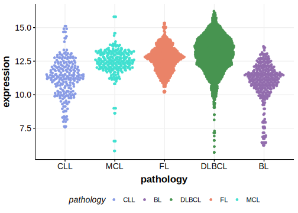

[[_TOC_]]

## Overview
Mutations in MPEG1 have been described in DLBCL[@morinMutationalStructuralAnalysis2013] with the overall rate of mutations somewhat variable across studies. MPEG1 is one of [a number of genes](https://github.com/morinlab/LLMPP/wiki/ashm) affected by aberrant somatic hypermutation in B-cell lymphomas, which complicates the interpretation of mutations at this locus. Coding and non-coding MPEG1 mutations are a feature of the MCD genetic subgroup of DLBCL. 

## Relevance tier by entity

|Entity|Tier|Description               |
|:------:|:----:|--------------------------|
||1|high-confidence MZL gene|
| |1   |high-confidence DLBCL gene[@morinMutationalStructuralAnalysis2013; @schmitzGeneticsPathogenesisDiffuse2018]|

## Mutation incidence in large patient cohorts (GAMBL reanalysis)

[[include:DLBCL_MPEG1.md]]

## Mutation pattern and selective pressure estimates

[[include:dnds_MPEG1.md]]

[[include:browser_MPEG1.md]]

## Expression

[[include:mermaid_MPEG1.md]]

## References

<!-- ORIGIN: morinMutationalStructuralAnalysis2013 -->
<!-- DLBCL: morinMutationalStructuralAnalysis2013 -->
