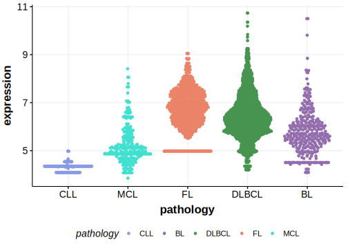

[[_TOC_]]

## Relevance tier by entity

[[include:table1_MRGPRF.md]]

## Mutation incidence in large patient cohorts (GAMBL reanalysis)

|Entity|source       |frequency (%)|
|:------:|:-------------:|:-------------:|
|MCL   |GAMBL genomes|0            |

## Mutation pattern and selective pressure estimates

|Entity|aSHM|Significant selection|dN/dS (missense)|dN/dS (nonsense)|
|:------:|:----:|:---------------------:|:----------------:|:----------------:|
|BL    |No  |No                   |1.899           |  0.000         |
|DLBCL |No  |No                   |0.000           |150.717         |
|FL    |No  |No                   |0.000           |  0.000         |

[[include:browser_MRGPRF.md]]

## Expression

<!-- ORIGIN: zhangGenomicLandscapeMantle2014 -->
<!-- MCL: zhangGenomicLandscapeMantle2014 -->

[[include:mermaid_MRGPRF.md]]

## References
