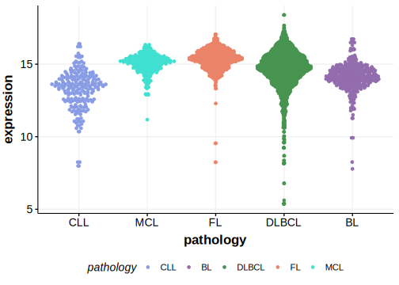

[[_TOC_]]

## Overview
MS4A1 encodes the CD20 protein, which is the target of rituximab and other therapeutic monoclonal antibodies. 
MS4A1 is one of [a number of genes](https://github.com/morinlab/LLMPP/wiki/ashm) affected by aberrant somatic hypermutation in B-cell lymphomas, 
which complicates the interpretation of mutations at this locus. 
In relapsed DLBCLs, MS4A1 is sometimes mutated and these mutations have been shown to reduce CD20 expression.[@rushtonGeneticEvolutionaryPatterns2020]

## Relevance tier by entity

|Entity|Tier|Description               |
|:------:|:----:|--------------------------|
||1|high-confidence PMBL/cHL/GZL gene[@mottokIntegrativeGenomicAnalysis2019]|
| |1-a | aSHM target and high-confidence DLBCL gene[@rushtonGeneticEvolutionaryPatterns2020]|

## Mutation incidence in large patient cohorts (GAMBL reanalysis)

[[include:DLBCL_MS4A1.md]]

## Mutation pattern and selective pressure estimates

[[include:dnds_MS4A1.md]]

## aSHM regions

|chr_name|hg19_start|hg19_end|region                                                                                    |regulatory_comment|
|:--------:|:----------:|:--------:|:------------------------------------------------------------------------------------------:|:------------------:|
|chr11   |60223385  |60225310|[TSS](https://genome.ucsc.edu/s/rdmorin/GAMBL%20hg19?position=chr11%3A60223385%2D60225310)|active_promoter   |

View coding variants in ProteinPaint [hg19](https://morinlab.github.io/LLMPP/GAMBL/MS4A1_protein.html)  or [hg38](https://morinlab.github.io/LLMPP/GAMBL/MS4A1_protein_hg38.html)

View all variants in GenomePaint [hg19](https://morinlab.github.io/LLMPP/GAMBL/MS4A1.html)  or [hg38](https://morinlab.github.io/LLMPP/GAMBL/MS4A1_hg38.html)

## MS4A1 Expression

[[include:mermaid_MS4A1.md]]

## References
<!-- ORIGIN: mottokIntegrativeGenomicAnalysis2019b -->
<!-- DLBCL: rushtonGeneticEvolutionaryPatterns2020 -->
<!-- PMBL: mottokIntegrativeGenomicAnalysis2019b -->
