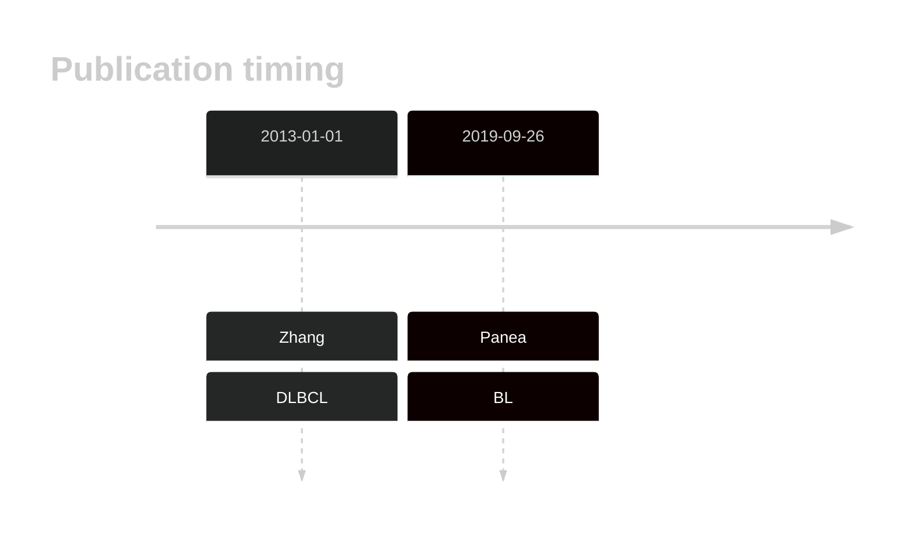
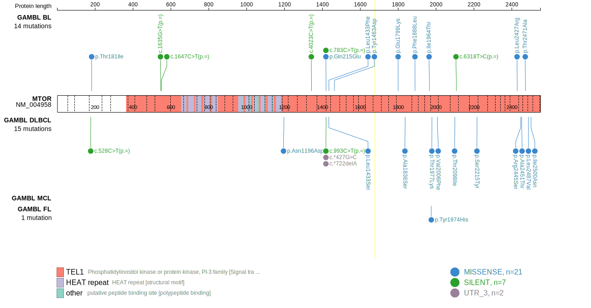
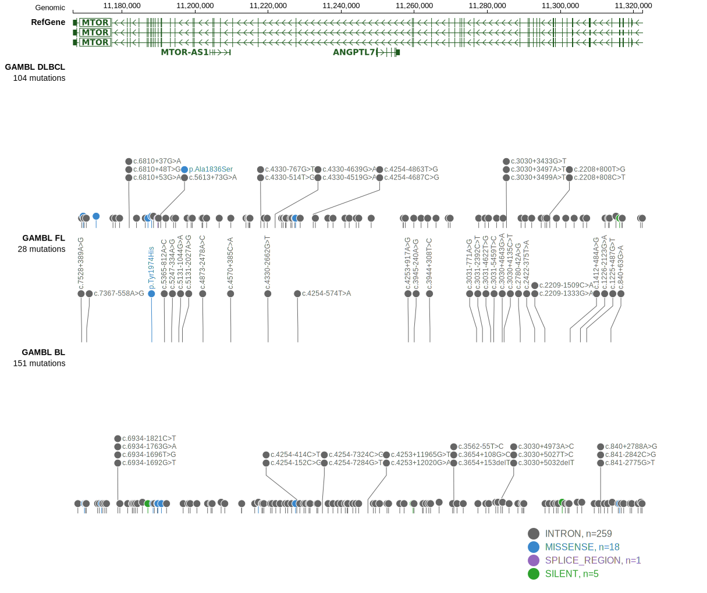
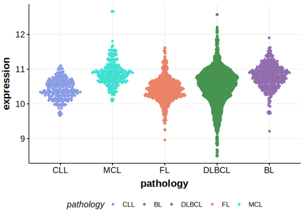
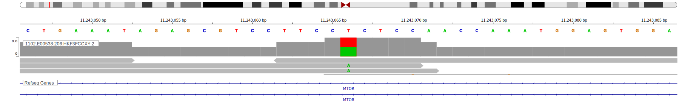

# MTOR

## Overview

Although mutations in MTOR have been reported in DLBCL and some BL, their role in lymphomagenesis has not been thoroughly studied. 

## History

## Relevance tier by entity

|Entity|Tier|Description                           |
|:------:|:----:|--------------------------------------|
|    |2-F   |Failed QC[@paneaWholeGenomeLandscape2019]|
| |1   |high-confidence DLBCL gene[@zhangGeneticHeterogeneityDiffuse2013]      |

## Mutation incidence in large patient cohorts (GAMBL reanalysis)

|Entity|source               |frequency (%)|
|:------:|:---------------------:|:-------------:|
|BL    |GAMBL genomes+capture| 4.62        |
|BL    |Thomas cohort        | 3.40        |
|BL    |Panea cohort         |10.90        |
|DLBCL |GAMBL genomes        | 4.02        |
|DLBCL |Schmitz cohort       | 4.04        |
|DLBCL |Reddy cohort         | 2.40        |
|DLBCL |Chapuy cohort        | 2.14        |

## Mutation pattern and selective pressure estimates

|Entity|aSHM|Significant selection|dN/dS (missense)|dN/dS (nonsense)|
|:------:|:----:|:---------------------:|:----------------:|:----------------:|
|BL    |No  |No                   |1.204           |0               |
|DLBCL |No  |No                   |5.630           |0               |
|FL    |No  |No                   |1.429           |0               |

## MTOR Hotspots

| Chromosome |Coordinate (hg19) | ref>alt | HGVSp | 
 | :---:| :---: | :--: | :---: |
| chr1 | 11169376 | A>T | I2500N |

View coding variants in ProteinPaint [hg19](https://morinlab.github.io/LLMPP/GAMBL/MTOR_protein.html)  or [hg38](https://morinlab.github.io/LLMPP/GAMBL/MTOR_protein_hg38.html)

View all variants in GenomePaint [hg19](https://morinlab.github.io/LLMPP/GAMBL/MTOR.html)  or [hg38](https://morinlab.github.io/LLMPP/GAMBL/MTOR_hg38.html)

## MTOR Expression

## Representative Mutations

### BL

**Rating**
&starf; &star; &star; &star; &star;

**Rating**
&starf; &star; &star; &star; &star; 

## References

<!-- ORIGIN: zhangGeneticHeterogeneityDiffuse2013 -->
<!-- DLBCL: zhangGeneticHeterogeneityDiffuse2013 -->
<!-- BL: paneaWholeGenomeLandscape2019 -->
