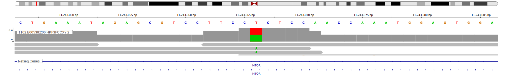

[[_TOC_]]

## Overview

Although mutations in MTOR have been reported in DLBCL and some BL, their role in lymphomagenesis has not been thoroughly studied. 

## Relevance tier by entity

|Entity|Tier|Description                           |
|:------:|:----:|--------------------------------------|
|    |3   |Retired, Failed QC[@paneaWholeGenomeLandscape2019]|
| |1   |high-confidence DLBCL gene[@zhangGeneticHeterogeneityDiffuse2013; @reddyGeneticFunctionalDrivers2017]      |

## Warnings

<<Warn("The variants reported in this gene in BL failed QC")>>

## Mutation incidence in large patient cohorts (GAMBL reanalysis)

[[include:DLBCL_MTOR.md]]
[[include:BL_MTOR.md]]

## Mutation pattern and selective pressure estimates

[[include:dnds_MTOR.md]]

## MTOR Hotspots

| Chromosome |Coordinate (hg19) | ref>alt | HGVSp | 
 | :---:| :---: | :--: | :---: |
| chr1 | 11169376 | A>T | I2500N |

[[include:browser_MTOR.md]]

## Expression

## Representative Mutations

### BL

**Rating**
&starf; &star; &star; &star; &star;

**Rating**
&starf; &star; &star; &star; &star; 

[[include:mermaid_MTOR.md]]

## References

<!-- ORIGIN: zhangGeneticHeterogeneityDiffuse2013 -->
<!-- DLBCL: zhangGeneticHeterogeneityDiffuse2013 -->
<!-- BL: paneaWholeGenomeLandscape2019 -->
