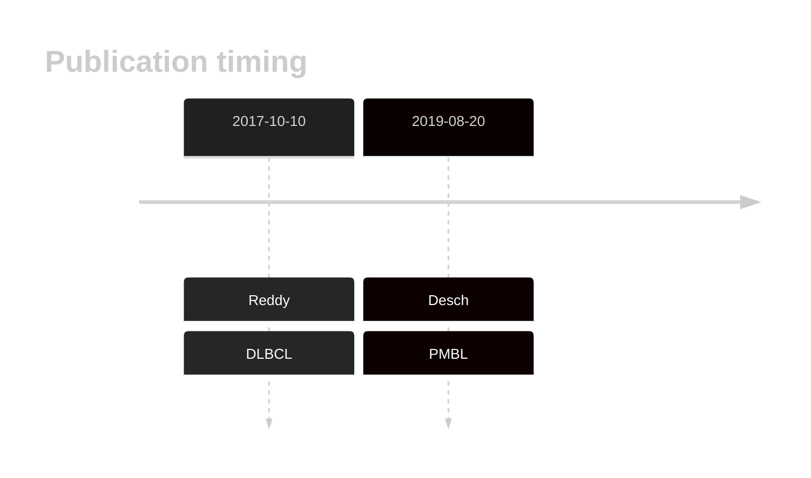

# MYB
## History

## Relevance tier by entity

|Entity|Tier|Description                              |
|:------:|:----:|-----------------------------------------|
||2|relevance in PMBL/cHL/GZL not firmly established|
| |2   |relevance in DLBCL not firmly established|

## Mutation incidence in large patient cohorts (GAMBL reanalysis)

|Entity|source        |frequency (%)|
|:------:|:--------------:|:-------------:|
|DLBCL |GAMBL genomes |0.57         |
|DLBCL |Schmitz cohort|2.13         |
|DLBCL |Reddy cohort  |1.10         |
|DLBCL |Chapuy cohort |0.85         |

## Mutation pattern and selective pressure estimates

|Entity|aSHM|Significant selection|dN/dS (missense)|dN/dS (nonsense)|
|:------:|:----:|:---------------------:|:----------------:|:----------------:|
|BL    |No  |No                   |2.555           |0               |
|DLBCL |No  |No                   |0.000           |0               |
|FL    |No  |No                   |2.377           |0               |

> [!NOTE]
> First described in DLBCL in 2017 by [Reddy A](https://pubmed.ncbi.nlm.nih.gov/28985567)

View coding variants in ProteinPaint [hg19](https://morinlab.github.io/LLMPP/GAMBL/MYB_protein.html)  or [hg38](https://morinlab.github.io/LLMPP/GAMBL/MYB_protein_hg38.html)

View all variants in GenomePaint [hg19](https://morinlab.github.io/LLMPP/GAMBL/MYB.html)  or [hg38](https://morinlab.github.io/LLMPP/GAMBL/MYB_hg38.html)

## MYB Expression

<!-- ORIGIN: reddyGeneticFunctionalDrivers2017 -->
<!-- DLBCL: reddyGeneticFunctionalDrivers2017 -->
<!-- PMBL: deschGenotypingCirculatingTumor2020 -->
## References
1.  Reddy A, Zhang J, Davis NS, Moffitt AB, Love CL, Waldrop A, Leppa S, Pasanen A, Meriranta L, Karjalainen-Lindsberg ML, Nørgaard P, Pedersen M, Gang AO, Høgdall E, Heavican TB, Lone W, Iqbal J, Qin Q, Li G, Kim SY, Healy J, Richards KL, Fedoriw Y, Bernal-Mizrachi L, Koff JL, Staton AD, Flowers CR, Paltiel O, Goldschmidt N, Calaminici M, Clear A, Gribben J, Nguyen E, Czader MB, Ondrejka SL, Collie A, Hsi ED, Tse E, Au-Yeung RKH, Kwong YL, Srivastava G, Choi WWL, Evens AM, Pilichowska M, Sengar M, Reddy N, Li S, Chadburn A, Gordon LI, Jaffe ES, Levy S, Rempel R, Tzeng T, Happ LE, Dave T, Rajagopalan D, Datta J, Dunson DB, Dave SS. Genetic and Functional Drivers of Diffuse Large B Cell Lymphoma. Cell. 2017 Oct;171(2):481-494.e15. 
2.  Desch AK, Hartung K, Botzen A, Brobeil A, Rummel M, Kurch L, Georgi T, Jox T, Bielack S, Burdach S, Classen CF, Claviez A, Debatin KM, Ebinger M, Eggert A, Faber J, Flotho C, Frühwald M, Graf N, Jorch N, Kontny U, Kramm C, Kulozik A, Kühr J, Sykora KW, Metzler M, Müller HL, Nathrath M, Nüßlein T, Paulussen M, Pekrun A, Reinhardt D, Reinhard H, Rössig C, Sauerbrey A, Schlegel PG, Schneider DT, Scheurlen W, Schweigerer L, Simon T, Suttorp M, Vorwerk P, Schmitz R, Kluge R, Mauz-Körholz C, Körholz D, Gattenlöhner S, Bräuninger A. Genotyping circulating tumor DNA of pediatric Hodgkin lymphoma. Leukemia. 2020 Jan;34(1):151–166. PMID: 31431735
