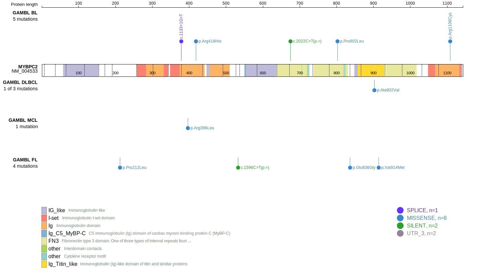
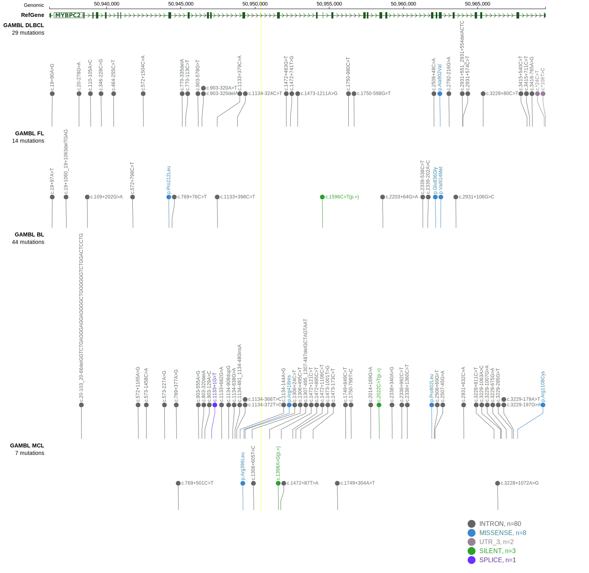
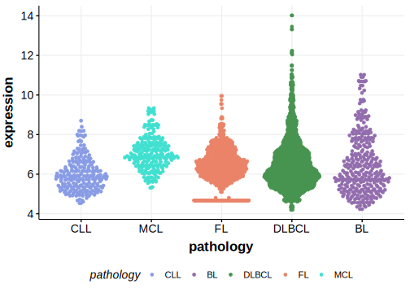

# MYBPC2

## Relevance tier by entity

|Entity|Tier|Description                              |
|:------:|:----:|-----------------------------------------|
| |2   |relevance in DLBCL not firmly established|

## Mutation incidence in large patient cohorts (GAMBL reanalysis)

|Entity|source        |frequency (%)|
|:------:|:--------------:|:-------------:|
|DLBCL |GAMBL genomes |0.57         |
|DLBCL |Schmitz cohort|3.40         |
|DLBCL |Reddy cohort  |2.80         |
|DLBCL |Chapuy cohort |1.71         |

## Mutation pattern and selective pressure estimates

|Entity|aSHM|Significant selection|dN/dS (missense)|dN/dS (nonsense)|
|:------:|:----:|:---------------------:|:----------------:|:----------------:|
|BL    |No  |No                   |1.437           |6.011           |
|DLBCL |No  |No                   |0.653           |0.000           |
|FL    |No  |No                   |4.460           |0.000           |

> [!NOTE]
> First described in DLBCL in 2018 by [Schmitz R](https://pubmed.ncbi.nlm.nih.gov/29641966)

View coding variants in ProteinPaint [hg19](https://morinlab.github.io/LLMPP/GAMBL/MYBPC2_protein.html)  or [hg38](https://morinlab.github.io/LLMPP/GAMBL/MYBPC2_protein_hg38.html)

View all variants in GenomePaint [hg19](https://morinlab.github.io/LLMPP/GAMBL/MYBPC2.html)  or [hg38](https://morinlab.github.io/LLMPP/GAMBL/MYBPC2_hg38.html)

## MYBPC2 Expression

<!-- ORIGIN: schmitzGeneticsPathogenesisDiffuse2018a -->
<!-- DLBCL: schmitzGeneticsPathogenesisDiffuse2018a -->
