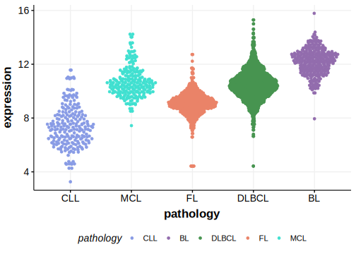

# MYC

## Overview
MYC is one of [a number of genes](https://github.com/morinlab/LLMPP/wiki/ashm) affected by aberrant somatic hypermutation in B-cell lymphomas, which complicates the interpretation of mutations at this locus.

## History

## Relevance tier by entity

|Entity|Tier|Description                           |
|:------:|:----:|--------------------------------------|
||2|relevance in PMBL/cHL/GZL not firmly established[@dunsCharacterizationDLBCLPMBL2021]|
||2|relevance in MZL not firmly established[@jalladesExomeSequencingIdentifies2017]|
|    |1-a | aSHM target and high-confidence BL gene               [@johnstonCmycHypermutationBurkitt1992]|
| |1-a | aSHM target and high-confidence DLBCL gene            [@pasqualucciHypermutationMultipleProtooncogenes2001]|
|    |2-a | aSHM target; Although recurrent, the relevance of mutations in FL is tenuous |

## Mutation incidence in large patient cohorts (GAMBL reanalysis)

[[include:DLBCL_MYC.md]]
[[include:FL_MYC.md]]
[[include:BL_MYC.md]]

## Mutation pattern and selective pressure estimates

[[include:dnds_MYC.md]]

## aSHM regions

|chr_name|hg19_start|hg19_end |region                                                                                     |regulatory_comment|
|:--------:|:----------:|:---------:|:-------------------------------------------------------------------------------------------:|:------------------:|
|chr8    |128748352 |128749427|[TSS](https://genome.ucsc.edu/s/rdmorin/GAMBL%20hg19?position=chr8%3A128748352%2D128749427)|active_promoter   |

## MYC Hotspots

| Chromosome |Coordinate (hg19) | ref>alt | HGVSp | 
 | :---:| :---: | :--: | :---: |
| chr8 | 128750677 | C>A | P72T |
| chr8 | 128750677 | C>G | P72A |
| chr8 | 128750677 | C>T | P72S |
| chr8 | 128750677 | CC>TT | P72F |
| chr8 | 128750678 | C>G | P72R |
| chr8 | 128750678 | C>T | P72L |
| chr8 | 128750680 | A>G | T73A |
| chr8 | 128750681 | C>A | T73N |
| chr8 | 128750681 | C>T | T73I |
| chr8 | 128750681 | CC>AT | T73N |
| chr8 | 128750681 | CC>GT | T73S |
| chr8 | 128750681 | CC>TA | T73I |
| chr8 | 128750681 | CC>TG | T73M |
| chr8 | 128750681 | CC>TT | T73I |
| chr8 | 128750683 | C>G | P74A |
| chr8 | 128750683 | C>T | P74S |
| chr8 | 128750684 | C>T | P74L |
| chr8 | 128750686 | C>A | P75T |
| chr8 | 128750686 | C>G | P75A |
| chr8 | 128750686 | C>T | P75S |
| chr8 | 128750686 | CC>TT | P75F |
| chr8 | 128750687 | C>A | P75H |
| chr8 | 128750687 | C>G | P75R |
| chr8 | 128750692 | T>C | S77P |
| chr8 | 128750692 | T>G | S77A |
| chr8 | 128750693 | C>G | S77C |
| chr8 | 128750695 | C>T | P78S |
| chr8 | 128750696 | C>G | P78R |

View coding variants in ProteinPaint [hg19](https://morinlab.github.io/LLMPP/GAMBL/MYC_protein.html)  or [hg38](https://morinlab.github.io/LLMPP/GAMBL/MYC_protein_hg38.html)

View all variants in GenomePaint [hg19](https://morinlab.github.io/LLMPP/GAMBL/MYC.html)  or [hg38](https://morinlab.github.io/LLMPP/GAMBL/MYC_hg38.html)

## MYC Expression

## References

<!-- ORIGIN: johnstonCmycHypermutationBurkitt1992 -->
<!-- DLBCL: pasqualucciHypermutationMultipleProtooncogenes2001a -->
<!-- MZL: jalladesExomeSequencingIdentifies2017 -->
<!-- BL: johnstonCmycHypermutationBurkitt1992 -->
<!-- BL: johnstonCmycHypermutationBurkitt1992 -->
<!-- PMBL: dunsCharacterizationDLBCLPMBL2021b -->
