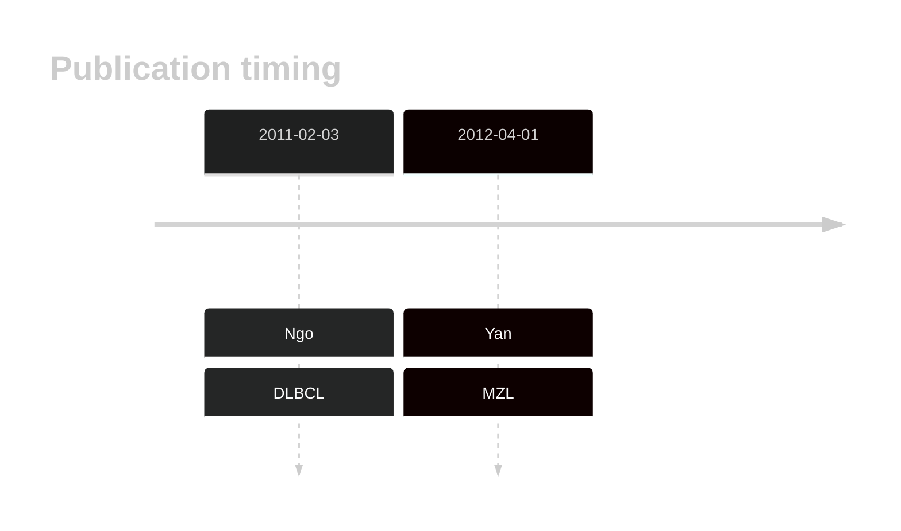

# MYD88

## History

## Relevance tier by entity

|Entity|Tier|Description                           |
|:------:|:----:|--------------------------------------|
||1|high-confidence MZL gene|
| |1   |high-confidence DLBCL gene            |
|    |2   |relevance in FL not firmly established|

## Mutation incidence in large patient cohorts (GAMBL reanalysis)

|Entity|source               |frequency (%)|
|:------:|:---------------------:|:-------------:|
|BL    |GAMBL genomes+capture| 0.46        |
|BL    |Thomas cohort        | 0.40        |
|BL    |Panea cohort         | 1.00        |
|DLBCL |GAMBL genomes        |13.38        |
|DLBCL |Schmitz cohort       |26.38        |
|DLBCL |Reddy cohort         |15.12        |
|DLBCL |Chapuy cohort        |21.37        |
|FL    |GAMBL genomes        | 1.85        |

## Mutation pattern and selective pressure estimates

|Entity|aSHM|Significant selection|dN/dS (missense)|dN/dS (nonsense)|
|:------:|:----:|:---------------------:|:----------------:|:----------------:|
|BL    |No  |No                   | 1.809          |0               |
|DLBCL |No  |Yes                  |56.390          |0               |
|FL    |No  |No                   |17.159          |0               |

 ## MYD88 Hotspots

| Chromosome |Coordinate (hg19) | ref>alt | HGVSp | 
 | :---:| :---: | :--: | :---: |
| chr3 | 38182641 | T>C | L265P |

View coding variants in ProteinPaint [hg19](https://morinlab.github.io/LLMPP/GAMBL/MYD88_protein.html)  or [hg38](https://morinlab.github.io/LLMPP/GAMBL/MYD88_protein_hg38.html)

View all variants in GenomePaint [hg19](https://morinlab.github.io/LLMPP/GAMBL/MYD88.html)  or [hg38](https://morinlab.github.io/LLMPP/GAMBL/MYD88_hg38.html)

## MYD88 Expression

<!-- ORIGIN: yanBCRTLRSignaling2012a -->
<!-- DLBCL: ngoOncogenicallyActiveMYD882011a -->
<!-- MZL: yanBCRTLRSignaling2012a -->

## References
1.  Ngo VN, Young RM, Schmitz R, Jhavar S, Xiao W, Lim KH, Kohlhammer H, Xu W, Yang Y, Zhao H, Shaffer AL, Romesser P, Wright G, Powell J, Rosenwald A, Muller-Hermelink HK, Ott G, Gascoyne RD, Connors JM, Rimsza LM, Campo E, Jaffe ES, Delabie J, Smeland EB, Fisher RI, Braziel RM, Tubbs RR, Cook JR, Weisenburger DD, Chan WC, Staudt LM. Oncogenically active MYD88 mutations in human lymphoma. Nature. 2011 Feb 3;470(7332):115–119. PMCID: PMC5024568
2.  Yan Q, Huang Y, Watkins AJ, Kocialkowski S, Zeng N, Hamoudi RA, Isaacson PG, de Leval L, Wotherspoon A, Du MQ. BCR and TLR signaling pathways are recurrently targeted by genetic changes in splenic marginal zone lymphomas. Haematologica. 2012 Apr;97(4):595–598. PMCID: PMC3347666
