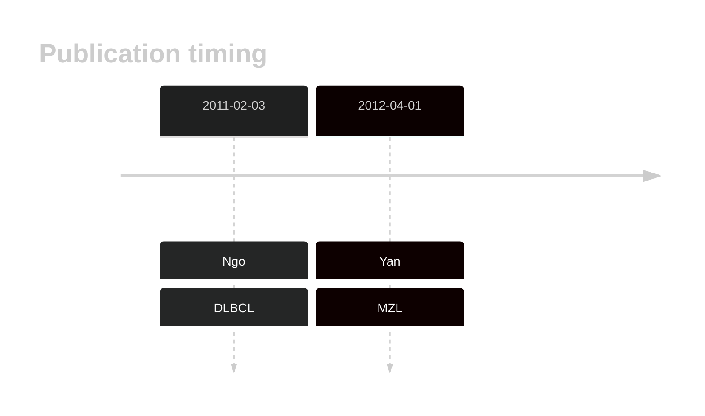

# MYD88

## History

## Relevance tier by entity

|Entity|Tier|Description                           |
|:------:|:----:|--------------------------------------|
||1|high-confidence MZL gene[@yanBCRTLRSignaling2012]|
| |1   |high-confidence DLBCL gene            [@ngoOncogenicallyActiveMYD882011]|
|    |2   |relevance in FL not firmly established|

## Mutation incidence in large patient cohorts (GAMBL reanalysis)

|Entity |Samples/Cohort      |Incidence estimate (95% CI) |
|:------|:-------------------|:---------------------------|
|DLBCL  |GAMBL without Reddy |0.1975 [0.174,0.221]        |
|DLBCL  |GAMBL best Reddy    |0.1914 [0.1724,0.2105]      |
|DLBCL  |BC                  |0.1614 [0.1131,0.2097]      |
|DLBCL  |Dana-Farber         |0.1881 [0.1441,0.2321]      |
|DLBCL  |NCI                 |0.2638 [0.224,0.3037]       |
|DLBCL  |Reddy               |0.1798 [0.1472,0.2123]      |
|DLBCL  |DLBCL_ICGC          |0.1059 [0.0405,0.1713]      |

## Mutation pattern and selective pressure estimates

|Entity|aSHM|Significant selection|dN/dS (missense)|dN/dS (nonsense)|
|:------:|:----:|:---------------------:|:----------------:|:----------------:|
|BL    |No  |No                   | 1.809          |0               |
|DLBCL |No  |Yes                  |56.390          |0               |
|FL    |No  |No                   |17.159          |0               |

## MYD88 Hotspots

| Chromosome |Coordinate (hg19) | ref>alt | HGVSp | 
 | :---:| :---: | :--: | :---: |
| chr3 | 38182641 | T>C | L265P |

View coding variants in ProteinPaint [hg19](https://morinlab.github.io/LLMPP/GAMBL/MYD88_protein.html)  or [hg38](https://morinlab.github.io/LLMPP/GAMBL/MYD88_protein_hg38.html)

View all variants in GenomePaint [hg19](https://morinlab.github.io/LLMPP/GAMBL/MYD88.html)  or [hg38](https://morinlab.github.io/LLMPP/GAMBL/MYD88_hg38.html)

## MYD88 Expression

<!-- ORIGIN: yanBCRTLRSignaling2012a -->
<!-- DLBCL: ngoOncogenicallyActiveMYD882011a -->
<!-- MZL: yanBCRTLRSignaling2012a -->

## References
