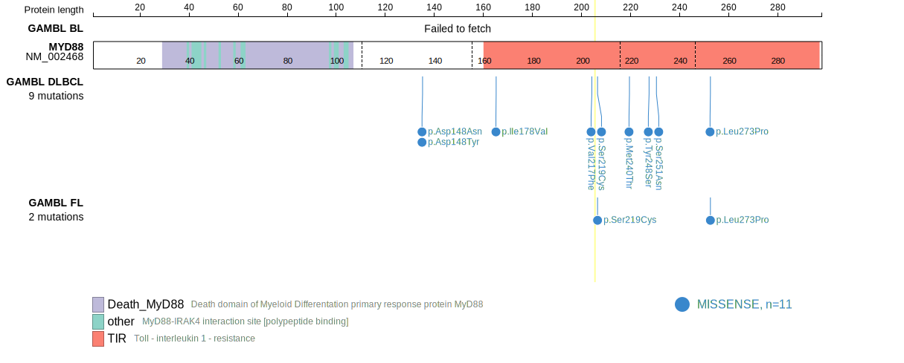
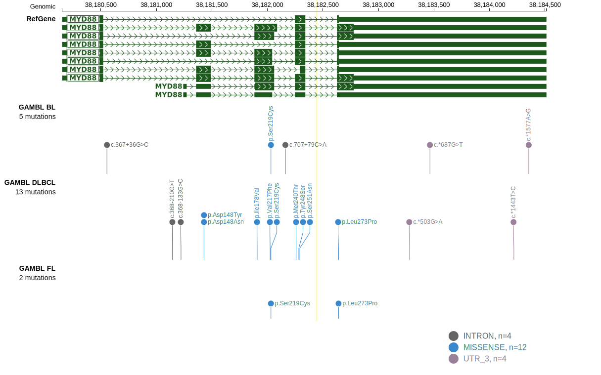
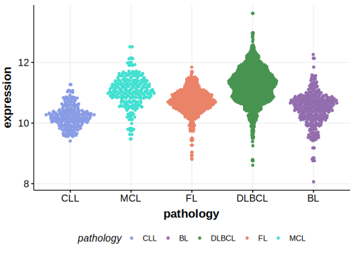

# MYD88

## Relevance tier by entity

|Entity|Tier|Description                           |
|:------:|:----:|--------------------------------------|
|BL    |2   |relevance in BL not firmly established|
|DLBCL |1   |high-confidence DLBCL gene            |
|FL    |2   |relevance in FL not firmly established|

## Mutation incidence in large patient cohorts (GAMBL reanalysis)

|Entity|source               |frequency (%)|
|:------:|:---------------------:|:-------------:|
|BL    |GAMBL genomes+capture| 0.46        |
|BL    |Thomas cohort        | 0.40        |
|BL    |Panea cohort         | 1.00        |
|DLBCL |GAMBL genomes        |13.38        |
|DLBCL |Schmitz cohort       |26.38        |
|DLBCL |Reddy cohort         |15.12        |
|DLBCL |Chapuy cohort        |21.37        |
|FL    |GAMBL genomes        | 1.85        |

## Mutation pattern and selective pressure estimates

|Entity|aSHM|Significant selection|dN/dS (missense)|dN/dS (nonsense)|
|:------:|:----:|:---------------------:|:----------------:|:----------------:|
|BL    |No  |No                   | 1.809          |0               |
|DLBCL |No  |Yes                  |56.390          |0               |
|FL    |No  |No                   |17.159          |0               |

> [!NOTE]
> First described in DLBCL in 2011 by [Ngo VN](https://pubmed.ncbi.nlm.nih.gov/21179087)

 ## MYD88 Hotspots

| Chromosome |Coordinate (hg19) | ref>alt | HGVSp | 
 | :---:| :---: | :--: | :---: |
| chr3 | 38182641 | T>C | L265P |

View coding variants in ProteinPaint [hg19](https://morinlab.github.io/LLMPP/GAMBL/MYD88_protein.html)  or [hg38](https://morinlab.github.io/LLMPP/GAMBL/MYD88_protein_hg38.html)

View all variants in GenomePaint [hg19](https://morinlab.github.io/LLMPP/GAMBL/MYD88.html)  or [hg38](https://morinlab.github.io/LLMPP/GAMBL/MYD88_hg38.html)

## MYD88 Expression

<!-- ORIGIN: ngoOncogenicallyActiveMYD882011a -->
