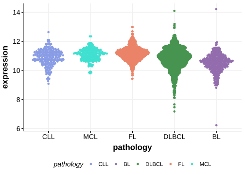

[[_TOC_]]

## Relevance tier by entity

[[include:tables/table1_MYO18A.md]]

## Mutation incidence in large patient cohorts (GAMBL reanalysis)

### DLBCL
[[include:tables/DLBCL_MYO18A.md]]

### FL
[[include:tables/FL_MYO18A.md]]

### BL
[[include:tables/BL_MYO18A.md]]

## Mutation pattern and selective pressure estimates

[[include:tables/dnds_MYO18A.md]]

[[include:tables/browser_MYO18A.md]]

## Expression

[[include:tables/mermaid_MYO18A.md]]

## References

<!-- ORIGIN: schmitzBurkittLymphomaPathogenesis2012 -->
<!-- BL: schmitzBurkittLymphomaPathogenesis2012 -->
